# Additional Flow Diagrams for Agent Queue System

## 10 more system flow diagrams (11–20)

### 11) Cost-aware scheduling (min-cost subject to SLA/deadlines)

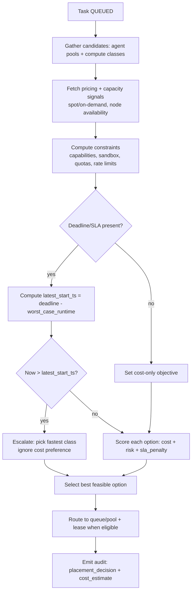

### 12) Spillover queues (admission control + overflow routing)

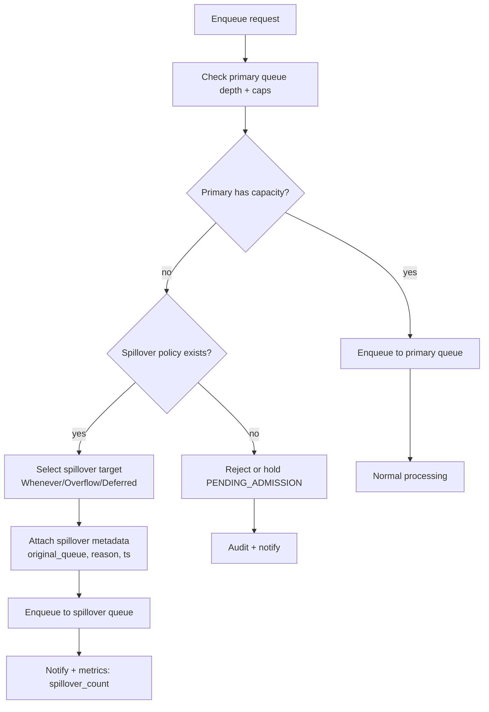

### 13) Work stealing (utilization without breaking policy)

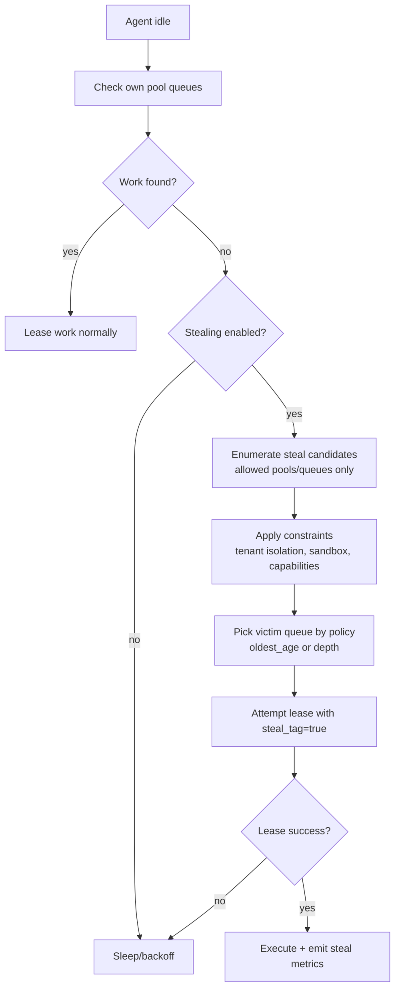

### 14) Batch formation (batch_key + window + size)

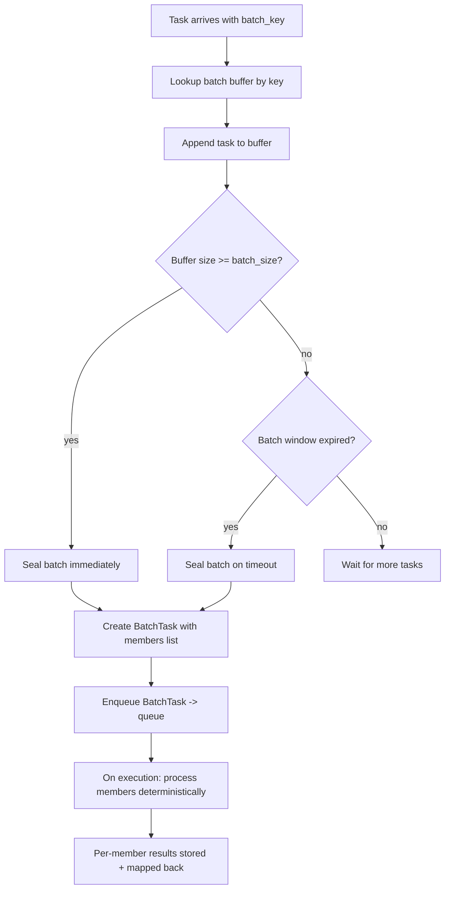

### 15) Maintenance windows (hard no-run outside window)

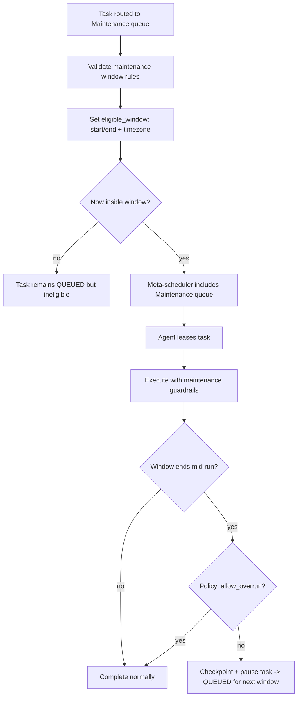

### 16) Schema migration (workflow.yml and runtime state)

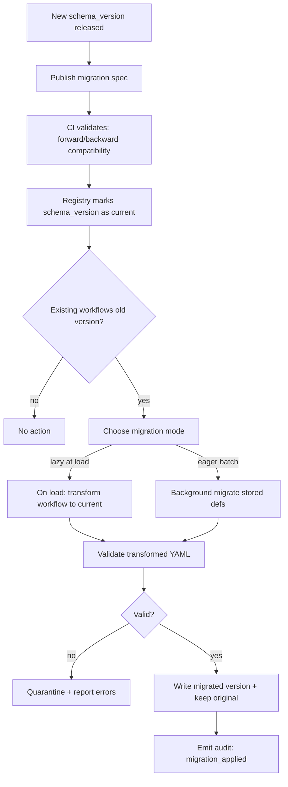

### 17) Exactly-once outcome (outbox/inbox pattern around side effects)

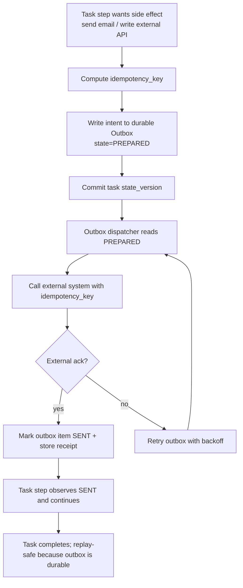

### 18) Cancellation propagation (run/task/step scopes)

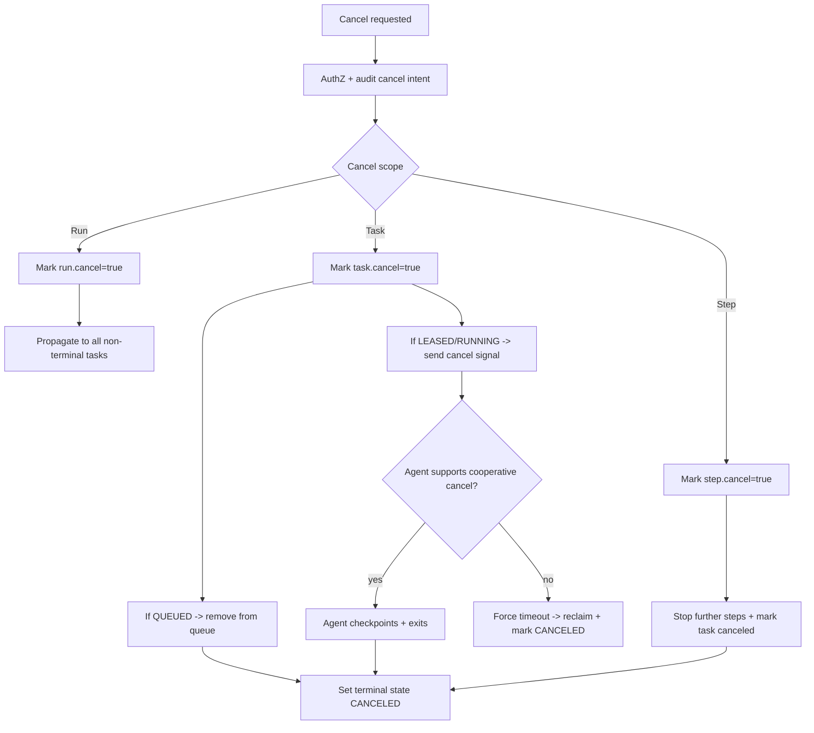

### 19) Run-level pause/resume (freeze orchestration without losing ordering)

```mermaid
flowchart TD
  A[Operator/User pauses Run] --> B[AuthZ + audit]
  B --> C[Set run.paused=true]
  C --> D[Mark child tasks ineligible for lease]
  D --> E{Any tasks currently RUNNING?}
  E -->|yes| F[Let finish or checkpoint+pause (policy)]
  E -->|no| G[All queued tasks remain queued but blocked]
  F --> H[Update states accordingly]
  G --> I[Resume requested]
  I --> J[Set run.paused=false]
  J --> K[Recompute eligibility + preserve ordering keys]
  K --> L[Meta-scheduler sees tasks again]
```

### 20) Observability + alerting loop (metrics → alerts → automated mitigations)

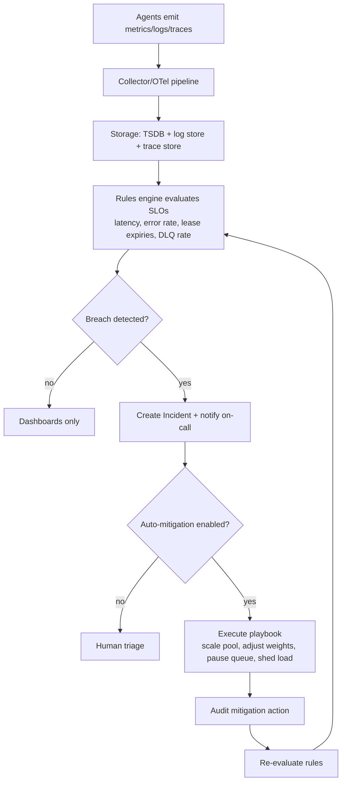

---

## 10 more user-story flow diagrams (US11–US20)

### US11) "Minimize cost but still meet an SLA deadline"

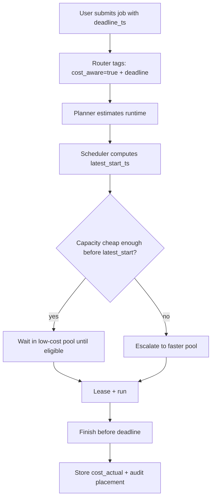

### US12) "Primary queue full; spill to overflow; later rehydrate back"

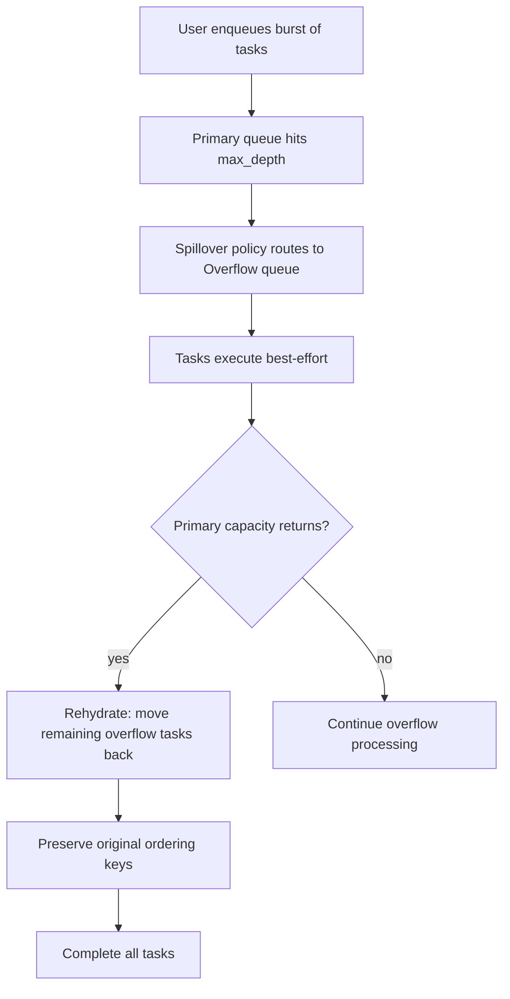

### US13) "Idle GPU agent steals compatible work from CPU pool"

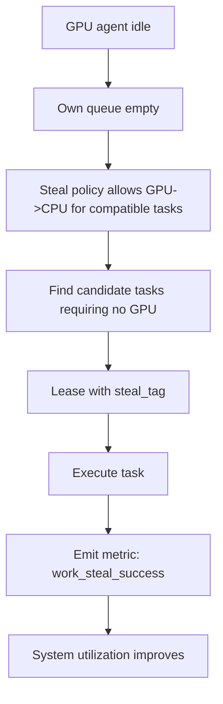

### US14) "Batch 1,000 small embedding tasks into batches of 50"

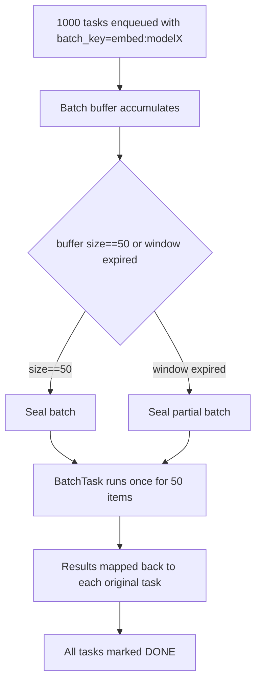

### US15) "Run database migration only during maintenance window"

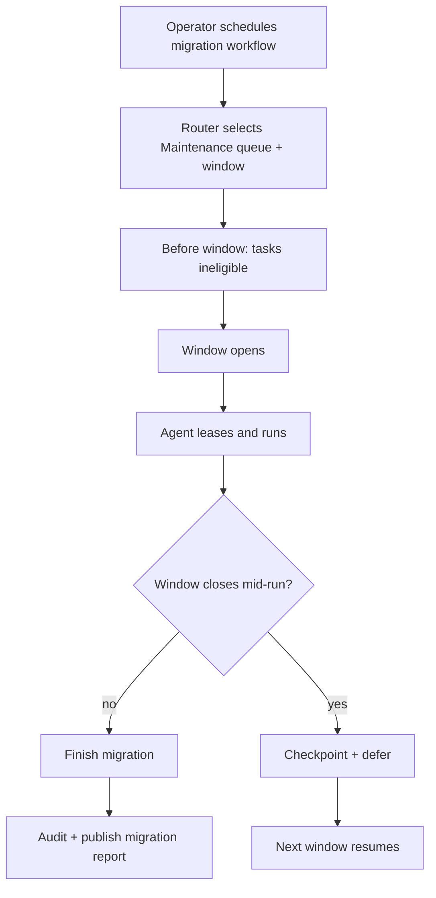

### US16) "Upgrade schema; old workflows migrate on load; invalid ones quarantined"

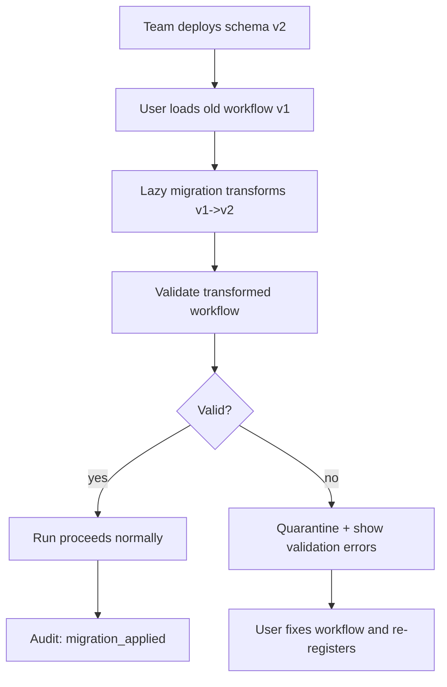

### US17) "Exactly-once external API write despite retries"

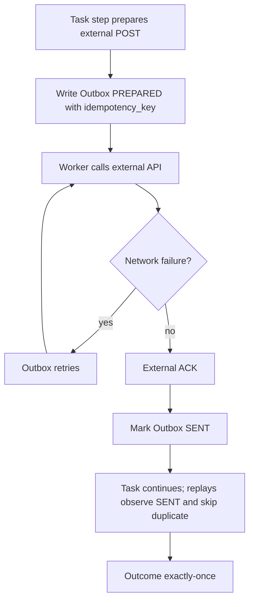

### US18) "Cancel a run; queued tasks removed; running tasks checkpoint and stop"

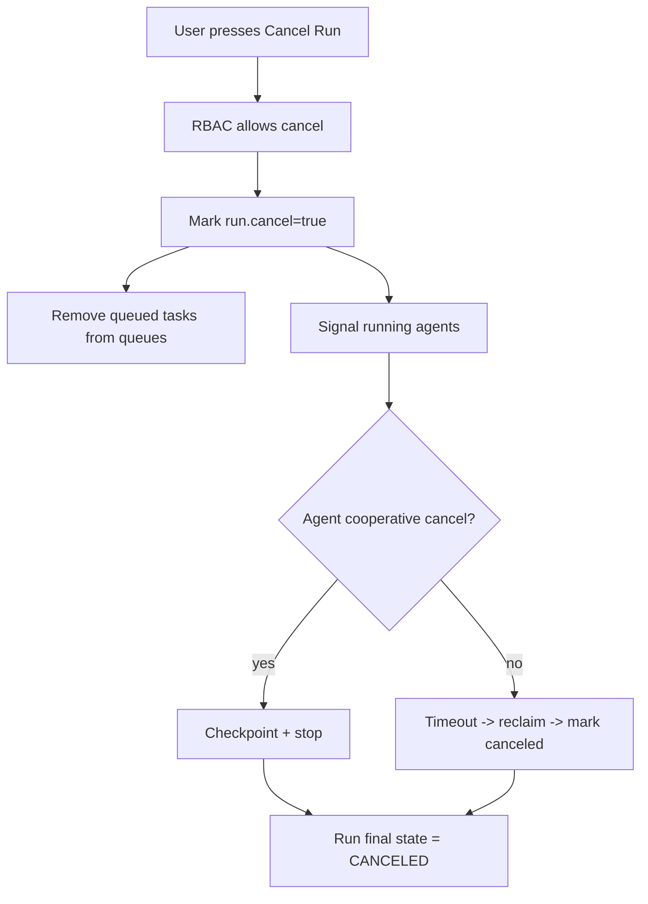

### US19) "Pause a run mid-flight; later resume without losing ordering"

```mermaid
flowchart TD
  A[Operator pauses run for investigation] --> B[Mark run.paused=true]
  B --> C[Queued tasks become ineligible]
  B --> D[Running task finishes or checkpoints (policy)]
  D --> E[System holds stable ordering keys]
  E --> F[Operator resumes run]
  F --> G[Mark run.paused=false]
  G --> H[Tasks regain eligibility]
  H --> I[Backlog continues deterministically]
```

### US20) "Alert on DLQ spike; auto-mitigate by pausing risky queue and scaling pool"

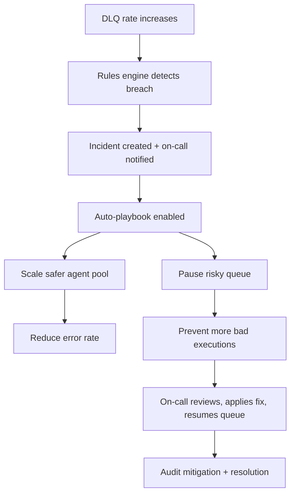

If you want, I can also output these as **one bundled "diagram pack" YAML** (each diagram as a named string field) so your coding agent can ingest them programmatically.
