# Ultimate Flow Diagrams for Agent Queue System

## 40 more flow diagrams (21–60)

### 21) Priority + aging (anti-starvation) scoring

```mermaid
flowchart TD
  A[Task queued] --> B[Compute base_priority]
  B --> C[Compute age = now - enqueue_ts]
  C --> D[age_boost = floor(age / aging_quantum) * aging_rate]
  D --> E[effective_priority = base_priority + age_boost]
  E --> F[Sort candidates by effective_priority desc]
  F --> G[Tie-break: due_ts asc, enqueue_ts asc, task_id asc]
  G --> H[Select next task]
```

### 22) Priority inversion guard (low-priority holds critical dependency)

```mermaid
flowchart TD
  A[High priority task H depends on L] --> B[L is low priority]
  B --> C[Detect: blocked_by_lower_priority]
  C --> D[Temporarily boost L priority to H-ε]
  D --> E[Route L to higher queue tier (optional)]
  E --> F[Execute L]
  F --> G[Unblock H]
  G --> H[Restore L original priority (post-complete)]
```

### 23) Deadline escalation (overdue items get promoted)

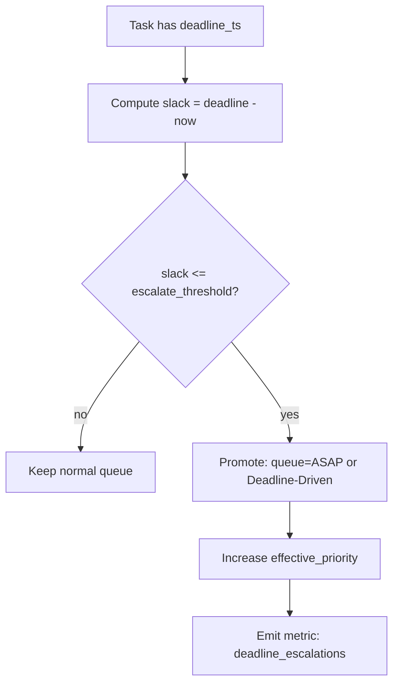

### 24) Overdue handling policy (drop vs run vs notify)

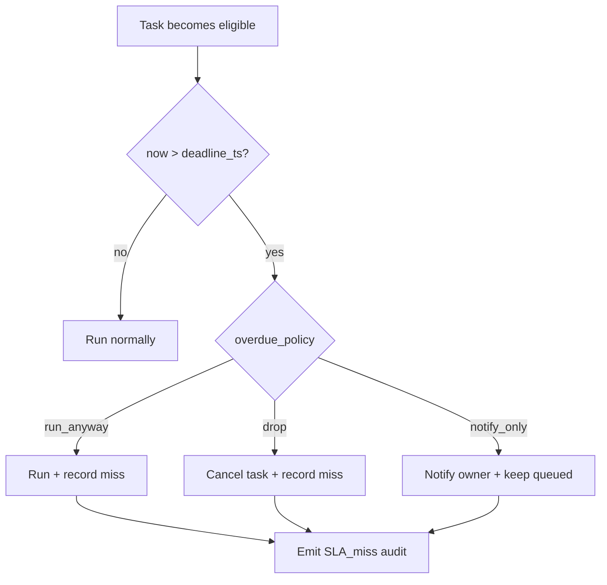

### 25) Rate-limited execution with token bucket

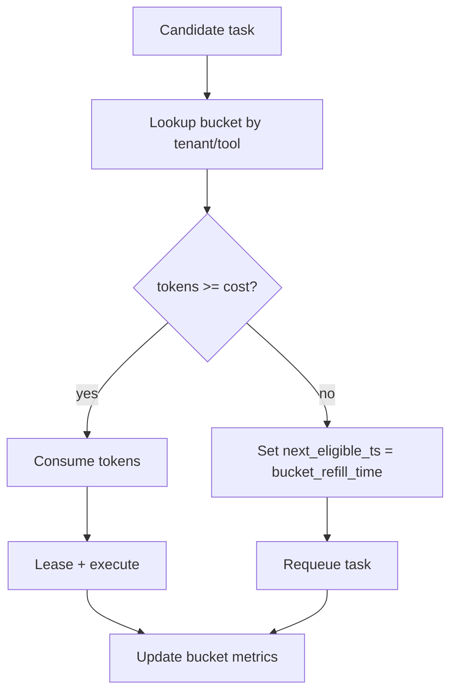

### 26) Per-tenant fair share (min_share + max_burst)

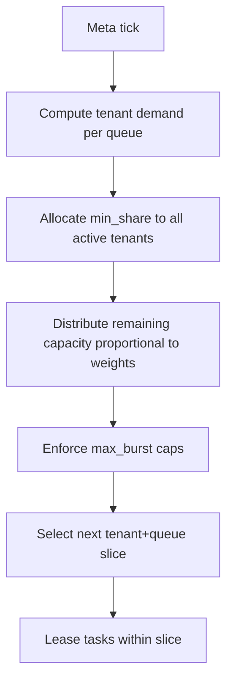

### 27) Queue sharding (partition by hash to scale)

```mermaid
flowchart TD
  A[Task enqueue] --> B[Compute shard = hash(routing_key) % N]
  B --> C[Append to shard queue Q[shard]]
  C --> D[Shard worker consumes Q[shard]]
  D --> E[Lease + execute]
  E --> F[Shard-local ordering rules apply]
```

### 28) Hot-shard mitigation (rebalance shards)

```mermaid
flowchart TD
  A[Monitor shard depths] --> B{Shard i much deeper than others?}
  B -->|no| C[No rebalance]
  B -->|yes| D[Split shard i into iA + iB]
  D --> E[Update shard mapping function (versioned)]
  E --> F[Move queued tasks by routing_key]
  F --> G[Gradually drain old shard mapping]
  G --> H[Emit audit: shard_rebalance]
```

### 29) Agent pool autoscaling (queue depth → scale)

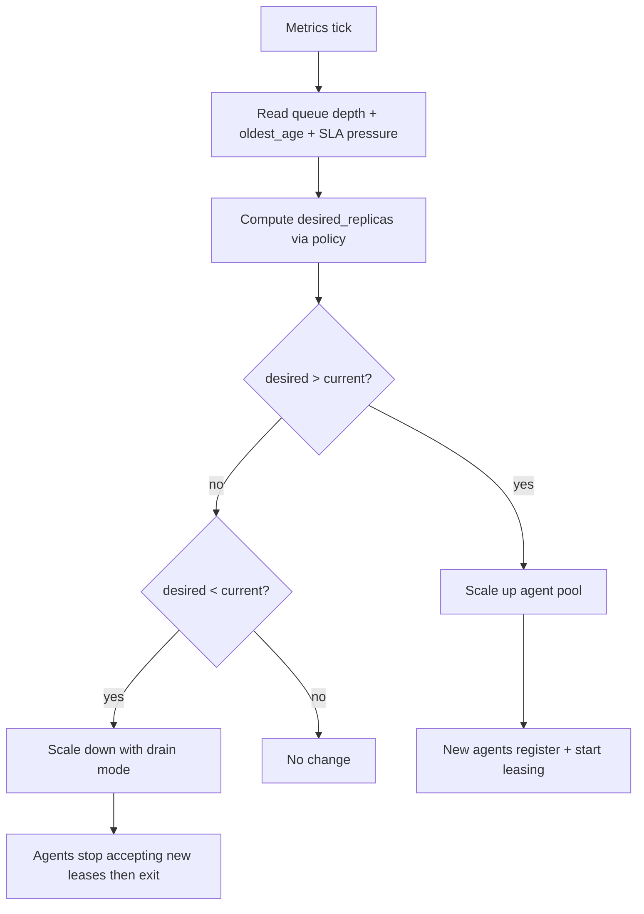

### 30) Graceful agent shutdown (drain + lease release)

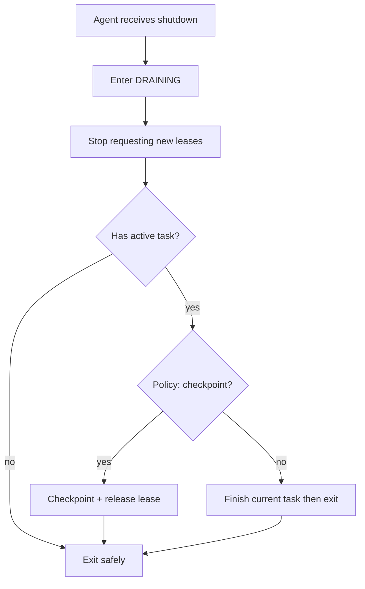

### 31) Capability matching (hard constraints + soft preferences)

```mermaid
flowchart TD
  A[Task requires capabilities] --> B[Filter agent pools by hard constraints]
  B --> C{Any pool matches?}
  C -->|no| D[Block task: UNSATISFIABLE_REQUIREMENTS]
  C -->|yes| E[Score pools by soft prefs (cost/latency/affinity)]
  E --> F[Select best pool]
  F --> G[Route task to pool queue]
```

### 32) Sandbox enforcement (deny-by-default tool policy)

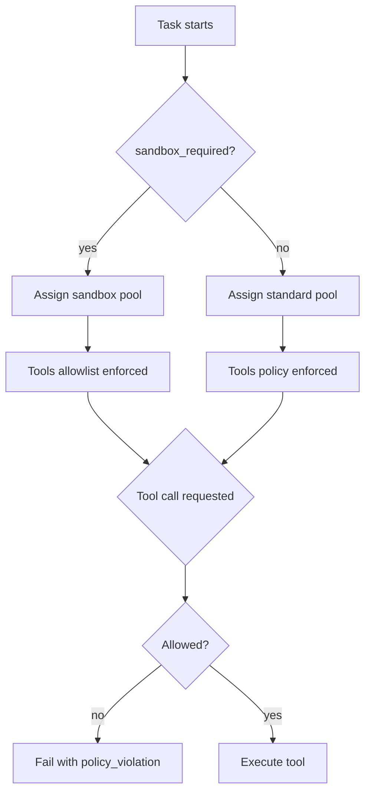

### 33) Secrets resolution (references only)

```mermaid
flowchart TD
  A[Task execution init] --> B[Read secrets refs from workflow]
  B --> C[RBAC check for secret scope]
  C --> D{Authorized?}
  D -->|no| E[Fail task: SECRET_ACCESS_DENIED]
  D -->|yes| F[Fetch secret material]
  F --> G[Inject into runtime env (masked)]
  G --> H[Ensure logs redact secret patterns]
```

### 34) RBAC decision path (least privilege)

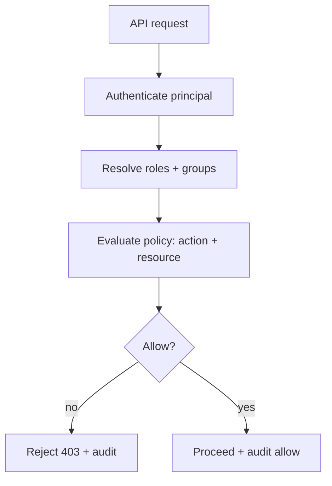

### 35) Audit event schema (immutable log)

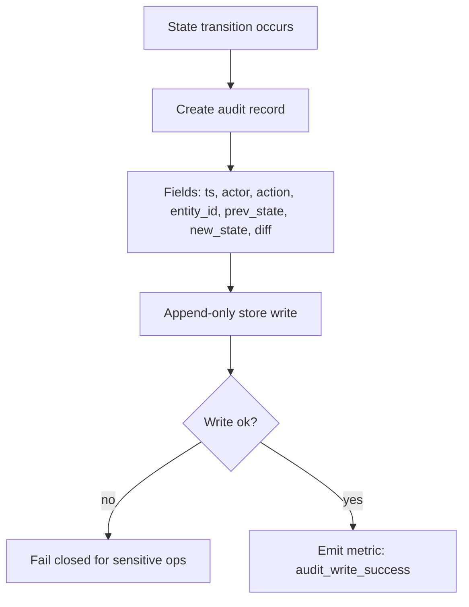

### 36) Deterministic replay mode (record decisions)

```mermaid
flowchart TD
  A[Run starts in deterministic=true] --> B[Load decision log if replay]
  B --> C{Decision needed? (routing/random/tool choice)}
  C -->|no| D[Continue]
  C -->|yes| E{Replay available?}
  E -->|yes| F[Use recorded decision]
  E -->|no| G[Compute decision deterministically]
  G --> H[Record decision to log]
  F --> D
  H --> D
```

### 37) DAG cycle detection (dependency validation)

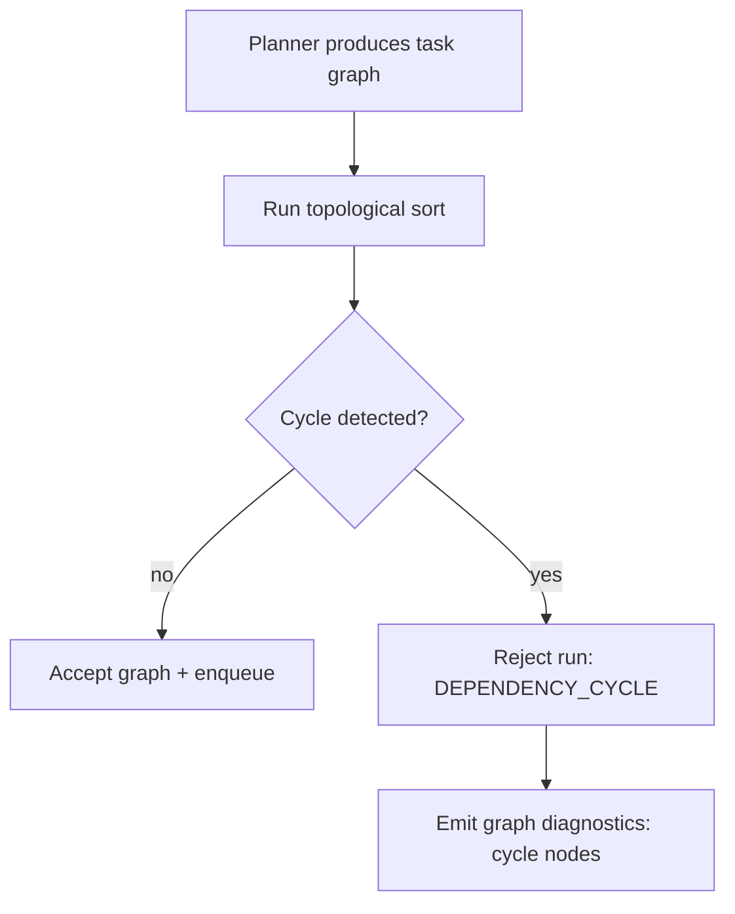

### 38) Fan-out / fan-in pattern (map-reduce workflow)

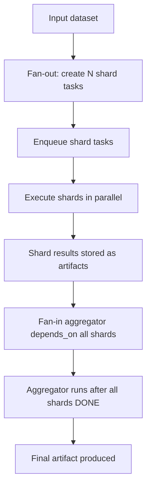

### 39) Dynamic task generation (agent creates new tasks mid-run)

```mermaid
flowchart TD
  A[Task running] --> B[Discovers additional work items]
  B --> C[Generate child tasks list]
  C --> D[Validate child tasks against schema + quotas]
  D --> E{Valid/admitted?}
  E -->|no| F[Fail parent or defer (policy)]
  E -->|yes| G[Enqueue child tasks]
  G --> H[Parent waits on children (optional)]
  H --> I[Parent continues/finishes]
```

### 40) Subworkflow invocation (child run)

```mermaid
flowchart TD
  A[Parent workflow step] --> B[Invoke subworkflow by id+version]
  B --> C[Create Child Run]
  C --> D[Parent step waits for child completion]
  D --> E{Child outcome}
  E -->|success| F[Parent continues]
  E -->|fail| G[Parent fails or retries (policy)]
  E -->|canceled| H[Propagate cancel up/down (policy)]
```

### 41) Partial retry (retry only failed steps)

```mermaid
flowchart TD
  A[Task fails at step k] --> B[Record step statuses 1..k]
  B --> C{Retry policy allows partial?}
  C -->|no| D[Retry whole task from step 1]
  C -->|yes| E[Resume from step k with checkpoint inputs]
  E --> F[Run remaining steps]
  F --> G[Mark task DONE]
```

### 42) Partial results handling (best-effort batch)

```mermaid
flowchart TD
  A[BatchTask executes members] --> B[Process member i]
  B --> C{Member success?}
  C -->|yes| D[Store result i]
  C -->|no| E[Classify error i]
  E --> F{Retryable?}
  F -->|yes| G[Requeue member i as standalone task]
  F -->|no| H[Mark member i FAILED + reason]
  D --> I{More members?}
  H --> I
  G --> I
  I -->|yes| B
  I -->|no| J[BatchTask completes with mixed outcomes]
```

### 43) Admission control (PENDING_ADMISSION state)

```mermaid
flowchart TD
  A[Enqueue request] --> B[Check system pressure + quotas]
  B --> C{Admit now?}
  C -->|yes| D[Task -> QUEUED]
  C -->|no| E[Task -> PENDING_ADMISSION]
  E --> F[Periodic admission scan]
  F --> G{Pressure reduced?}
  G -->|no| H[Remain pending]
  G -->|yes| I[Promote to QUEUED preserving ordering intent]
```

### 44) Queue pause at category level (ASAP paused, others continue)

```mermaid
flowchart TD
  A[Operator pauses ASAP queue] --> B[Audit action]
  B --> C[Meta-scheduler excludes ASAP]
  C --> D[Scheduled/Whenever still eligible]
  D --> E[Agents lease from remaining queues]
  E --> F[ASAP tasks accumulate]
  F --> G[Resume ASAP]
  G --> H[Meta-scheduler includes ASAP again]
```

### 45) System-wide safe mode (deny new risky tasks)

```mermaid
flowchart TD
  A[Incident declared] --> B[Enable SAFE_MODE=true]
  B --> C[Admission control checks risk_tier]
  C --> D{risk_tier high?}
  D -->|yes| E[Reject or Human-Gate new tasks]
  D -->|no| F[Allow enqueue]
  E --> G[Notify + audit]
  F --> H[Continue processing low-risk tasks]
```

### 46) DLQ triage pipeline (classify → cluster → propose fix)

```mermaid
flowchart TD
  A[DLQ entry created] --> B[Extract error signature]
  B --> C[Cluster by signature + workflow_version]
  C --> D[Assign owner/team]
  D --> E[Propose action: fix config / fix code / increase limits]
  E --> F{Operator decision}
  F -->|requeue| G[Requeue with override]
  F -->|close| H[Mark resolved + link RCA]
  F -->|escalate| I[Create incident]
```

### 47) Requeue with override guardrails (safe override)

```mermaid
flowchart TD
  A[Operator requests override requeue] --> B[RBAC verify override permission]
  B --> C[Validate override fields within bounds]
  C --> D{Valid?}
  D -->|no| E[Reject + audit]
  D -->|yes| F[Create new task instance linked_to prior]
  F --> G[Apply overrides: priority/queue/bypass_deps]
  G --> H[Enqueue new task]
  H --> I[Audit: override_applied]
```

### 48) Cancellation propagation in DAG (tree walk)

```mermaid
flowchart TD
  A[Cancel node X] --> B[Find downstream dependents]
  B --> C{Propagation mode}
  C -->|none| D[Only cancel X]
  C -->|downstream| E[Cancel all dependents]
  C -->|upstream| F[Cancel prerequisites (rare)]
  C -->|both| G[Cancel upstream + downstream]
  E --> H[Mark dependents CANCELED if not terminal]
  D --> I[Audit cancel graph]
  F --> I
  G --> I
```

### 49) Reprioritize while queued (stable ordering keys)

```mermaid
flowchart TD
  A[Task QUEUED] --> B[Operator changes priority]
  B --> C[Write new priority + audit]
  C --> D[Recompute effective_priority]
  D --> E[Reinsert into priority structure preserving tie-break rules]
  E --> F[Meta-scheduler sees updated rank]
```

### 50) Scheduled window enforcement (hard gating)

```mermaid
flowchart TD
  A[Task in Scheduled-Window] --> B{Now within window?}
  B -->|yes| C[Eligible -> can be leased]
  B -->|no| D[Ineligible]
  D --> E[Compute next window start]
  E --> F[Set next_eligible_ts]
  F --> G[Remain queued]
```

### 51) Cron slot identity + dedupe (schedule_slot_id)

```mermaid
flowchart TD
  A[Scheduler tick] --> B[Compute current slot by cron + timezone]
  B --> C[slot_id = hash(schedule_id + slot_time)]
  C --> D{slot_id already created?}
  D -->|yes| E[No-op (dedup)]
  D -->|no| F[Create Run for slot_id]
  F --> G[Enqueue tasks]
```

### 52) Repeat fixed-delay non-overlap (single active instance)

```mermaid
flowchart TD
  A[Run instance completes] --> B[Compute next_due = now + delay]
  B --> C{Overlap allowed?}
  C -->|no| D[Ensure no active run exists]
  D --> E[Create next run with due_ts=next_due]
  C -->|yes| F[Create regardless of active instances]
  E --> G[Scheduled-Once queue]
  F --> G
```

### 53) Backpressure policy (drop vs degrade)

```mermaid
flowchart TD
  A[Queue depth rising] --> B{Depth > warn?}
  B -->|no| C[Normal]
  B -->|yes| D[Emit warning + autoscale signal]
  D --> E{Depth > hard_limit?}
  E -->|no| F[Throttle admissions]
  E -->|yes| G{Drop policy}
  G -->|drop_low| H[Drop droppable tasks]
  G -->|reject_new| I[Reject new enqueue]
  G -->|spillover| J[Spill to overflow queue]
```

### 54) Exact-once within internal state transitions (compare-and-swap)

```mermaid
flowchart TD
  A[Agent reports completion] --> B[Load task state_version]
  B --> C[Attempt CAS update: version -> version+1]
  C --> D{CAS success?}
  D -->|yes| E[Apply terminal state + write audit]
  D -->|no| F[Detect duplicate/late report]
  F --> G[Ignore or reconcile based on state]
```

### 55) Multi-region replication (durable state + failover)

```mermaid
flowchart TD
  A[Primary region writes state] --> B[Replicate to secondary]
  B --> C{Replication lag acceptable?}
  C -->|yes| D[Continue]
  C -->|no| E[Reduce admissions / safe mode]
  D --> F{Primary outage?}
  F -->|no| G[Normal ops]
  F -->|yes| H[Promote secondary to primary]
  H --> I[Agents reconnect + resume leasing]
```

### 56) Disaster recovery restore (rebuild queues from state log)

```mermaid
flowchart TD
  A[Restore initiated] --> B[Load durable state store snapshot]
  B --> C[Replay audit/state log forward]
  C --> D[Reconstruct tasks by state]
  D --> E[Re-enqueue QUEUED tasks]
  D --> F[Reclaim LEASED tasks with expired leases]
  D --> G[Preserve terminal tasks as DONE/FAILED/CANCELED]
  E --> H[Resume schedulers + meta-scheduler]
```

### 57) CI pipeline for workflow.yml (lint → validate → register)

```mermaid
flowchart TD
  A[PR opened] --> B[Lint YAML formatting]
  B --> C{Lint ok?}
  C -->|no| D[Fail CI]
  C -->|yes| E[Schema validate]
  E --> F{Valid?}
  F -->|no| G[Fail CI with error list]
  F -->|yes| H[Dry-run planner expansion]
  H --> I{Graph valid? cycles?}
  I -->|no| J[Fail CI with diagnostics]
  I -->|yes| K[Register workflow to registry on merge]
```

### 58) Policy overlay resolution (env + tenant + queue + workflow)

```mermaid
flowchart TD
  A[Base policy] --> B[Apply environment overlay]
  B --> C[Apply tenant overlay]
  C --> D[Apply queue-level overlay]
  D --> E[Apply workflow-level overrides (bounded)]
  E --> F[Compute effective policy]
  F --> G[Use effective policy in routing/exec]
```

### 59) Local-model optimization: chunking planner for long tasks

```mermaid
flowchart TD
  A[Large task input detected] --> B[Estimate token footprint]
  B --> C{Exceeds context_budget?}
  C -->|no| D[Run as single task]
  C -->|yes| E[Split into chunks by deterministic rule]
  E --> F[Create chunk tasks with chunk_id + ranges]
  F --> G[Fan-in summarizer depends_on chunks]
  G --> H[Summarizer produces final output]
```

### 60) Prompt/tool gating by risk tier (agentic safety control)

```mermaid
flowchart TD
  A[Task has risk_tier] --> B{risk_tier}
  B -->|low| C[Tools allow broad set]
  B -->|medium| D[Require allowlist + logging]
  B -->|high| E[Human gate + sandbox + limited tools]
  C --> F[Execute]
  D --> F
  E --> G[Wait for approval]
  G --> H{Approved?}
  H -->|no| I[Cancel task]
  H -->|yes| F
```

---

If you want to "ultimate handoff pack," I can output **all 60 diagrams** as a single **machine-ingestible YAML** object (diagram_id → title → mermaid_string) so your coding agent can auto-render, index, and map each diagram to implementation modules.
