# Flow Diagrams for Agent Queue System

Below are **20 LLM-readable flow diagrams in Mermaid**: **10 system-level** diagrams (how the whole queue + YAML workflow system works) and **10 user-story** diagrams (end-to-end stories). Copy/paste directly to your coding agent.

---

## System flow diagrams (1–10)

### 1) End-to-end: YAML workflow → queued tasks → execution → completion

```mermaid
flowchart TD
  A[Author/CI produces workflow.yml] --> B[Registry stores workflow_version + schema_version]
  B --> C[Trigger creates Run]
  C --> D[Planner expands Run into Tasks/Steps]
  D --> E[Router assigns Queue Level<br/>(ASAP/Whenever/Scheduled/Repeat/etc.)]
  E --> F[Enqueue Task -> QUEUED]
  F --> G[Meta-scheduler selects next queue]
  G --> H[Agent claims Task via Lease -> LEASED]
  H --> I[Agent executes Steps -> RUNNING]
  I --> J{Step outcome}
  J -->|success| K[Update state -> DONE]
  J -->|retryable fail| L[Retry policy -> backoff -> QUEUED]
  J -->|non-retryable fail| M[FAILED or DLQ]
  K --> N{More tasks in Run?}
  N -->|yes| D
  N -->|no| O[Finalize Run -> DONE/FAILED]
```

### 2) Workflow intake + strict validation + normalization

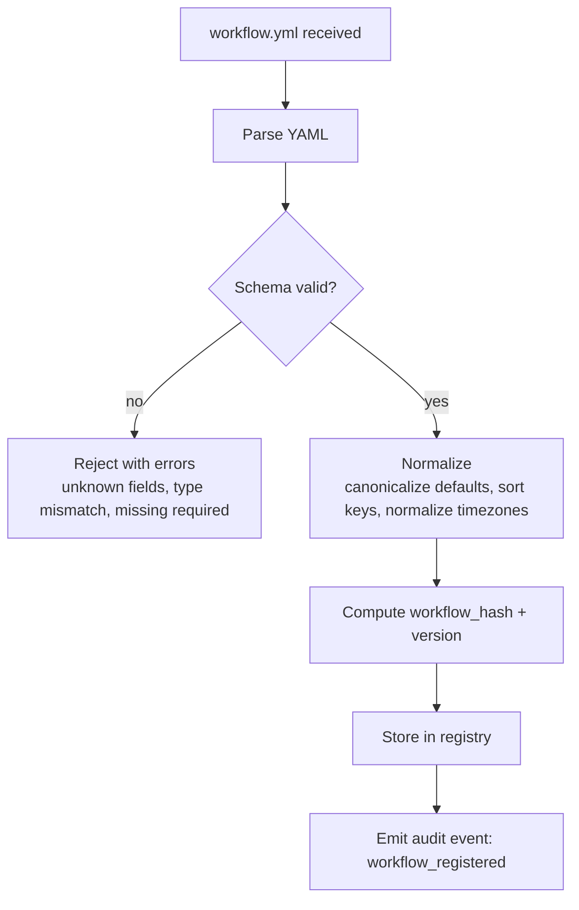

### 3) Triggering model: event trigger + schedule trigger + manual trigger

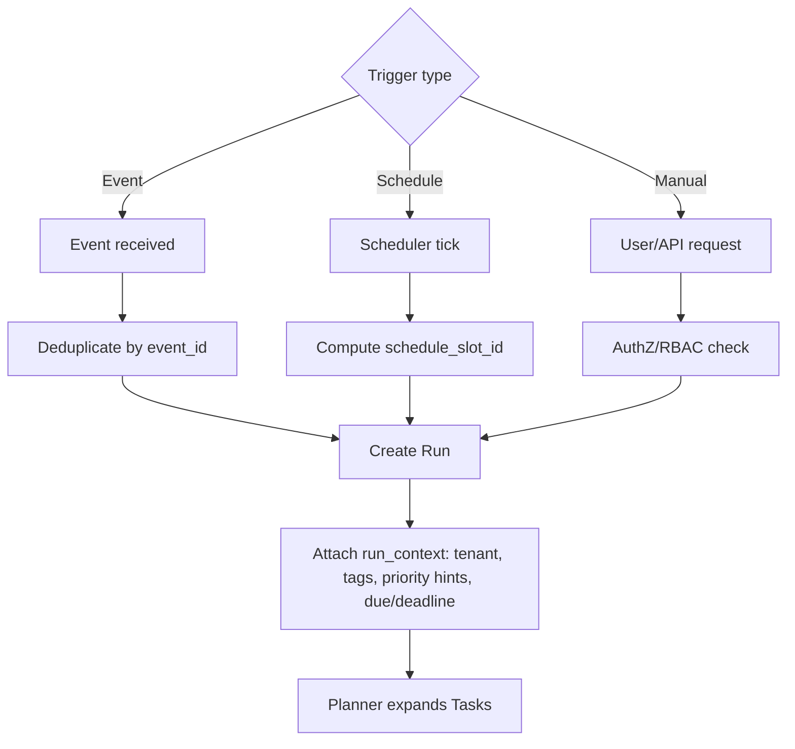

### 4) Router: determine queue category (ASAP / Whenever / Scheduled / Repeat / etc.)

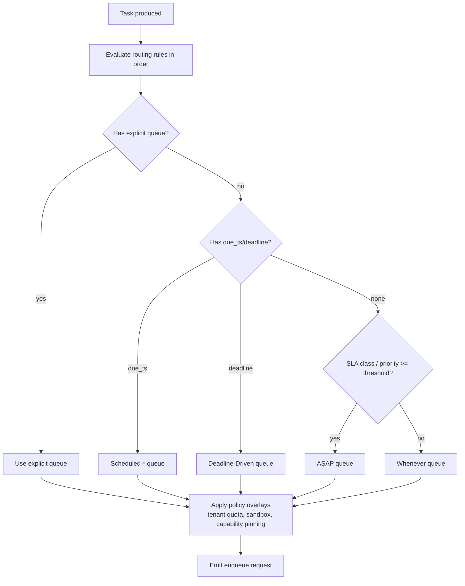

### 5) Meta-scheduler (queue-of-queues): choose which queue to pull from next

```mermaid
flowchart TD
  A[Meta-scheduler tick] --> B[Fetch queue snapshots<br/>depth, oldest_age, SLA_pressure, due_items]
  B --> C[Apply hard gates<br/>paused queues, maintenance windows, quota blocks]
  C --> D{Strategy}
  D -->|WRR| E[Weighted round robin]
  D -->|DRR| F[Deficit round robin]
  D -->|Priority+aging| G[Compute effective_priority = priority + age_boost]
  D -->|EDF| H[Pick earliest due/deadline]
  E --> I[Select queue Q]
  F --> I
  G --> I
  H --> I
  I --> J[Emit "next_queue = Q" to dispatcher]
```

### 6) Lease + heartbeat + reclaim (crash-safe claiming)

```mermaid
flowchart TD
  A[Agent requests work] --> B[Dispatcher selects queue from meta-scheduler]
  B --> C[Pop candidate task]
  C --> D{Eligible now? (due_ts passed, gate satisfied, quota ok)}
  D -->|no| E[Defer task -> stays queued]
  D -->|yes| F[Create lease: lease_id + ttl]
  F --> G[Set task.state = LEASED]
  G --> H[Agent executes + sends heartbeats]
  H --> I{Heartbeat received before ttl?}
  I -->|yes| J[Extend lease ttl + progress update]
  I -->|no| K[Lease expires]
  K --> L[Reclaim task -> QUEUED]
  L --> M[Increment lease_expiry metric + audit]
```

### 7) Task execution engine: steps, tools, checkpoints, artifacts

```mermaid
flowchart TD
  A[Task LEASED] --> B[Initialize execution context<br/>trace_id, secrets refs, tools policy]
  B --> C{Sandbox required?}
  C -->|yes| D[Run in sandbox pool]
  C -->|no| E[Run in standard pool]
  D --> F[Execute step loop]
  E --> F
  F --> G[Step: prepare inputs]
  G --> H{Tool allowed by policy?}
  H -->|no| I[Fail step: policy_violation]
  H -->|yes| J[Invoke tool / code]
  J --> K[Checkpoint state (optional)]
  K --> L[Store artifacts + logs]
  L --> M{More steps?}
  M -->|yes| F
  M -->|no| N[Return outcome to orchestrator]
```

### 8) Retry + backoff + DLQ decisioning

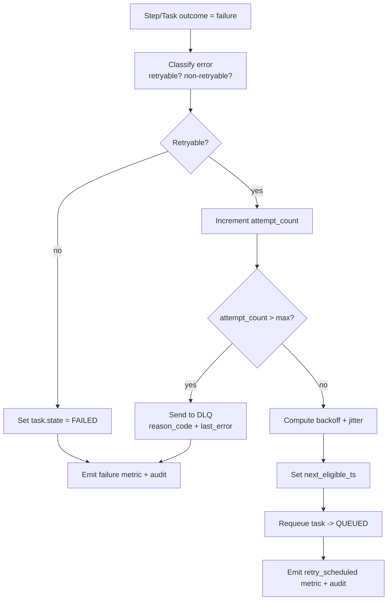

### 9) Time-based semantics: Scheduled / Repeat / Catchup policies

```mermaid
flowchart TD
  A[Scheduler service tick] --> B[Load repeat definitions]
  B --> C[For each schedule]
  C --> D[Compute slots since last_run]
  D --> E{Catchup policy}
  E -->|none| F[Create only next future slot]
  E -->|latest| G[Create only most recent missed slot]
  E -->|all| H[Create all missed slots]
  E -->|bounded(n)| I[Create up to n missed slots]
  F --> J[Create Run + due_ts]
  G --> J
  H --> J
  I --> J
  J --> K[Enqueue tasks into Scheduled-* queue]
  K --> L[Ensure: no execution before due_ts]
```

### 10) Governance gates: RBAC, quotas, rate limits, human approval, overrides

```mermaid
flowchart TD
  A[Action requested<br/>enqueue/cancel/requeue/override] --> B[AuthN]
  B --> C[RBAC check]
  C --> D{Authorized?}
  D -->|no| E[Reject + audit]
  D -->|yes| F{Quota available?}
  F -->|no| G[Block + notify + audit]
  F -->|yes| H{Rate limit ok?}
  H -->|no| I[Throttle/Defer]
  H -->|yes| J{Human approval gate required?}
  J -->|yes| K[Create approval task -> Human-Gated]
  J -->|no| L{Override requested?}
  L -->|yes| M[Apply override (reprioritize/requeue/bypass deps)<br/>audit always]
  L -->|no| N[Proceed normally]
  K --> O[Upon approval -> eligible]
  M --> P[Emit operator_override metric]
  N --> Q[Continue workflow]
```

---

## User-story flow diagrams (1–10)

### US1) "Enqueue an ASAP task and have it execute immediately"

```mermaid
flowchart TD
  A[User submits request: "run now"] --> B[API AuthN/AuthZ]
  B --> C[Create Run]
  C --> D[Planner creates Task(s)]
  D --> E[Router picks ASAP queue]
  E --> F[Task QUEUED]
  F --> G[Meta-scheduler selects ASAP due to weight/priority]
  G --> H[Agent leases task]
  H --> I[Execute steps]
  I --> J[Task DONE]
  J --> K[Run DONE]
  K --> L[Notify user + store artifacts]
```

### US2) "Enqueue Whenever background job that only uses idle capacity"

```mermaid
flowchart TD
  A[User submits: "backfill/index later"] --> B[AuthZ OK]
  B --> C[Router selects Whenever]
  C --> D[Task QUEUED in Whenever]
  D --> E{System under load?}
  E -->|yes| F[ASAP/Scheduled consume capacity first]
  E -->|no| G[Whenever becomes eligible]
  G --> H[Agent leases Whenever task]
  H --> I[Run batch-friendly steps]
  I --> J[Done + metrics]
```

### US3) "Schedule a one-time job for a specific due time"

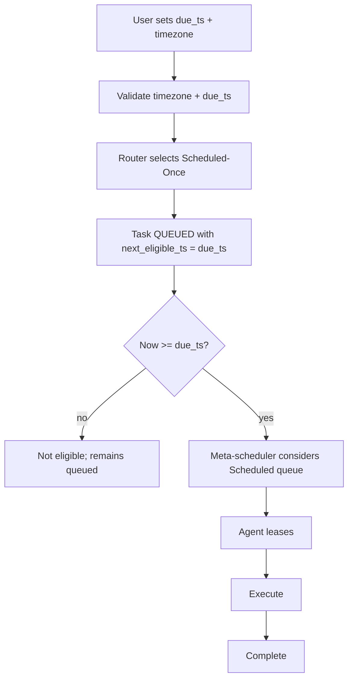

### US4) "Create a Repeat-Cron workflow with catchup=latest"

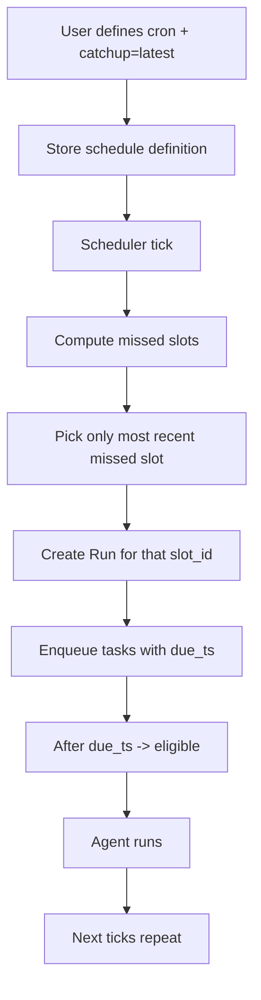

### US5) "Task depends on another task; dependency blocks leasing until done"

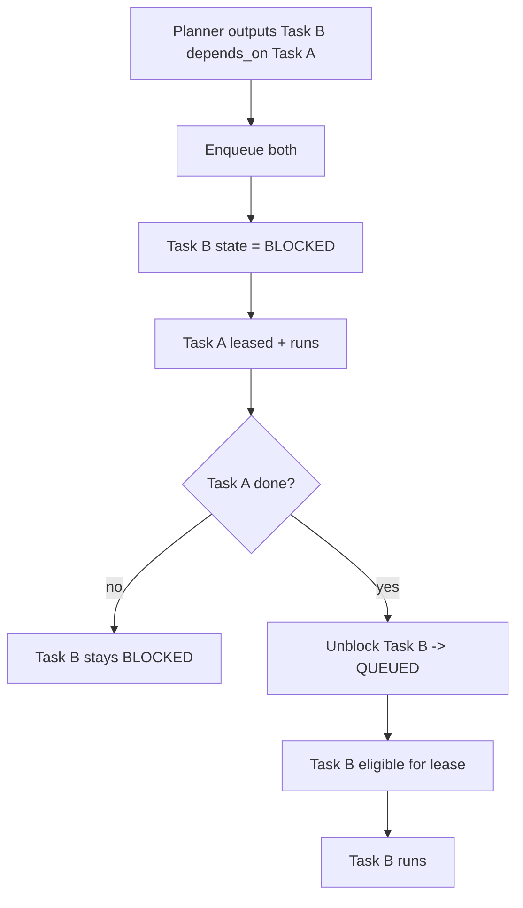

### US6) "Agent crashes mid-task; lease expires; task is reclaimed and retried"

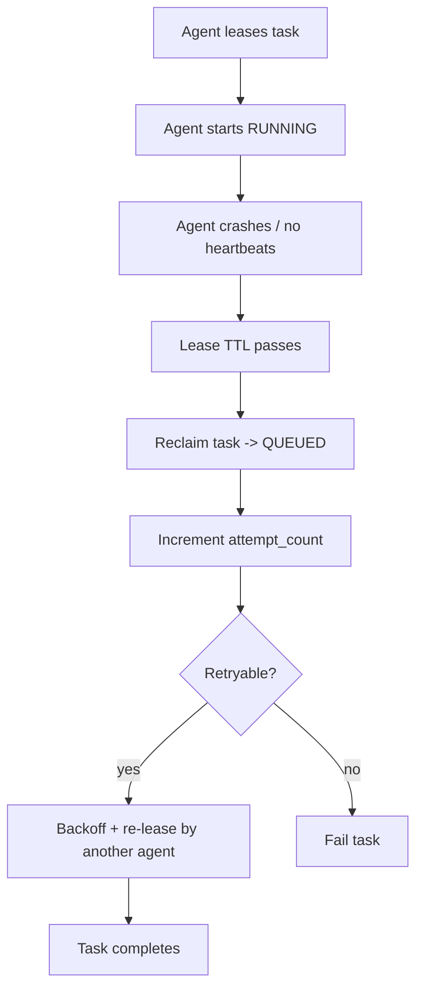

### US7) "Retry exhausts; task moves to DLQ; operator requeues with override"

```mermaid
flowchart TD
  A[Task fails repeatedly] --> B[attempt_count reaches max]
  B --> C[Move to DLQ with reason_code]
  C --> D[Operator reviews DLQ entry]
  D --> E[RBAC check]
  E --> F[Operator chooses requeue]
  F --> G[Apply override: priority boost + queue=ASAP]
  G --> H[Create new task instance (linked to DLQ entry)]
  H --> I[ASAP executes]
  I --> J[Audit trail preserved]
```

### US8) "Human approval gate blocks execution until approved"

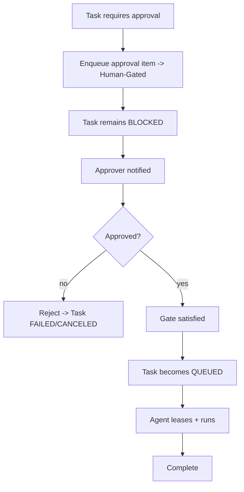

### US9) "Tenant quota exceeded; enqueue blocked; later succeeds when quota frees"

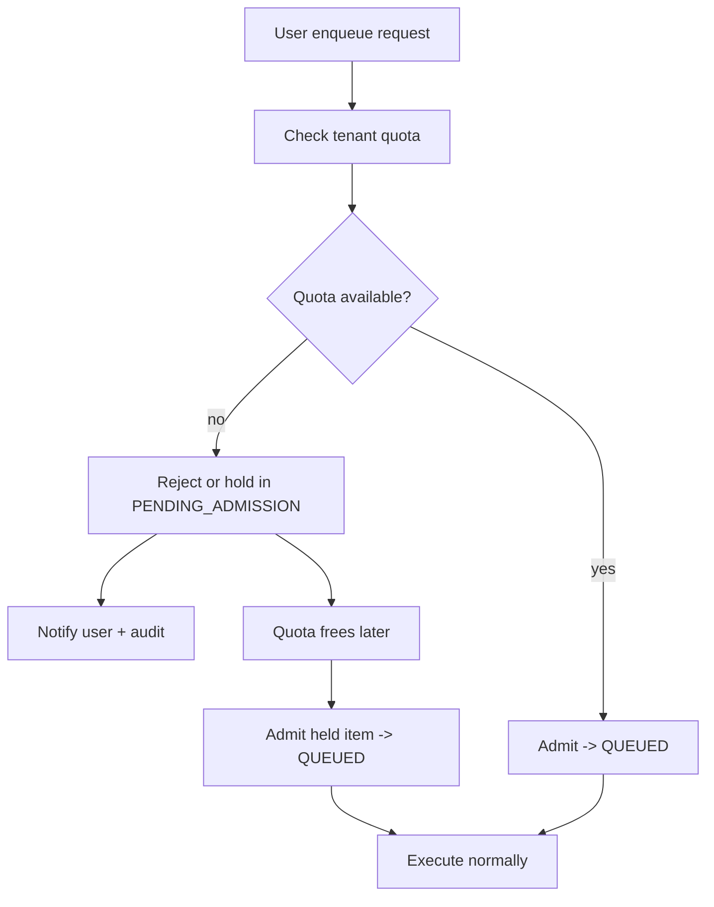

### US10) "Operator pauses a queue; tasks stop leasing; later resumes"

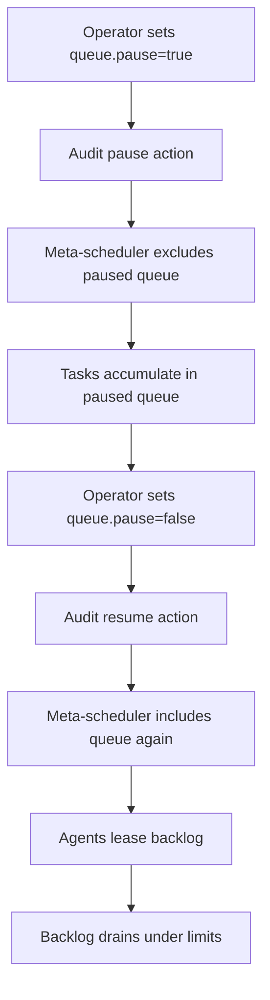

---

If you want, I can also produce **10 additional diagrams** specifically for: **cost-aware scheduling**, **spillover queues**, **work stealing**, **batch formation**, **maintenance windows**, **schema migration**, **exactly-once outcome (outbox/inbox)**, **cancellation propagation**, **pause/resume at run-level**, and **observability/alerting loops**—but above meets your "at least 10 + 10" requirement and is ready to hand to a coding agent.
