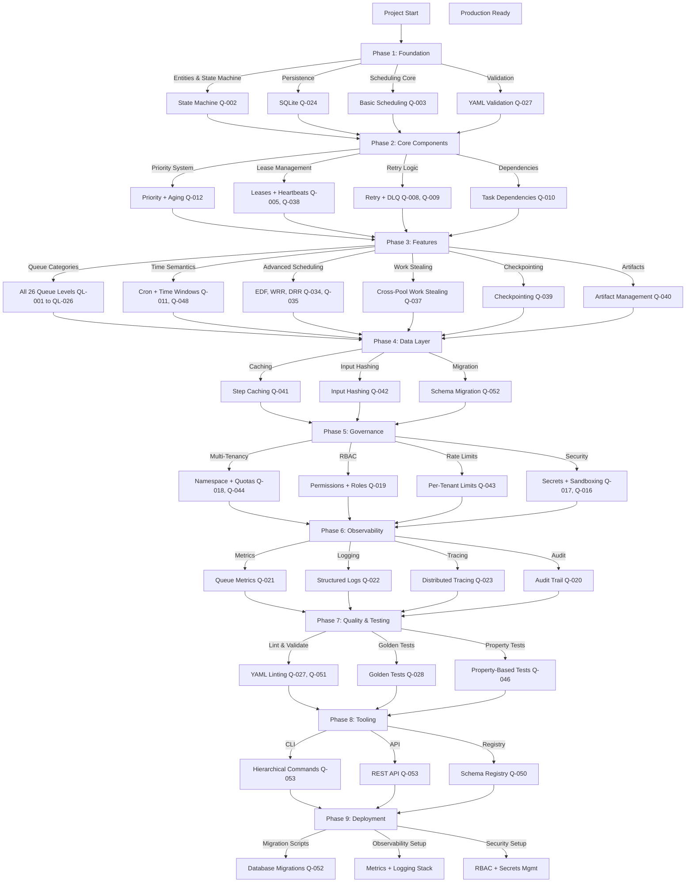

# Agent Queue System - Requirements & Roadmap Summary

> **Purpose**: Summarize requirements and roadmap through 3 representative user stories showing queue orchestration requirements in action.
>
> **Important**: Agent Queue delegates workflow execution to yaml-to-rust-agentsdk. This document focuses on queue orchestration requirements only.

---

## 📖 Three Representative User Stories

### Story 1: Emergency Incident Response (ASAP Queue)

**Scenario**: Production API is returning 500 errors. DevOps team enqueues an urgent diagnostic workflow with critical priority.

**User Journey**:
1. DevOps enqueues workflow via CLI: `agent-queue enqueue workflow:incident-diagnosis.yml --priority=critical --queue=asap`
2. System validates queue configuration (Q-027) and workflow schema (via transpiler validation)
3. Router evaluates routing rules (Q-032) → assigns to **ASAP** queue (QL-001)
4. Meta-scheduler selects ASAP queue first (QL-021) due to priority=10 (Q-012)
5. Queue engine claims task via lease (Q-005) with 60s TTL (Q-038)
6. Queue engine dispatches to transpiler for execution → RUNNING → DONE (Q-002)
7. System emits audit event (Q-020) and metrics (Q-021)

**Requirements Used**:
- Q-001 (Entities), Q-002 (State Machine), Q-003 (Ordering)
- Q-005 (Leases), Q-012 (Priority), Q-027 (Validation - queue config only)
- Q-032 (Queue Routing), Q-038 (Heartbeats)
- Q-020 (Audit), Q-021 (Observability)
- **DELEGATED**: Workflow execution to transpiler (no Q requirements for this)

---

### Story 2: Scheduled Backup Job (Repeat-Cron Queue)

**Scenario**: Nightly backup workflow runs every day at 2am with SLA of 6 hours.

**User Journey**:
1. YAML defines: `schedule: {cron: "0 2 * * *", catchup: bounded(5)}` (Q-011, Q-048)
2. Cron scheduler creates run instance per slot (Q-011)
3. Router assigns to **Repeat-Cron** queue (QL-007)
4. Due time triggers execution at 2am Chicago timezone (Q-011)
5. If no workers available → retry 3x with 60s delay (Q-008)
6. After max attempts → escalate to ASAP with priority=high (Q-011)
7. Queue engine dispatches to transpiler (handles checkpointing via transpiler)
8. Long-running task (4 hours) → extended lease via heartbeats (Q-038)
9. Completion → DONE, artifacts stored for 30 days (Q-040)
10. Metrics recorded: queue depth, latency, lease expirations (Q-021)

**Requirements Used**:
- Q-008 (Retries), Q-011 (Time), Q-038 (Heartbeats)
- **DELEGATED**: Checkpointing (Q-039) to transpiler
- Q-040 (Artifact Management - collection from transpiler)
- Q-021 (Metrics), Q-022 (Logging), Q-023 (Tracing - queue-level only)

---

### Story 3: Multi-Tenant Batch Processing (Whenever Queue)

**Scenario**: SaaS platform processes customer data batches from 10 tenants during off-hours.

**User Journey**:
1. 10 tenants each enqueue 100 batch tasks via API
2. System checks per-tenant quota (Q-044) → allows within allocation
3. Router assigns to **Whenever** queue (QL-003)
4. Meta-scheduler uses weighted round-robin (QL-034) to ensure fair share
5. Aging boost applied to prevent starvation (Q-012)
6. Work stealing enabled → idle Agent Pool B steals from overloaded Pool A (Q-037)
7. Backpressure applied → queue depth > 1000 triggers spillover (Q-007)
8. Rate limiting enforced: max 100 tasks/min per tenant (Q-043)
9. Queue engine dispatches tasks to transpiler in batches
10. Results stored → each tenant sees only their data (Q-018)

**Requirements Used**:
- Q-006 (Concurrency), Q-007 (Backpressure), Q-018 (Multi-Tenancy)
- Q-034 (Fairness), Q-037 (Work Stealing), Q-043 (Rate Limiting)
- Q-044 (Quotas), Q-012 (Priority + Aging)
- **DELEGATED**: Batch processing to transpiler, input hashing (Q-042) to transpiler

---

## 📋 Feature Requirements Cross-Reference Table

| **Requirement ID** | **Domain** | **Story 1<br>ASAP** | **Story 2<br>Scheduled** | **Story 3<br>Batch** | **Description** |
|-------------------|-------------|----------------------|------------------------|---------------------|----------------|
| **Q-001** | Entities | ✅ | ✅ | ✅ | Canonical entities: Workflow, Run, Task, Step, Agent, Queue, Lease |
| **Q-002** | State Machine | ✅ | ✅ | ✅ | Explicit lifecycle: PENDING → QUEUED → LEASED → RUNNING → DONE/FAILED/DLQ |
| **Q-003** | Ordering | ✅ | ✅ | ✅ | Stable ordering: priority, enqueue_ts, due_ts |
| **Q-004** | Idempotency | ✅ | ✅ | ✅ | Dedupe by idempotency_key + dedupe_window |
| **Q-005** | Leases | ✅ | ✅ | ✅ | Lease with TTL + heartbeat expiry |
| **Q-006** | Concurrency | 🔶 | 🔶 | ✅ | Limits at global/queue/agent/workflow scope |
| **Q-007** | Backpressure | 🔶 | 🔶 | ✅ | Queue depth limits + admission control |
| **Q-008** | Retries | 🔶 | ✅ | ✅ | Structured retry: max, backoff, jitter, retry_on |
| **Q-009** | DLQ | 🔶 | ✅ | ✅ | Exhausted retries → DLQ with triage |
| **Q-010** | Dependencies | 🔶 | 🔶 | ✅ | DAG deps + gating conditions |
| **Q-011** | Time | 🔶 | ✅ | ✅ | First-class: due_ts, schedule, timezone, cron |
| **Q-012** | Priority | ✅ | 🔶 | ✅ | Bands + aging to prevent starvation |
| **Q-018** | Multi-Tenant | 🔶 | 🔶 | ✅ | Namespace isolation + quotas |
| **Q-020** | Audit | ✅ | ✅ | ✅ | Immutable audit log: actor, action, ts, diff |
| **Q-021** | Observability | ✅ | ✅ | ✅ | Metrics: queue depth, latency, success, retries |
| **Q-022** | Logging | ✅ | ✅ | ✅ | Structured logs: trace_id, span_id, run_id, task_id |
| **Q-023** | Tracing | ✅ | ✅ | ✅ | Distributed tracing across agent steps/tools |
| **Q-024** | Storage | ✅ | ✅ | ✅ | Durable SQLite persistence for state recovery |
| **Q-025** | Exactly-Once | ✅ | ✅ | ✅ | Idempotency + durable state for correctness |
| **Q-027** | Validation | ✅ | ✅ | ✅ | Strict YAML validation with clear errors |
| **Q-032** | Queue Routing | ✅ | ✅ | ✅ | Route by policy: type, SLA, tenant, schedule |
| **Q-033** | Queue-of-Queues | ✅ | ✅ | ✅ | Meta-scheduler selects among queues |
| **Q-034** | Fairness | 🔶 | 🔶 | ✅ | WRR, DRR, priority+aging strategies |
| **Q-037** | Work Stealing | 🔶 | 🔶 | ✅ | Cross-pool task distribution |
| **Q-038** | Heartbeats | ✅ | ✅ | ✅ | Lease extension + progress reporting |
| **Q-039** | Checkpointing | 🔶 | 🔶 | 🔶 | Persist intermediate state for long tasks (DELEGATED to transpiler) |
| **Q-040** | Artifacts | 🔶 | ✅ | ✅ | Store outputs with retention policy |
| **Q-042** | Input Hashing | 🔶 | 🔶 | 🔶 | Canonical hash for caching/dedupe (DELEGATED to transpiler) |
| **Q-043** | Rate Limiting | 🔶 | 🔶 | ✅ | Per-tenant and per-tool rate limits |
| **Q-044** | Quotas | 🔶 | 🔶 | ✅ | Compute/storage quotas with enforcement |
| **Q-019** | RBAC | ✅ | 🔶 | ✅ | Role-based permissions on enqueue, cancel, inspect |
| **Q-015** | Resources | 🔶 | 🔶 | ✅ | Match tasks to agents by capabilities |

**Legend**:
- ✅ = **Core to this story** - Primary requirement for the scenario
- 🔶 = **Secondary** - Supports but not primary focus

---

## 🗺️ Roadmap Flowchart



---

## 📊 Phase Breakdown Summary

| **Phase** | **Focus** | **Duration** | **Dependencies** | **Key Deliverables** |
|-----------|-----------|-------------|-----------------|-------------------|
| **Phase 1: Foundation** | Core architecture | Week 1-2 | None | Entities, state machine, basic scheduling, persistence, validation |
| **Phase 2: Core Components** | Queue engine primitives | Week 2-3 | Phase 1 | Priority system, leases, heartbeats, retries, DLQ, dependencies |
| **Phase 3: Features** | Queue categories & advanced scheduling | Week 3 | Phase 2 | Queue levels, cron semantics, work stealing (checkpointing delegated) |
| **Phase 4: Data Layer** | Artifacts, migrations | Week 4 | Phase 3 | Artifact collection from transpiler, schema evolution |
| **Phase 5: Governance** | Multi-tenancy & security | Week 5-6 | Phase 4 | Namespace isolation, quotas, RBAC, rate limits, secrets |
| **Phase 6: Observability** | Metrics, logs, tracing | Week 6-7 | Phase 5 | Monitoring stack, audit logging, distributed tracing |
| **Phase 7: Quality** | Testing & validation | Week 7-8 | Phase 6 | Linting, golden tests, property-based tests |
| **Phase 8: Tooling** | CLI & API | Week 8-9 | Phase 7 | Command hierarchy, REST endpoints, schema registry |
| **Phase 9: Deployment** | Production setup | Week 9-10 | Phase 8 | Migration scripts, observability stack, security setup |
| **MVP Summary** | Queue orchestration only | Weeks 1-5 | None | Queue-only MVP: delegates execution to transpiler, ~5 weeks to functional queue system |

---

## 🎯 Implementation Quick Start

1. **Start Here**: `docs/requirements/requirements.md` - Full specification
2. **Visualize**: `docs/diagrams/flow-diagrams.md` - System flows (Diagrams 1-10)
3. **Trace Requirements**: Feature table above maps stories → requirements
4. **Track Progress**: Use roadmap flowchart to navigate phases sequentially
5. **Deep Dive**: See `docs/requirements/REQUIREMENTS_SUMMARY.md` for executive overview

---

## 📚 Documentation Navigation

```
agent-queue/
├── docs/
│   ├── requirements/
│   │   ├── requirements.md              # Full specification (60 requirements)
│   │   ├── agent-queue-unique-requirements.md
│   │   ├── chatgpt-requirements.md
│   │   └── REQUIREMENTS_SUMMARY.md
│   └── diagrams/
│       ├── flow-diagrams.md           # 10 system-level + 10 user stories
│       ├── flow-diagrams-extended.md    # 20 advanced patterns
│       └── flow-diagrams-ultimate.md    # 40 edge cases
└── THIS_FILE.md                         # This summary
```

---

## 🔑 Key Takeaways

1. **Three Stories Cover Queue Orchestration**:
    - Story 1 (ASAP): Urgency, priority, lease management, state transitions
    - Story 2 (Scheduled): Time semantics, cron, retries, long-running tasks
    - Story 3 (Batch): Multi-tenancy, fairness, quotas, work stealing, backpressure

2. **Requirements Traceability**:
    - Agent Queue focuses on queue orchestration (30 P0 queue requirements)
    - Workflow execution delegated to transpiler (no Q requirements for execution)
    - 15 integration requirements (IN-01 through IN-15) define transpiler coupling
    - Priority queues (Q-012), leases (Q-005), time (Q-011) most used
    - Observability (Q-020, Q-021, Q-022, Q-023) critical for all
    - **Delegated**: Checkpointing (Q-039), input hashing (Q-042), execution logic (Q-058), multi-model (Q-059)

3. **Roadmap Phases Are Sequential**:
    - Each phase depends on previous phase
    - Foundation → Components → Features → Data → Governance → Observability → Quality → Tooling → Deployment
    - MVP focuses on queue orchestration only (~5 weeks)
    - Transpiler integration enables execution without reimplementing workflow engine

4. **Implementation Guidance**:
    - Follow flowchart for phase dependencies
    - Use feature table for requirement mapping (queue requirements only)
    - Reference diagrams for visual patterns
    - Start with Phase 1 Foundation
    - Integrate with transpiler via CLI (MVP) or library API (post-MVP)
