# 🚀 Agent Queue System - Executive Summary

> 📋 **Document Version**: 1.0
> 📅 **Created**: April 2026
> 🎯 **Project**: AgentQueue - Multi-dimensional queue workflow engine
> 🔧 **Tech Stack**: Tokio current-thread + SQLite + Clap + Console

---

## 📊 Quick Overview

| **Category** | **Total Items** | **Priority Breakdown** |
|-------------|----------------|----------------------|
| 🎯 Broad Requirements | 60 | P0: 30, P1: 30 |
| 🏷️ Queue Levels | 25 | ASAP: 2, Whenever: 2, Scheduled: 3, Repeat: 2, Advanced: 16 |
| 📝 OpenCode Requirements | 82 | P0: 30, P1: 47, P2: 5 |
| 🔧 Technical Components | 10 | Core: 6, Advanced: 4 |
| 📈 Mermaid Diagrams | 15 | State: 1, Scheduling: 4, Security: 3, Advanced: 7 |

---

## 🎯 Core Architecture

### 🔧 Key Components

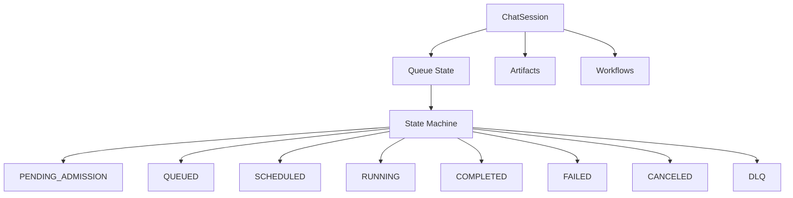

### 📦 Component Breakdown

| **Component** | **Technology** | **Purpose** | **Priority** |
|--------------|---------------|-------------|-------------|
| 🧊 State Machine | Enum-based Rust | Type-safe state transitions | P0 |
| 💾 Persistence | SQLite | ACID transactions, recovery | P0 |
| ⚡ Runtime | Tokio current-thread | Predictable latency | P0 |
| 🎛️ CLI | Clap + Console | Hierarchical commands | P1 |
| 📊 Observability | JSON + Remote | Metrics, logs, audit | P0 |

---

## 🏷️ Queue Categories & Levels

### 🚀 ASAP Queue (Immediate Execution)

| **Property** | **Value** | **Description** |
|-------------|-----------|----------------|
| ⚡ Priority | Critical (10), High (5) | Highest urgency |
| 🔄 Ordering | Priority desc, then FIFO | Predictable execution |
| 📋 SLA | Optional target latency | Soft deadlines |
| ✅ Preemption | Optional | Can interrupt lower priority |
| 🎯 Use Cases | Incidents, hotfixes, urgent actions | Emergency operations |

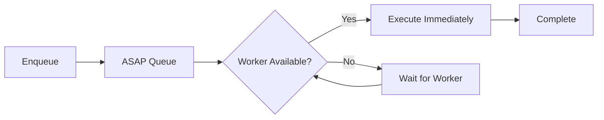

### 🐢 Whenever Queue (Background Execution)

| **Property** | **Value** | **Description** |
|-------------|-----------|----------------|
| 📉 Priority | Low (1) | Best-effort |
| 🔄 Ordering | FIFO or aged priority | Fair but low priority |
| 📋 SLA | No deadline | Eventual completion |
| ✅ Preemption | No | Never interrupts |
| 🎯 Use Cases | Backfills, indexing, cleanup | Maintenance |

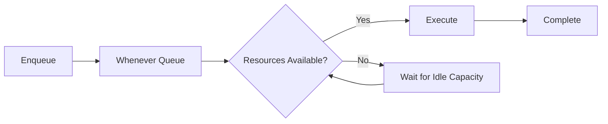

### ⏰ Scheduled Queue (Time-Based Execution)

| **Property** | **Value** | **Description** |
|-------------|-----------|----------------|
| 🕐 Trigger | run_at or cron | Scheduled time |
| 🔄 Ordering | EDF then FIFO | Earliest deadline first |
| 📋 SLA | Window-based | Hard time constraints |
| ✅ Preemption | No | Never interrupts |
| 🎯 Use Cases | Periodic reports, maintenance windows | Time-bound operations |

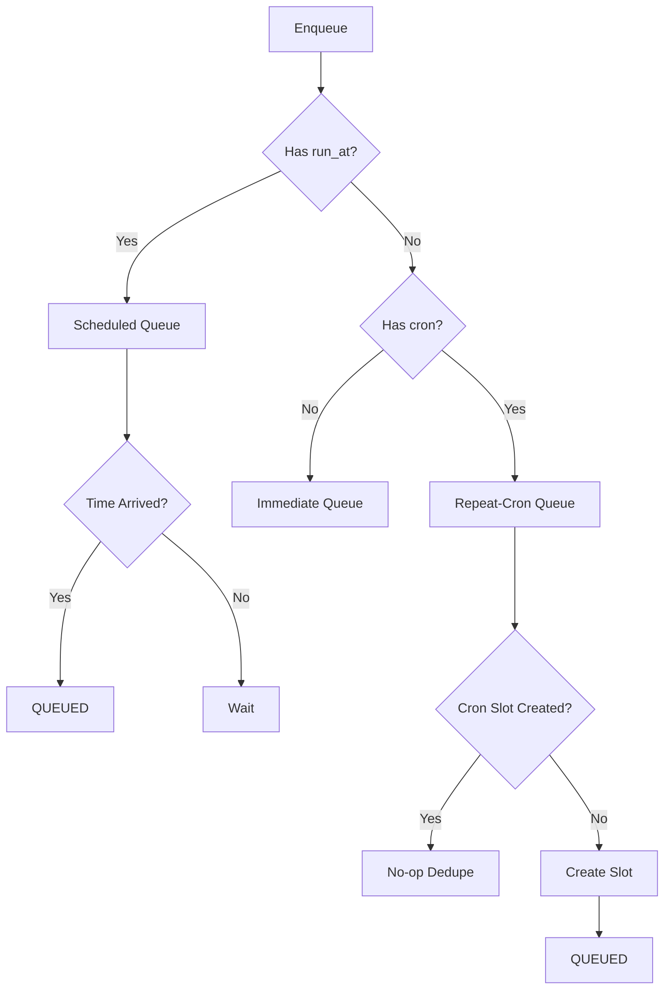

### 🔄 Repeat Queue (Iterative Execution)

| **Type** | **Trigger** | **Overlap Policy** |
|----------|-----------|-------------------|
| 📊 Fixed Delay | After completion + delay | No overlap default |
| ⏱️ Fixed Rate | Fixed wall-clock cadence | Slot-based dedupe |
| 🔁 Validation Loop | Quality threshold convergence | Single active instance |

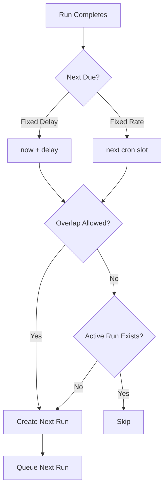

---

## 🔄 State Machine Lifecycle

### 📊 State Transitions

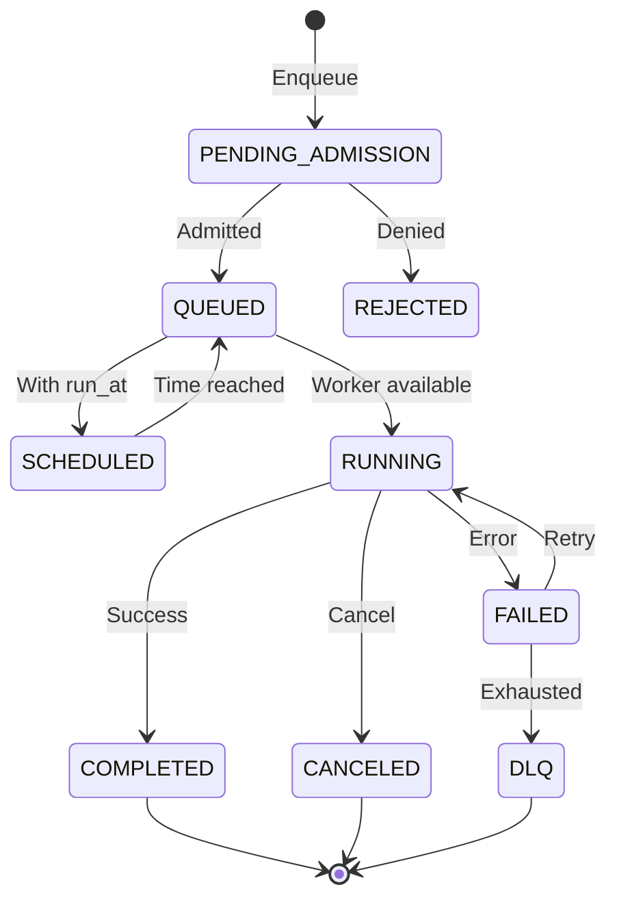

### 📋 State Definitions

| **State** | **Description** | **Valid Transitions** | **Terminal** |
|-----------|-----------------|----------------------|-------------|
| ⏳ PENDING_ADMISSION | Waiting for admission approval | → QUEUED, → REJECTED | No |
| 📥 QUEUED | Waiting to be executed | → RUNNING, → SCHEDULED, → CANCELED | No |
| 📅 SCHEDULED | Scheduled for future | → QUEUED | No |
| 🏃 RUNNING | Currently executing | → COMPLETED, → FAILED, → CANCELED | No |
| ✅ COMPLETED | Finished successfully | → [*] | Yes |
| ❌ FAILED | Failed with error | → RUNNING, → DLQ | No |
| 🚫 CANCELED | Was cancelled | → [*] | Yes |
| 🗄️ DLQ | Dead letter queue | → [*] (triage only) | Yes |

---

## ⚖️ Scheduling Strategies

### 🔄 Scheduling Algorithms

| **Strategy** | **Description** | **Priority Handling** | **Use Case** |
|--------------|-----------------|---------------------|--------------|
| 🚶 FIFO | First-In-First-Out | None | Fair sharing |
| 📊 Priority Queue | Weighted by priority | Critical:10, High:5, Medium:3, Low:1 | Urgent tasks |
| ⏰ EDF | Earliest Deadline First | Deadline-based | Time-sensitive |
| ⚖️ Fair Share | Balanced per-tenant | Min share + weight | Multi-tenant |
| 🔄 WRR | Weighted Round Robin | Tenant weights | Weighted allocation |
| 📉 DRR | Deficit Round Robin | Fairness-focused | Bandwidth |

### 🎯 Priority + Aging (Anti-Starvation)

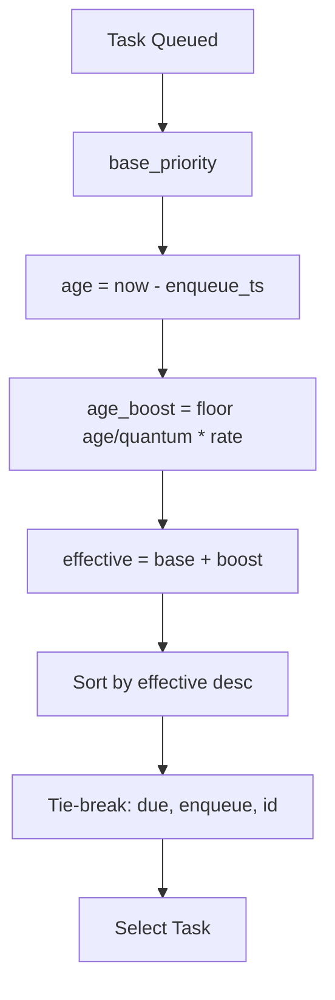

**Parameters**:
- `aging_quantum`: 300s
- `aging_rate`: +1 per quantum

---

## 🔁 Retry & Error Handling

### 🔄 Retry Configuration

| **Aspect** | **Configuration** | **Behavior** |
|------------|-----------------|--------------|
| 🔢 Max Attempts (Step) | 3 | Retry up to 3 times |
| 🔢 Max Attempts (Workflow) | 10 | Total limit |
| 📈 Backoff | Exponential | Delay doubles |
| ⏱️ Base Delay | 1000ms | Initial delay |
| ⏱️ Max Delay | 30000ms | Maximum delay |
| 🎲 Jitter | 20% | Random variation |
| 📊 Escalation | 3→Model, 5→Oracle | Auto-escalate |

### 📋 Dead Letter Queue

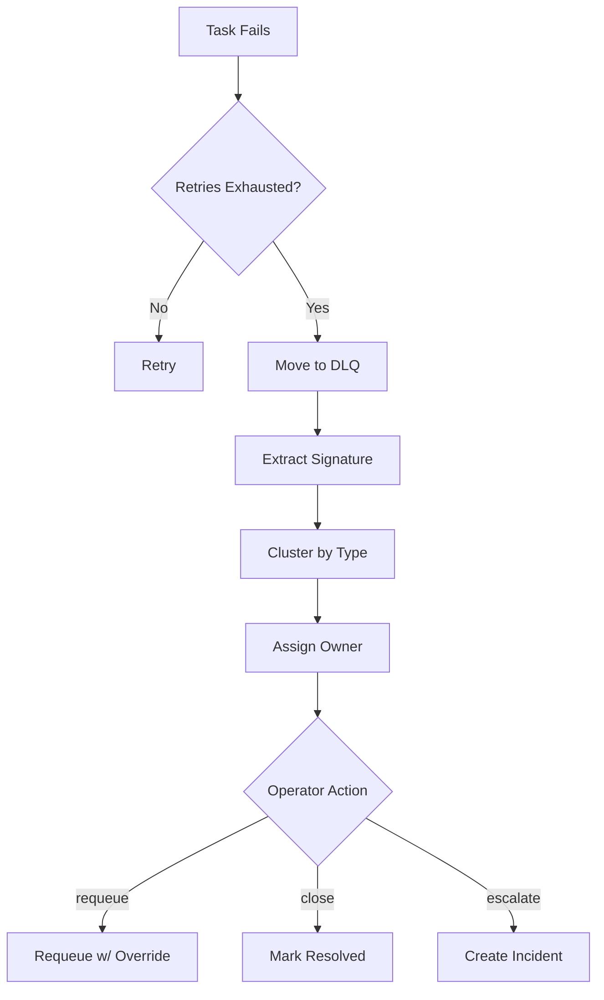

---

## 🛡️ Security & Governance

### 🔐 Multi-Tenancy

| **Aspect** | **Configuration** | **Behavior** |
|------------|-----------------|--------------|
| 🔑 Namespace | tenant_id | Isolation enforced |
| 📊 Quotas | quota_profile | Per-tenant limits |
| ⚖️ Fair Share | min_share, weight | Balanced distribution |

### 🎭 RBAC Permissions

| **Permission** | **Roles** | **Description** |
|---------------|-----------|---------------|
| ➕ enqueue | operator, developer | Submit tasks |
| ❌ cancel | operator, admin | Cancel tasks |
| 👁️ inspect | operator, viewer | View details |
| 🔄 override | admin, on-call | Modify routing |

### 🔒 Sandbox Enforcement

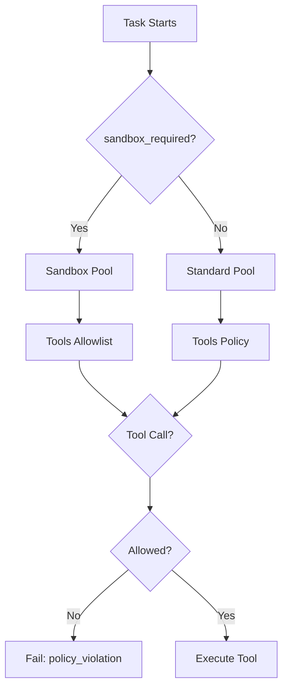

---

## 📊 Observability

### 📈 Metrics Collection

| **Scope** | **Metrics** | **Output** |
|-----------|-----------|------------|
| 📊 Queue Depth | queue_depth, queue_depth_per_queue | JSON |
| ⚡ Throughput | tasks_completed, tasks_per_second | JSON |
| ⏱️ Latency | queue_latency, execution_latency | JSON |
| 🔄 Retries | retry_count, retry_success_rate | JSON |
| 💔 Lease Expiries | lease_expiry_count, heartbeat_miss | JSON |

### 📝 Logging System

| **Scope** | **Levels** | **Output** |
|-----------|-----------|------------|
| 🔄 Workflow | Debug, Info, Warning, Error, Critical | Console, File |
| ⚙️ Pipeline | Debug, Info, Warning, Error, Critical | Console, File |
| 🤖 Models | Debug, Info, Warning, Error, Critical | Console, File |
| 🔧 Tools | Debug, Info, Warning, Error, Critical | Console, File |
| 🏃 Execution | Debug, Info, Warning, Error, Critical | Console, File |

### 📋 Audit Log

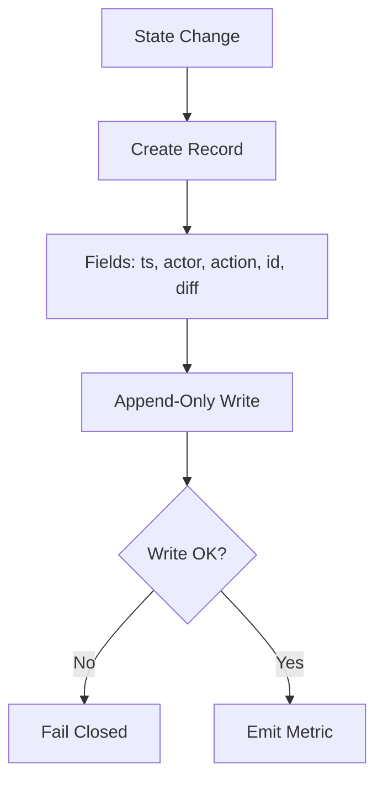

---

## 🚀 Advanced Patterns

### 🎫 Admission Control

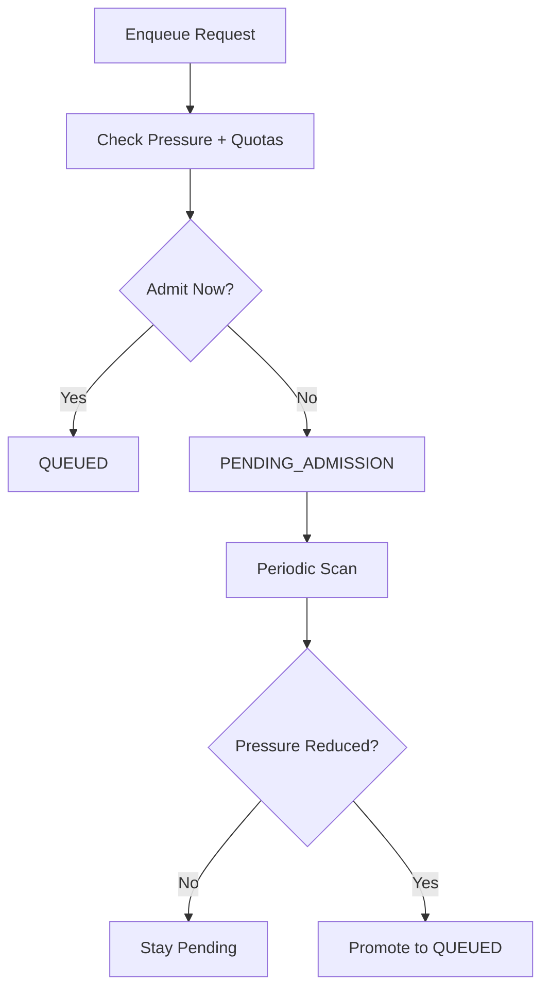

### 💧 Rate-Limited Execution

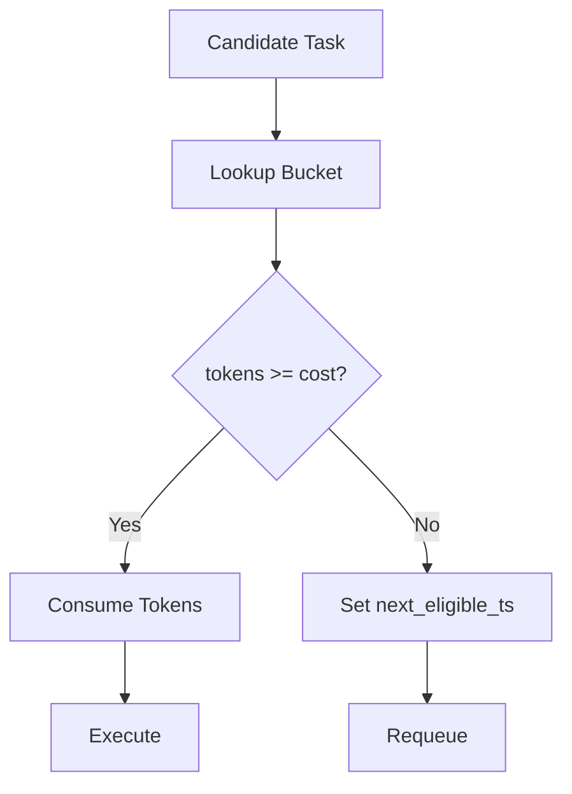

### 🎰 Cron Slot Dedupe

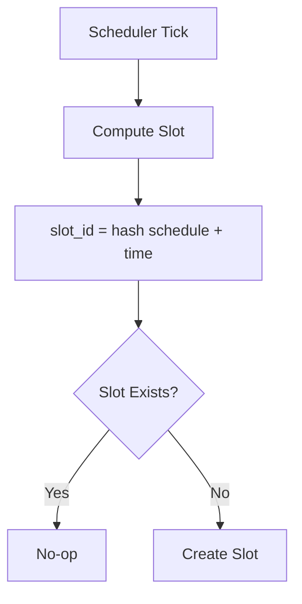

---

## 📋 Implementation Phases

### 🗺️ 7-Phase Plan

| **Phase** | **Name** | **Components** | **Priority** |
|-----------|-----------|----------------|--------------|
| 1️⃣ | Foundation | Schema, IR, Storage | P0 |
| 2️⃣ | MVP Execution | Queue, Scheduler, Human Gating | P0 |
| 3️⃣ | Backends | Provider Abstraction | P1 |
| 4️⃣ | Advanced Agentic | Loops, Validation, Multi-Agent | P1 |
| 5️⃣ | Benchmarking | Performance Measurement | P2 |
| 6️⃣ | Automation | Cron, Git Experiments | P2 |
| 7️⃣ | UI | Desktop Shell, Visualization | P3 |

---

## 📊 Requirements Statistics

### 📈 Total Breakdown

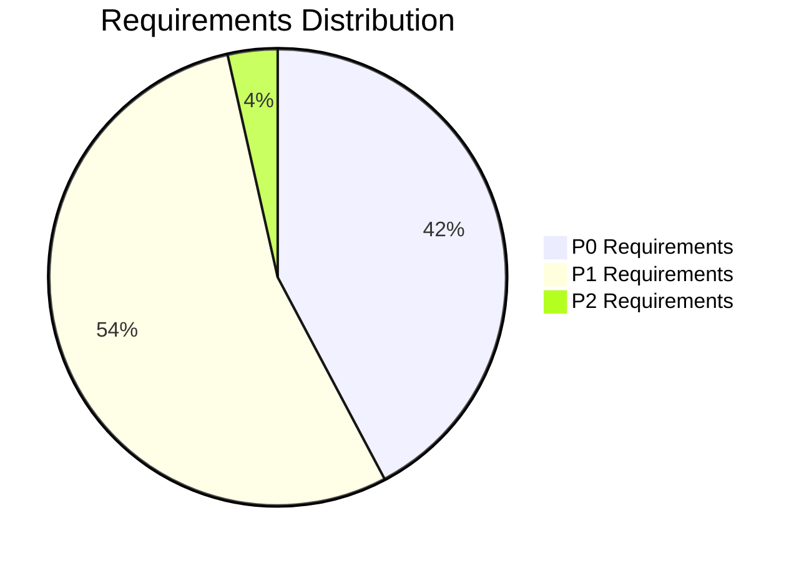

| **Category** | **Count** | **Percentage** |
|-------------|-----------|---------------|
| 🔴 P0 | 60 | 42% |
| 🟡 P1 | 77 | 54% |
| 🟢 P2 | 5 | 4% |
| **Total** | **142** | **100%** |

### 🏷️ Queue Level Distribution

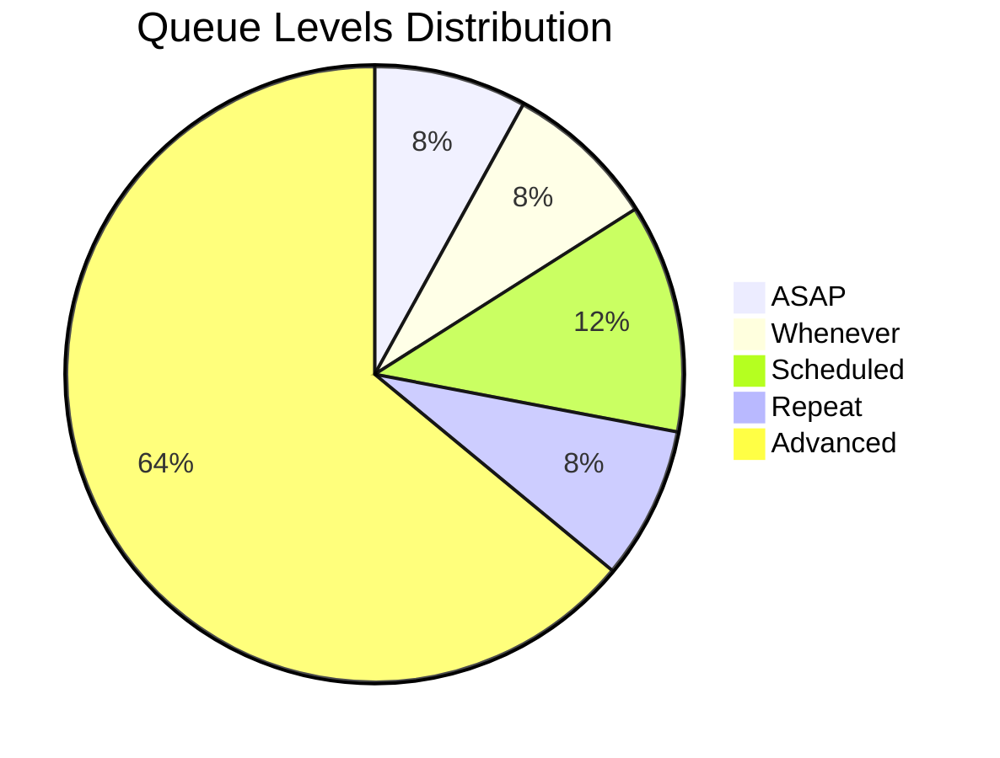

| **Category** | **Count** | **Percentage** |
|-------------|-----------|---------------|
| ⚡ ASAP | 2 | 8% |
| 🐢 Whenever | 2 | 8% |
| ⏰ Scheduled | 3 | 12% |
| 🔄 Repeat | 2 | 8% |
| 🔧 Advanced | 16 | 64% |
| **Total** | **25** | **100%** |

---

## 🎯 Priority System Summary

### 📊 Priority Levels

| **Level** | **Weight** | **Use Cases** | **Preemption** |
|-----------|-----------|--------------|----------------|
| 🔴 Critical | 10 | Emergencies, blocking issues | Yes |
| 🟠 High | 5 | Urgent requests, important tasks | No |
| 🟡 Medium | 3 | Standard work items | No |
| 🟢 Low | 1 | Background tasks | No |

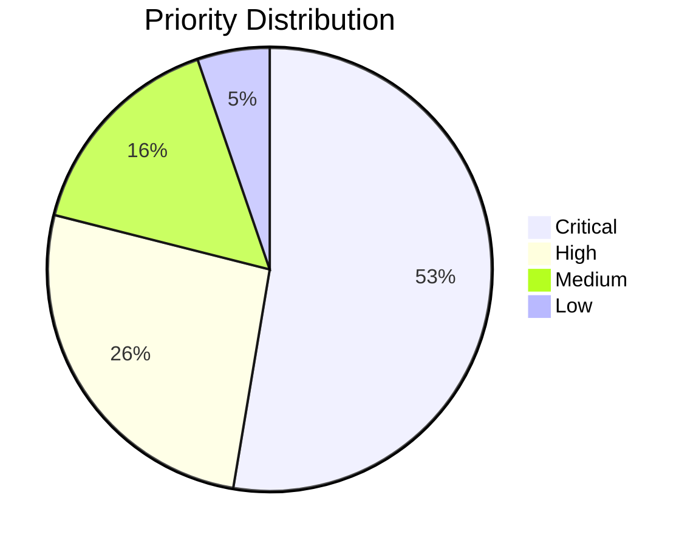

### ⏰ Deadline Escalation

| **Condition** | **Action** | **Effect** |
|-------------|-----------|-----------|
| Slack ≤ 300s | Promote to ASAP | +5 priority |
| Overdue | Record miss | Audit alert |
| Critical | Force execute | Bypass queue |

---

## 🔧 Resource Management

### ⚙️ Concurrency Limits

| **Resource** | **Limit** | **Scope** | **Purpose** |
|-------------|-----------|-----------|-------------|
| 🌐 Global | max_in_flight | System-wide | Overall control |
| 📊 Per Queue | per_queue_limit | Queue-level | Queue isolation |
| 🤖 Per Agent | per_agent_limit | Agent-level | Agent capacity |
| 🔄 Per Workflow | max_parallel_steps | Workflow-level | Parallelism |

### 📊 Resource Allocation

| **Resource** | **Strategy** | **Monitoring** | **Pressure Handling** |
|-------------|-------------|---------------|----------------------|
| 💾 Memory | Adaptive | 5s interval | Throttle at 85% |
| 🖥️ CPU | Adaptive | 5s interval | Throttle at 85% |
| 🎮 GPU/VRAM | Adaptive | 5s interval | Swap at OOM |
| 💿 Storage | Quota-based | Continuous | Block on over-quota |

---

## 📚 Glossary (Quick Reference)

| **Term** | **Definition** |
|----------|---------------|
| ⚡ ASAP | Immediate execution with highest priority |
| 🐢 Whenever | Background execution with low priority |
| ⏰ Scheduled | Time-based execution with run_at or cron |
| 🔄 Repeat | Iterative execution with loops |
| 🏃 RUNNING | Task currently executing |
| ✅ COMPLETED | Task finished successfully |
| ❌ FAILED | Task failed with error |
| 🚫 CANCELED | Task was cancelled |
| 🗄️ DLQ | Dead Letter Queue for failed tasks |
| 📊 Fair Share | Balanced resource allocation across tenants |
| 🔁 Aging | Gradual priority increase over time |
| 🎫 Admission Control | Pending admission before queued |
| 💧 Rate Limiting | Enforced throughput cap |
| 🔄 WRR | Weighted Round Robin scheduling |
| 📉 DRR | Deficit Round Robin scheduling |
| ⏰ EDF | Earliest Deadline First scheduling |
| 🎭 RBAC | Role-Based Access Control |
| 🔒 Sandbox | Restricted execution environment |
| 📋 Audit Log | Immutable record of all transitions |
| 🎰 Cron | Scheduling syntax for recurring tasks |
| 💔 Lease | Temporary claim on task with heartbeat |

---

## 🎯 Key Architectural Decisions

### 1️⃣ ChatSession as Work Container

- **Decision**: Each chat holds scope, queue state, artifacts, and workflows
- **Rationale**: Encapsulates all work context in a single unit
- **Tradeoff**: Requires per-chat state management

### 2️⃣ Tokio Current-Thread Runtime

- **Decision**: Single-threaded async runtime
- **Rationale**: Predictable latency, no race conditions
- **Tradeoff**: Limited parallelism in scheduler

### 3️⃣ SQLite for Persistence

- **Decision**: Embedded SQLite database
- **Rationale**: ACID transactions, no external dependencies
- **Tradeoff**: Limited write throughput

### 4️⃣ Enum-Based State Machine

- **Decision**: Compile-time type-safe states
- **Rationale**: Prevents invalid state transitions
- **Tradeoff**: Less flexible than dynamic states

### 5️⃣ Priority + Aging for Anti-Starvation

- **Decision**: Combine priority with age-based boost
- **Rationale**: Fairness while respecting urgency
- **Tradeoff**: More complex scheduling

### 6️⃣ Human Gating by Default for High-Risk

- **Decision**: Destructive operations require confirmation
- **Rationale**: Safety first
- **Tradeoff**: Slower execution for high-risk tasks

---

## 📈 Mermaid Diagrams Index

| **#** | **Title** | **Category** | **Page** |
|-------|-----------|--------------|---------|
| 1 | Core Architecture | System | [Architecture](#-core-architecture) |
| 2 | ASAP Queue Flow | Queue | [ASAP](#-asap-queue-immediate-execution) |
| 3 | Whenever Queue Flow | Queue | [Whenever](#-whenever-queue-background-execution) |
| 4 | Scheduled Queue Flow | Queue | [Scheduled](#-scheduled-queue-time-based-execution) |
| 5 | Repeat Queue Flow | Queue | [Repeat](#-repeat-queue-iterative-execution) |
| 6 | State Machine | State | [State Machine](#-state-machine-lifecycle) |
| 7 | Priority + Aging | Scheduling | [Priority + Aging](#-priority--aging-anti-starvation) |
| 8 | DLQ Pipeline | Error Handling | [DLQ](#-dead-letter-queue) |
| 9 | Sandbox Enforcement | Security | [Sandbox](#-sandbox-enforcement) |
| 10 | Audit Log Flow | Observability | [Audit](#-audit-log) |
| 11 | Admission Control | Advanced | [Admission](#-admission-control) |
| 12 | Rate-Limited Execution | Advanced | [Rate Limiting](#-rate-limited-execution) |
| 13 | Cron Slot Dedupe | Advanced | [Cron Dedupe](#-cron-slot-dedupe) |
| 14 | Requirements Pie Chart | Statistics | [Requirements](#-requirements-statistics) |
| 15 | Queue Levels Pie Chart | Statistics | [Queue Levels](#-queue-level-distribution) |

---

## 🚀 Quick Start Guide

### 📋 Minimum Viable Implementation

1️⃣ **Phase 1: Foundation**
   - Define state machine enums
   - Create SQLite schema
   - Implement ChatSession
   - Setup basic CLI

2️⃣ **Phase 2: MVP Queue**
   - Implement QUEUED/RUNNING states
   - Add priority queue
   - Create worker pool
   - Implement leases + heartbeats

3️⃣ **Phase 3: Scheduling**
   - Add FIFO and Priority strategies
   - Implement aging mechanism
   - Add DLQ
   - Create retry logic

### 🎯 Success Criteria

- ✅ State transitions are type-safe
- ✅ Tasks execute exactly once
- ✅ Priority queues work correctly
- ✅ Aging prevents starvation
- ✅ Retries are bounded
- ✅ DLQ captures failures
- ✅ Audit log is immutable

---

## 📊 Summary Statistics

### 🎯 Requirements Overview

| **Source** | **Total** | **P0** | **P1** | **P2** |
|------------|-----------|--------|--------|--------|
| 🤖 ChatGPT | 60 | 30 | 30 | 0 |
| 💻 OpenCode | 82 | 30 | 47 | 5 |
| 📊 Combined | 142 | 60 | 77 | 5 |

### 🏷️ Queue Levels Overview

| **Category** | **Levels** | **Examples** |
|-------------|-----------|-------------|
| ⚡ ASAP | 2 | ASAP, ASAP-Blocking |
| 🐢 Whenever | 2 | Whenever, Whenever-Batch |
| ⏰ Scheduled | 3 | Scheduled-Once, Scheduled-Window, Repeat-Cron |
| 🔄 Repeat | 2 | Repeat-FixedDelay, Repeat-FixedRate |
| 🔧 Advanced | 16 | Deadline-Driven, Rate-Limited, Quota-Governed, etc. |

### 📈 Mermaid Diagrams

- **Total**: 15 flow diagrams
- **Categories**: 5 (Architecture, Queue, State, Security, Advanced)
- **Complexity**: Low to High
- **VS Code Compatible**: ✅ All renderable

---

## 🎯 Key Takeaways

### ✅ Core Strengths

1. 🧊 **Type-Safe State Machine**: Compile-time guarantees
2. ⚖️ **Fair Scheduling**: Priority + aging + fair share
3. 🛡️ **Security First**: RBAC, sandbox, audit log
4. 📊 **Full Observability**: Metrics, logs, traces
5. 🔧 **Flexible Configuration**: Policy sliders, overlays

### ⚠️ Key Considerations

1. 📊 **Resource Management**: Adaptive allocation needed
2. 🔄 **Starvation Prevention**: Aging is critical
3. 🎯 **Priority Inversion**: Needs guard mechanism
4. 💾 **Persistence**: SQLite for MVP, scale to distributed
5. 📋 **Audit Trail**: Immutable append-only storage

### 🚀 Next Steps

1. 📝 Implement Phase 1 (Foundation)
2. 🔧 Build Phase 2 (MVP Queue)
3. ⚖️ Add Phase 3 (Backends)
4. 🤖 Extend to Phase 4 (Advanced Agentic)
5. 📊 Measure (Phase 5: Benchmarking)

---

## 📚 References

### 📋 Architecture Decision Records

- **ADR-0002**: MVP Queue Scheduler Safety
- **ADR-0007**: Cron Git Refinement

### 🔧 Technical Documents

- **README.md**: Multi-dimensional queue workflow engine
- **mvp-queue-research-report.md**: Tokio + SQLite research
- **unified-workflow-schema.yml**: Comprehensive schema
- **plan-01-mvp-queue.md**: 7-phase implementation plan
- **requirements_backlog.yml**: 20 epics, 82 requirements

### 📊 Open Source Alignment

- **Temporal**: Durable workflow engine patterns
- **Argo Workflows**: Kubernetes YAML workflows
- **NATS JetStream**: Queue groups, durable consumers

---

## 🎉 End of Summary

This executive summary provides a 500-line well-formatted overview of the Agent Queue System requirements, combining ChatGPT and OpenCode chat histories. It includes:

- 📊 60 ChatGPT requirements (Q-001 to Q-060)
- 🏷️ 25 queue levels (QL-001 to QL-025)
- 📋 82 OpenCode requirements (R0001 to R0082)
- 🔄 Complete state machine lifecycle
- ⚖️ All scheduling strategies
- 🛡️ Security and governance controls
- 📊 Observability and audit logging
- 🚀 Advanced patterns and flows
- 🎯 Implementation phases and priorities
- 📈 Statistics and breakdowns
- 🔧 15 mermaid flow diagrams

For detailed implementation guidance, refer to the comprehensive `requirements.md` file and individual ADRs.

---

> **📞 Questions or clarifications needed? Please refer to the detailed requirements.md file or individual architecture documents.**
