# Agent Queue System - Unique Requirements

> **Document Purpose**: This document contains ONLY the requirements unique to the `agent-queue` project that are NOT covered by the related `yaml-to-local-rust-agentsdk` project.
> 
> **Project Focus**: Multi-dimensional queue workflow engine for scheduling, state management, and operational coordination.
> 
> **Related Project**: `yaml-to-local-rust-agentsdk` focuses on YAML-to-Rust transpilation, code generation, and LLM model execution. Requirements for transpilation, schema definition, AST parsing, code generation, and model lifecycle are documented there.

---

## Table of Contents

1. [Differentiation Analysis](#differentiation-analysis)
2. [Unique Queue Categories & Levels](#unique-queue-categories--levels)
3. [Unique Scheduling Strategies](#unique-scheduling-strategies)
4. [Unique Lease & Concurrency Management](#unique-lease--concurrency-management)
5. [Unique Backpressure & Admission Control](#unique-backpressure--admission-control)
6. [Unique Multi-Tenancy & Fairness](#unique-multi-tenancy--fairness)
7. [Unique Dead-Letter Queue Patterns](#unique-dead-letter-queue-patterns)
8. [Unique Time & Scheduling Semantics](#unique-time--scheduling-semantics)
9. [Unique Distributed Systems Patterns](#unique-distributed-systems-patterns)
10. [Unique Operational Controls](#unique-operational-controls)
11. [Requirements Traceability](#requirements-traceability)

---

## Differentiation Analysis

### What `yaml-to-local-rust-agentsdk` Covers (NOT in this document)

| Domain | Description | Reason |
|--------|-------------|--------|
| **Transpilation** | YAML-to-Rust code generation | Core transpiler concern |
| **Schema Definition** | YAML grammar, schema evolution | Transpiler-specific |
| **Parser & AST** | Building AST from YAML | Code generation pipeline |
| **Typed WorkflowIR** | Intermediate representation | Transpiler internal |
| **AgentSDK Mapping** | Mapping IR to AgentSDK code | Code generation concern |
| **LLM Model Lifecycle** | Load, unload, manage model instances | Model execution layer |
| **Context Budgeting** | Context management for LLMs | LLM-specific |
| **Tool Provider Registry** | Custom Rust tool hooks | Tooling system |
| **Build Orchestration** | Reproducible builds | Build system concern |
| **Minification** | Token optimization for LLMs | LLM efficiency |
| **Local Model Execution** | Local-first LLM inference | Model layer |

### What `agent-queue` Adds Uniquely (THIS document)

| Domain | Description | Reason Unique |
|--------|-------------|---------------|
| **Queue Categories & Levels** | 25 distinct queue levels (ASAP, Whenever, Scheduled, Repeat, etc.) | Scheduling semantics |
| **Meta-Scheduler** | Queue-of-queues coordination | Multi-level orchestration |
| **Priority + Aging** | Anti-starvation with aging boost | Fairness guarantees |
| **Lease Management** | Heartbeats, TTL, expiry, reclaim | Distributed coordination |
| **Advanced Scheduling** | EDF, WRR, DRR, Fair Share, Token Bucket | Scheduling algorithms |
| **Backpressure** | Queue depth management, drop/spillover policies | System stability |
| **Admission Control** | Pending admission state, pressure-based gating | Overload protection |
| **Rate Limiting** | Per-tenant, per-tool rate limits | API fairness |
| **Quotas** | Multi-tenant resource allocation | Governance |
| **Work Stealing** | Cross-pool task distribution | Utilization optimization |
| **Agent Pools** | Capability-based pools, autoscaling | Resource management |
| **Dead-Letter Queue** | Triage, requeue with overrides, error clustering | Error handling |
| **Scheduled Windows** | Time-gated execution, maintenance windows | Time semantics |
| **Cron Semantics** | Slot dedupe, catchup policies, timezone handling | Recurring execution |
| **Deadline Escalation** | SLA-driven priority promotion | SLA management |
| **Spillover Queues** | Overflow handling to alternate queues | Burst handling |
| **Queue Pausing** | Category-level pause/resume | Operational control |
| **Safe Mode** | System-wide risk-based admission control | Incident response |
| **Cancellation Propagation** | DAG-aware cancellation, upstream/downstream | Control flow |
| **Multi-Region Replication** | Cross-region state sync, DR | High availability |
| **Exactly-Once Outcome** | Outbox/inbox patterns, CAS updates | Delivery guarantees |
| **Hot-Shard Mitigation** | Dynamic shard rebalancing | Scalability |
| **Deadline-Driven Scheduling** | EDF with deadline escalation | SLA compliance |
| **Per-Tenant Fair Share** | Weighted distribution with min_share | Multi-tenant fairness |
| **Priority Inversion Guard** | Temporary priority boost for blocking deps | Correctness |

---

## Unique Queue Categories & Levels

### Queue Levels NOT in yaml-to-local-rust-agentsdk

The following queue levels represent scheduling semantics unique to agent-queue:

| **Level_ID** | **Queue Level / Category** | **Meta-Level Semantics** | **Why Unique** |
|--------------|--------------------------|------------------------|----------------|
| QL-001 | ASAP | Highest urgency; runs before lower classes | Priority-based urgency classification |
| QL-002 | ASAP-Blocking | Blocks workflow until complete | Critical path semantics |
| QL-003 | Whenever | Best-effort background | Background/detached execution |
| QL-004 | Whenever-Batch | Batch-optimized background | Batching optimization |
| QL-005 | Scheduled-Once | Not eligible until `due_ts` | Time-gated eligibility |
| QL-006 | Scheduled-Window | Eligible only in time window | Hard window constraint |
| QL-007 | Repeat-Cron | Creates runs on cron schedule | Recurring schedule semantics |
| QL-008 | Repeat-FixedDelay | Next run after completion + delay | Completion-triggered scheduling |
| QL-009 | Repeat-FixedRate | Fixed wall-clock cadence | Time-slot based scheduling |
| QL-010 | Deadline-Driven | Prioritizes by closest deadline (EDF) | SLA-aware scheduling |
| QL-011 | Rate-Limited | Enforced throughput cap | Rate limiting semantics |
| QL-012 | Quota-Governed | Tenant quotas gate eligibility | Multi-tenant quota enforcement |
| QL-013 | Human-Gated | Waits for approval before eligible | Human-in-the-loop semantics |
| QL-014 | Manual-Override | Operator can force priority/routing | Operational override |
| QL-015 | DLQ | Triage-only, not auto-executed | Error handling pattern |
| QL-016 | Sandbox | Runs only on sandboxed agents | Security isolation |
| QL-017 | Capability-Pinned | Eligible only for certain pools | Capability matching |
| QL-018 | Cost-Aware | Schedules to minimize cost | Cost optimization |
| QL-019 | Maintenance | Runs only during maintenance window | Ops window enforcement |
| QL-020 | Experiment | Low priority, can be dropped | Best-effort experimentation |
| QL-021 | Meta-Scheduler Strategy | Selects which queue to pull from | Multi-queue coordination |
| QL-022 | Starvation Guard | Ensures low classes eventually progress | Fairness guarantee |
| QL-023 | Spillover | If queue full, spill to alternate | Overflow handling |
| QL-024 | Queue Paused | Temporarily ineligible | Operational control |
| QL-025 | Scheduled Catchup Policy | Behavior for missed schedule slots | Missed run handling |

### Queue Categories Summary

| **Category** | **Mapped Levels** | **Unique Semantics** |
|-------------|------------------|---------------------|
| **ASAP** | QL-001, QL-002 | Immediate execution with highest priority, optional blocking |
| **Whenever** | QL-003, QL-004 | Background execution with batch optimization |
| **Scheduled** | QL-005, QL-006, QL-007 | Time-based eligibility with window constraints |
| **Repeat** | QL-008, QL-009 | Recurring execution with delay/rate semantics |
| **Deadline-Driven** | QL-010 | EDF scheduling with SLA awareness |
| **Rate-Limited** | QL-011 | Throughput caps independent of priority |
| **Quota-Governed** | QL-012 | Tenant-based resource allocation |
| **Human-Gated** | QL-013 | Approval-based eligibility |
| **Operational** | QL-014, QL-019, QL-024 | Manual control, maintenance windows, pausing |
| **Error Handling** | QL-015, QL-023 | DLQ, spillover patterns |
| **Security/Isolation** | QL-016, QL-017 | Sandbox, capability pinning |
| **Cost/Optimization** | QL-018, QL-020 | Cost-aware, droppable experiments |
| **Fairness** | QL-021, QL-022 | Meta-scheduler, starvation guard |

---

## Unique Scheduling Strategies

### Advanced Scheduling Algorithms

| **Strategy** | **Description** | **Unique Semantics** | **Source** |
|--------------|-----------------|---------------------|------------|
| **Weighted Round Robin (WRR)** | Weighted cyclic selection across queues | Cross-queue fairness with configurable weights | Q-034, QL-021 |
| **Deficit Round Robin (DRR)** | Fair deficit-based selection | Bandwidth-fair distribution across queues | Q-034 |
| **Earliest Deadline First (EDF)** | Schedule by closest deadline | SLA-compliant scheduling with deadline awareness | Q-011, Q-035 |
| **Fair Share** | Balanced resource allocation across tenants | Per-tenant fairness with min_share guarantees | Q-034 |
| **Priority + Aging** | Priority with anti-starvation aging boost | Prevents indefinite postponement of low-priority tasks | Q-012 |
| **Priority Inversion Guard** | Temporary boost for blocking dependencies | Correctness guarantee for dependent tasks | Q-012 |
| **Deadline Escalation** | SLA-driven priority promotion when deadline nears | Automatic escalation for SLA compliance | Q-035 |
| **Token Bucket Rate Limiting** | Token bucket for throughput control | Rate limiting independent of priority | Q-043, QL-011 |
| **Cost-Aware Scheduling** | Schedule to minimize cost under constraints | Cost optimization with deadline guarantees | QL-018 |
| **Work Stealing** | Cross-pool task distribution when idle | Utilization optimization across pools | Q-037 |

### Priority + Aging (Anti-Starvation) - UNIQUE

```mermaid
flowchart TD
    A[Task queued] --> B[Compute base_priority]
    B --> C[Compute age = now - enqueue_ts]
    C --> D[age_boost = floor(age / aging_quantum) * aging_rate]
    D --> E[effective_priority = base_priority + age_boost]
    E --> F[Sort candidates by effective_priority desc]
    F --> G[Tie-break: due_ts asc, enqueue_ts asc, task_id asc]
    G --> H[Select next task]
```

**Parameters**:
- `aging_quantum`: Time interval for aging boost (default: 300s)
- `aging_rate`: Priority increment per quantum (default: 1)

**Acceptance Criteria**:
- No task waits longer than `max_wait_time` without execution
- Aging boost applied uniformly across all queue levels
- Effective priority never exceeds maximum bound

### Priority Inversion Guard - UNIQUE

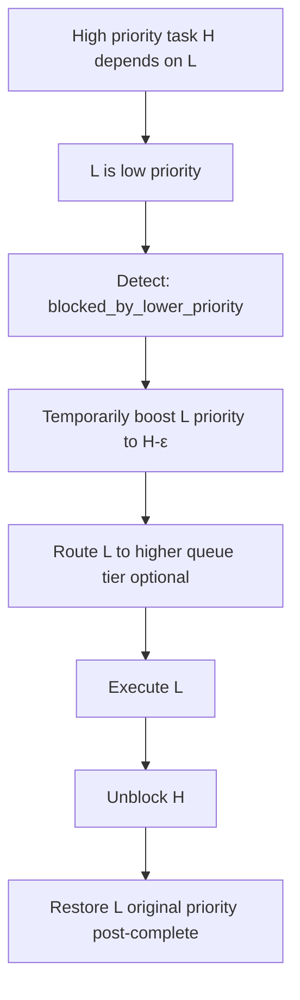
```mermaid
flowchart TD
    A[High priority task H depends on L] --> B[L is low priority]
    B --> C[Detect: blocked_by_lower_priority]
    C --> D[Temporarily boost L priority to H-ε]
    D --> E[Route L to higher queue tier optional]
    E --> F[Execute L]
    F --> G[Unblock H]
    G --> H[Restore L original priority post-complete]
```

**Acceptance Criteria**:
- High-priority tasks blocked by low-priority get temporary boost
- Boost is reverted after dependency completes
- No circular boost scenarios

### Deadline Escalation - UNIQUE

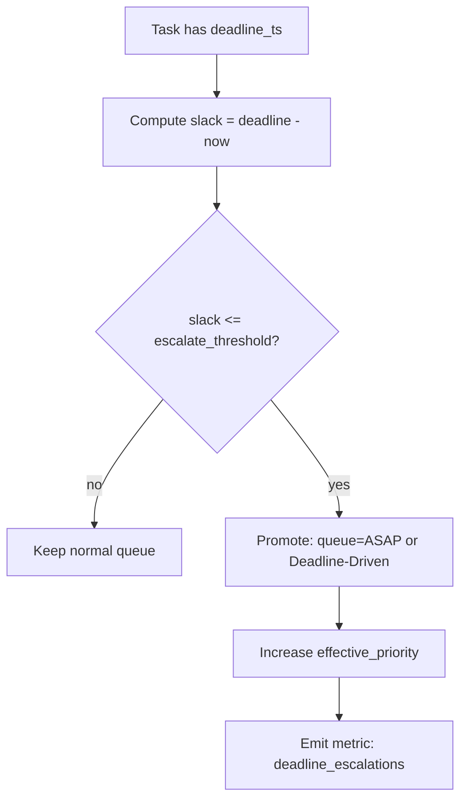
```mermaid
flowchart TD
    A[Task has deadline_ts] --> B[Compute slack = deadline - now]
    B --> C{slack <= escalate_threshold?}
    C -->|no| D[Keep normal queue]
    C -->|yes| E[Promote: queue=ASAP or Deadline-Driven]
    E --> F[Increase effective_priority]
    F --> G[Emit metric: deadline_escalations]
```

**Parameters**:
- `escalate_threshold`: Slack threshold for escalation (default: 300s)
- `escalation_boost`: Priority increase amount (default: +5)

**Acceptance Criteria**:
- Tasks approaching deadline get automatic escalation
- Escalation is audited and observable
- No task misses deadline due to insufficient priority

### Rate-Limited Execution (Token Bucket) - UNIQUE

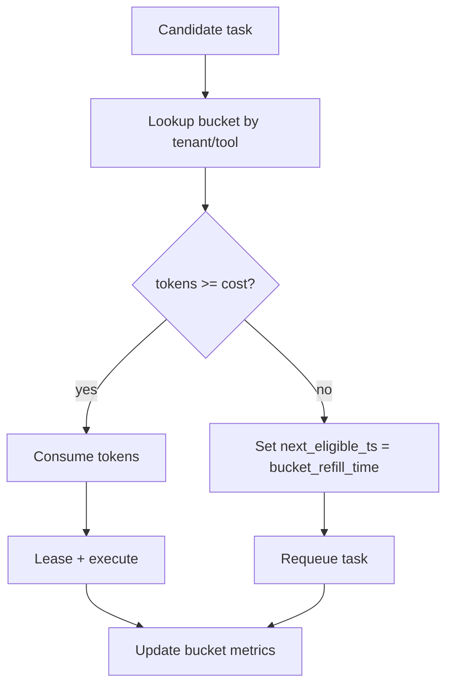
```mermaid
flowchart TD
    A[Candidate task] --> B[Lookup bucket by tenant/tool]
    B --> C{tokens >= cost?}
    C -->|yes| D[Consume tokens]
    D --> E[Lease + execute]
    C -->|no| F[Set next_eligible_ts = bucket_refill_time]
    F --> G[Requeue task]
    E --> H[Update bucket metrics]
    G --> H
```

**Parameters**:
- `bucket_capacity`: Max tokens per bucket (default: 100)
- `refill_rate`: Tokens per second refilled (default: 1/s)
- `token_cost`: Cost per task execution (default: 1)

**Acceptance Criteria**:
- Rate limits never exceeded
- Token consumption is atomic
- Refill rate is consistent

### Per-Tenant Fair Share - UNIQUE

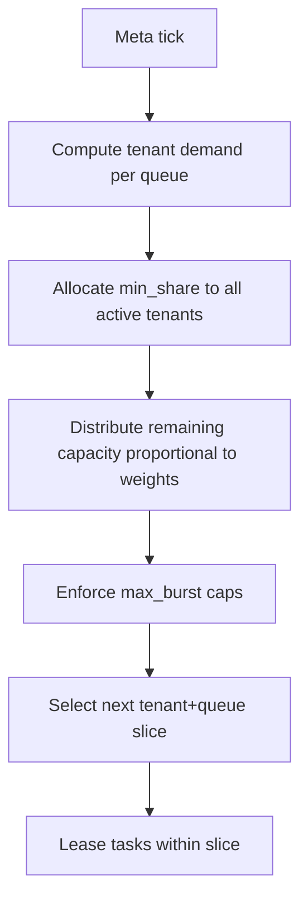
```mermaid
flowchart TD
    A[Meta tick] --> B[Compute tenant demand per queue]
    B --> C[Allocate min_share to all active tenants]
    C --> D[Distribute remaining capacity proportional to weights]
    D --> E[Enforce max_burst caps]
    E --> F[Select next tenant+queue slice]
    F --> G[Lease tasks within slice]
```

**Parameters**:
- `min_share`: Minimum tasks per tick per tenant (default: 1)
- `weight`: Tenant weight for distribution (default: 1.0)
- `max_burst`: Maximum tasks per tick (default: 10)

**Acceptance Criteria**:
- All tenants receive min_share allocation
- Weighted distribution is fair and deterministic
- No tenant can monopolize resources

---

## Unique Lease & Concurrency Management

### Lease Management - UNIQUE

| **Aspect** | **Configuration** | **Behavior** | **Source** |
|------------|-----------------|--------------|------------|
| **Lease TTL** | `lease_ttl` (default: 300s) | Maximum time a worker can hold a task | Q-005 |
| **Heartbeat Interval** | `heartbeat_interval` (default: 30s) | Frequency of heartbeat updates | Q-038 |
| **Lease Expiry** | Automatic reclaim on expiry | Task returns to queue for re-lease | Q-005 |
| **Heartbeat Payload** | Progress reporting | Extend lease + report status | Q-038 |

### Lease Lifecycle Flow - UNIQUE

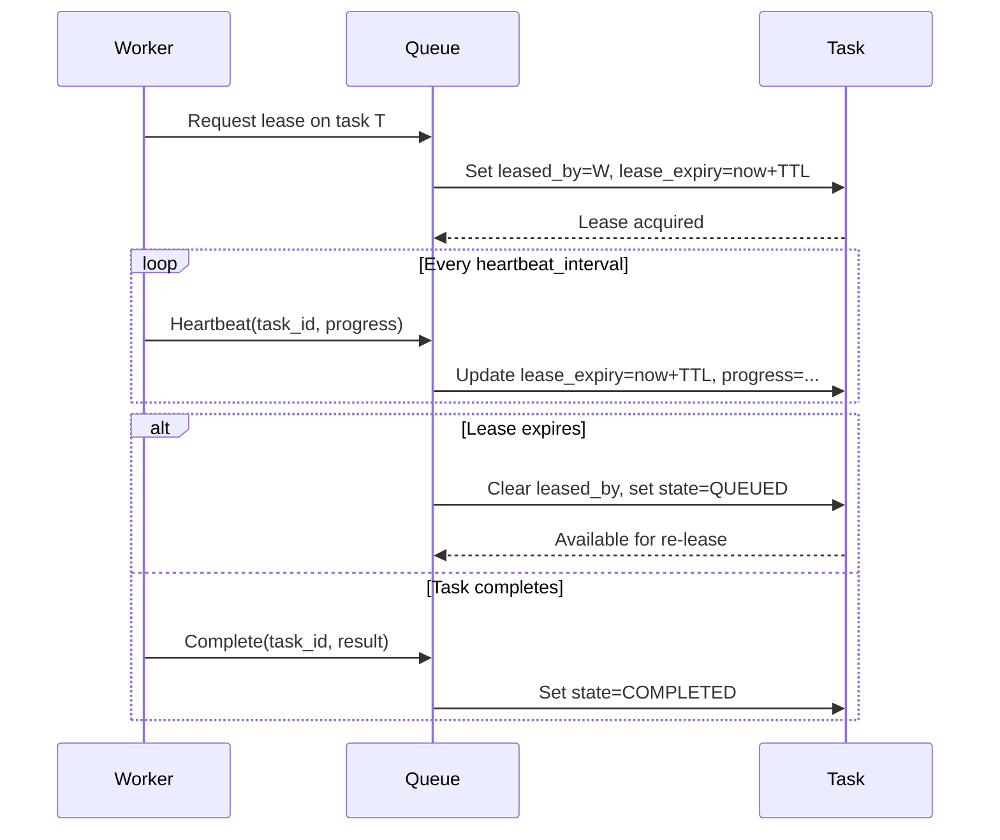
```mermaid
sequenceDiagram
    participant W as Worker
    participant Q as Queue
    participant T as Task
    
    W->>Q: Request lease on task T
    Q->>T: Set leased_by=W, lease_expiry=now+TTL
    T-->>Q: Lease acquired
    
    loop Every heartbeat_interval
        W->>Q: Heartbeat(task_id, progress)
        Q->>T: Update lease_expiry=now+TTL, progress=...
    end
    
    alt Lease expires
        Q->>T: Clear leased_by, set state=QUEUED
        T-->>Q: Available for re-lease
    else Task completes
        W->>Q: Complete(task_id, result)
        Q->>T: Set state=COMPLETED
    end
```

### Concurrency Limits - UNIQUE

| **Scope** | **Limit Type** | **Configuration** | **Purpose** | **Source** |
|-----------|---------------|-------------------|-------------|------------|
| **Global** | `max_in_flight` | System-wide concurrent tasks | Prevent system overload | Q-006 |
| **Per Queue** | `per_queue_limit` | Queue-specific concurrency | Queue isolation | Q-006 |
| **Per Agent** | `per_agent_limit` | Agent-specific concurrency | Agent capacity | Q-006 |
| **Per Workflow** | `max_parallel_steps` | Workflow parallelism | Workflow isolation | Q-006 |
| **Per Tenant** | `tenant_concurrency_limit` | Tenant-specific concurrency | Multi-tenant fairness | Q-044 |

### Heartbeat Updates - UNIQUE

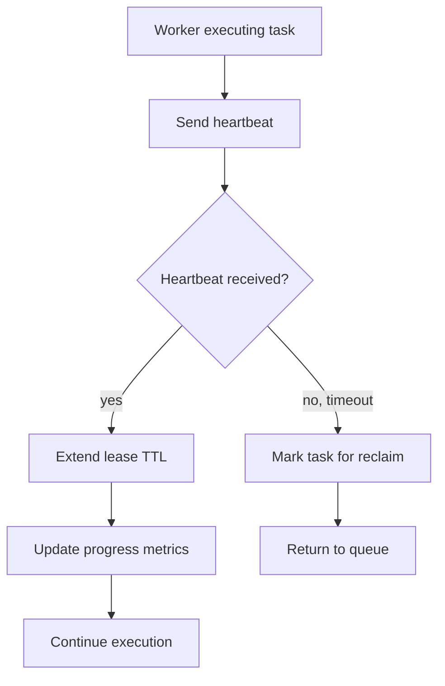
```mermaid
flowchart TD
    A[Worker executing task] --> B[Send heartbeat]
    B --> C{Heartbeat received?}
    C -->|yes| D[Extend lease TTL]
    D --> E[Update progress metrics]
    E --> F[Continue execution]
    C -->|no, timeout| G[Mark task for reclaim]
    G --> H[Return to queue]
```

**Acceptance Criteria**:
- Missing heartbeats trigger reclaim after `heartbeat_timeout`
- Progress updates are persisted and queryable
- Heartbeat overhead < 1% of task execution time

---

## Unique Backpressure & Admission Control

### Backpressure Policies - UNIQUE

| **Policy** | **Description** | **Trigger** | **Action** | **Source** |
|------------|-----------------|-------------|------------|------------|
| **Reject New** | Reject new enqueue requests | Queue depth > hard_limit | Return error to client | Q-007 |
| **Drop Low** | Drop droppable low-priority tasks | Queue depth > hard_limit | Remove lowest priority | Q-007 |
| **Spillover** | Redirect to alternate queue | Queue depth > hard_limit | Move to spillover queue | Q-007, QL-023 |
| **Throttle Admissions** | Slow down new task intake | Queue depth > warn_threshold | Apply admission delay | Q-007 |

### Backpressure Flow - UNIQUE

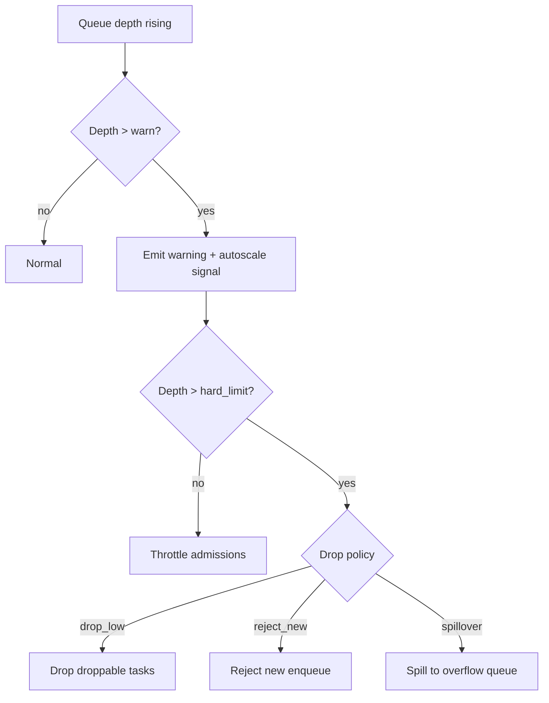
```mermaid
flowchart TD
    A[Queue depth rising] --> B{Depth > warn?}
    B -->|no| C[Normal]
    B -->|yes| D[Emit warning + autoscale signal]
    D --> E{Depth > hard_limit?}
    E -->|no| F[Throttle admissions]
    E -->|yes| G{Drop policy}
    G -->|drop_low| H[Drop droppable tasks]
    G -->|reject_new| I[Reject new enqueue]
    G -->|spillover| J[Spill to overflow queue]
```

**Parameters**:
- `warn_threshold`: Warning depth (default: 50)
- `hard_limit`: Hard limit depth (default: 100)
- `drop_policy`: Strategy for overflow (drop_low, reject_new, spillover)

### Admission Control - UNIQUE

| **Aspect** | **Configuration** | **Behavior** | **Source** |
|------------|-----------------|--------------|------------|
| **Pending Admission State** | `PENDING_ADMISSION` | Tasks wait for admission approval | Q-002 |
| **Pressure-Based Gating** | System pressure metrics | Admission based on resource pressure | Q-007 |
| **Quota-Based Gating** | Tenant quota status | Admission based on quota availability | Q-044 |
| **Periodic Admission Scan** | Scheduled scan interval | Promote pending tasks when capacity available | Q-007 |

### Admission Control Flow - UNIQUE

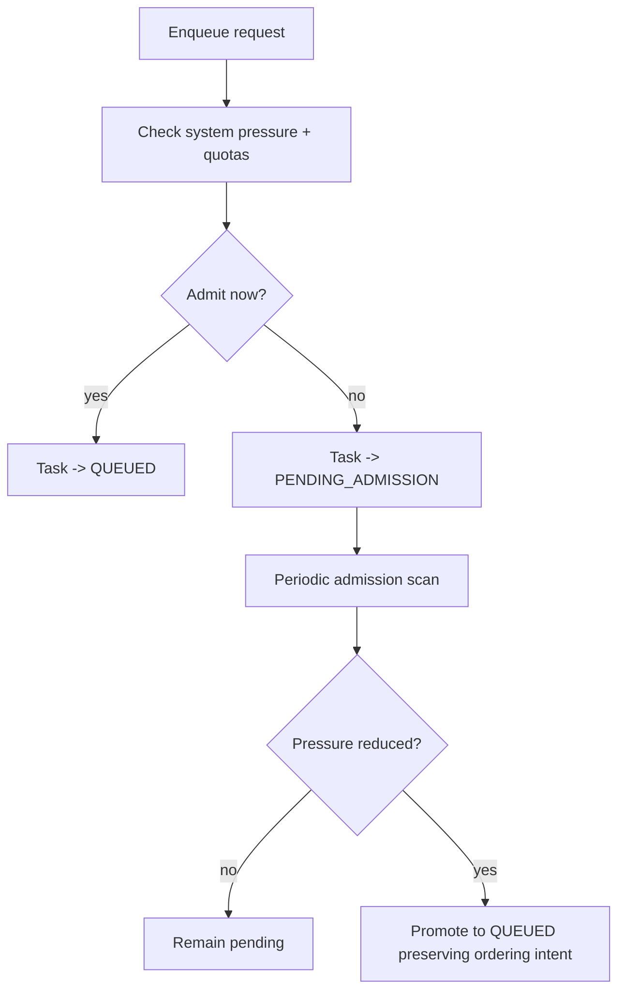
```mermaid
flowchart TD
    A[Enqueue request] --> B[Check system pressure + quotas]
    B --> C{Admit now?}
    C -->|yes| D[Task -> QUEUED]
    C -->|no| E[Task -> PENDING_ADMISSION]
    E --> F[Periodic admission scan]
    F --> G{Pressure reduced?}
    G -->|no| H[Remain pending]
    G -->|yes| I[Promote to QUEUED preserving ordering intent]
```

**Acceptance Criteria**:
- PENDING_ADMISSION tasks have predictable promotion behavior
- Admission decisions are auditable
- No task starves indefinitely in pending state

---

## Unique Multi-Tenancy & Fairness

### Multi-Tenancy Isolation - UNIQUE

| **Aspect** | **Configuration** | **Behavior** | **Source** |
|------------|-----------------|--------------|------------|
| **Namespace Isolation** | `tenant_id` | No cross-tenant reads/writes | Q-018 |
| **Quota Profiles** | `quota_profile` | Per-tenant resource limits | Q-044 |
| **Fair Share** | `min_share`, `weight` | Balanced distribution | Q-034 |
| **Tenant Isolation** | Tenant-specific queues | Queue-level isolation | Q-018 |

### Quota Profiles - UNIQUE

| **Quota Type** | **Description** | **Enforcement** | **Source** |
|----------------|-----------------|----------------|------------|
| **Compute Quota** | CPU/GPU time limits | Block lease when exceeded | Q-044 |
| **Storage Quota** | Artifact storage limits | Block enqueue when exceeded | Q-044 |
| **Concurrency Quota** | Max concurrent tasks | Block lease when exceeded | Q-044 |
| **Rate Quota** | Max operations per time window | Rate limit when exceeded | Q-043, Q-044 |

### Queue Sharding - UNIQUE

```mermaid
flowchart TD
    A[Task enqueue] --> B[Compute shard = hash routing_key % N]
    B --> C[Append to shard queue Q[shard]]
    C --> D[Shard worker consumes Q[shard]]
    D --> E[Lease + execute]
    E --> F[Shard-local ordering rules apply]
```

**Parameters**:
- `shard_count`: Number of shards (default: number of workers)
- `routing_key`: Key for shard assignment (default: task_id or tenant_id)

**Acceptance Criteria**:
- Shard assignment is deterministic
- Load is balanced across shards
- Shard boundaries are stable

### Hot-Shard Mitigation - UNIQUE

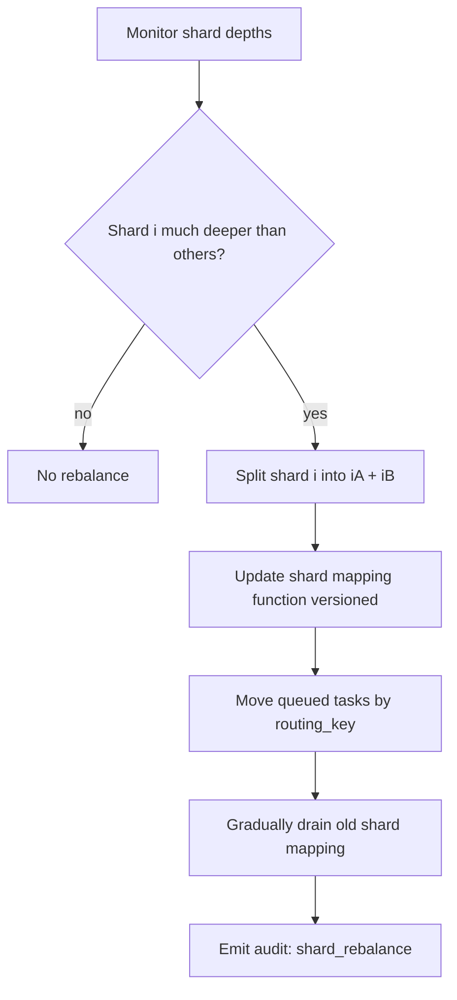
```mermaid
flowchart TD
    A[Monitor shard depths] --> B{Shard i much deeper than others?}
    B -->|no| C[No rebalance]
    B -->|yes| D[Split shard i into iA + iB]
    D --> E[Update shard mapping function versioned]
    E --> F[Move queued tasks by routing_key]
    F --> G[Gradually drain old shard mapping]
    G --> H[Emit audit: shard_rebalance]
```

**Trigger**: When one shard exceeds 2x average depth

**Acceptance Criteria**:
- Rebalancing is transparent to executing tasks
- Rebalancing is audited
- No task is lost during rebalance

---

## Unique Dead-Letter Queue Patterns

### DLQ Triage Pipeline - UNIQUE

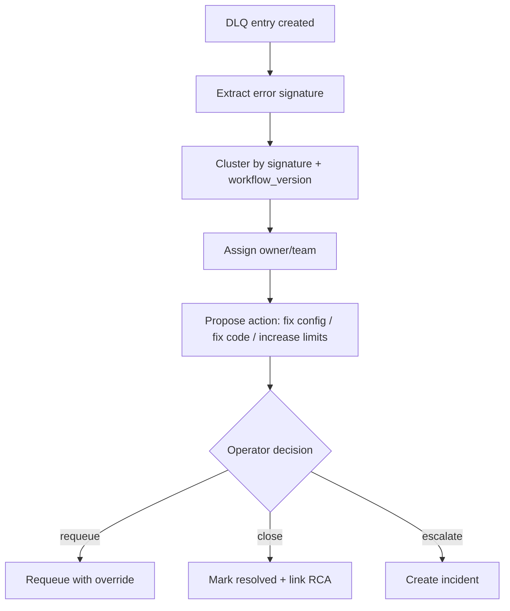
```mermaid
flowchart TD
    A[DLQ entry created] --> B[Extract error signature]
    B --> C[Cluster by signature + workflow_version]
    C --> D[Assign owner/team]
    D --> E[Propose action: fix config / fix code / increase limits]
    E --> F{Operator decision}
    F -->|requeue| G[Requeue with override]
    F -->|close| H[Mark resolved + link RCA]
    F -->|escalate| I[Create incident]
```

### DLQ Entry Structure - UNIQUE

| **Field** | **Type** | **Description** |
|-----------|----------|----------------|
| `dlq_id` | UUID | Unique DLQ entry identifier |
| `original_task_id` | UUID | Original task that failed |
| `error_signature` | String | Clustered error pattern |
| `error_message` | String | Detailed error message |
| `retry_count` | Integer | Number of retry attempts |
| `last_failure_ts` | Timestamp | Time of last failure |
| `workflow_version` | String | Version of workflow |
| `tenant_id` | UUID | Tenant identifier |
| `triage_status` | Enum | pending, assigned, resolved, escalated |
| `assigned_team` | String | Team responsible for triage |

### Requeue with Override Guardrails - UNIQUE

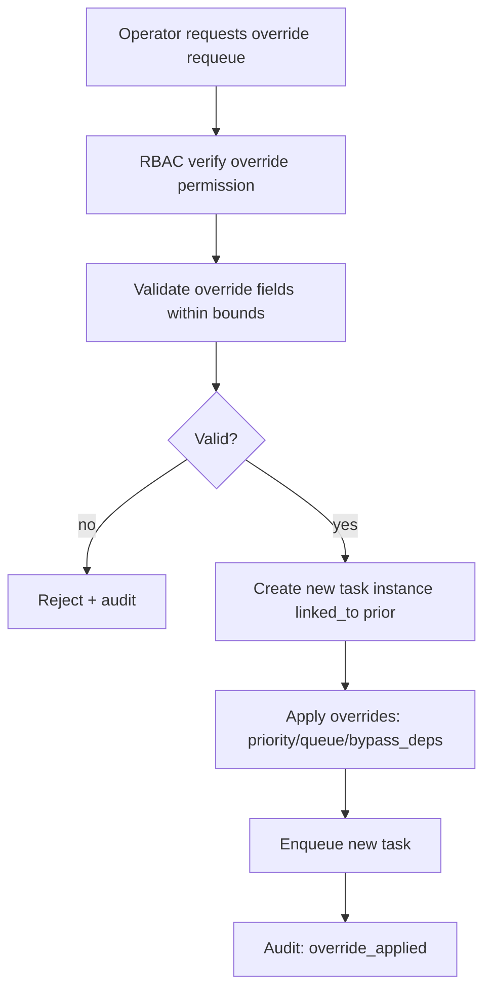
```mermaid
flowchart TD
    A[Operator requests override requeue] --> B[RBAC verify override permission]
    B --> C[Validate override fields within bounds]
    C --> D{Valid?}
    D -->|no| E[Reject + audit]
    D -->|yes| F[Create new task instance linked_to prior]
    F --> G[Apply overrides: priority/queue/bypass_deps]
    G --> H[Enqueue new task]
    H --> I[Audit: override_applied]
```

**Override Options**:
- `priority_override`: Set new priority
- `queue_override`: Route to different queue
- `bypass_dependencies`: Skip dependency checks
- `max_retries_override`: Increase retry limit

**Acceptance Criteria**:
- All overrides are audited
- Override permissions are RBAC-controlled
- Original task is preserved for reference

---

## Unique Time & Scheduling Semantics

### Scheduled Window Enforcement - UNIQUE

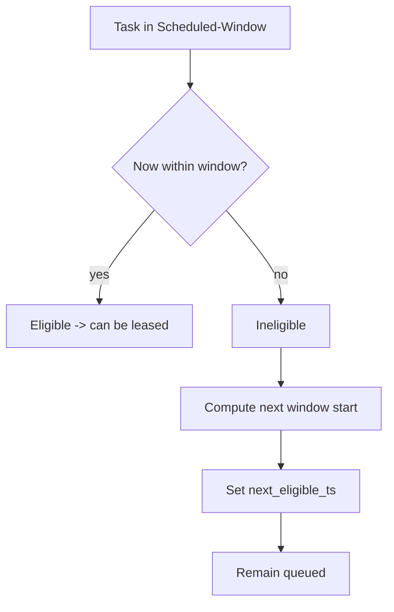
```mermaid
flowchart TD
    A[Task in Scheduled-Window] --> B{Now within window?}
    B -->|yes| C[Eligible -> can be leased]
    B -->|no| D[Ineligible]
    D --> E[Compute next window start]
    E --> F[Set next_eligible_ts]
    F --> G[Remain queued]
```

**Window Types**:
- **Hard Window**: Task never executes outside window
- **Soft Window**: Task can execute outside with degraded priority
- **Maintenance Window**: Only maintenance tasks execute

### Cron Slot Identity + Dedupe - UNIQUE

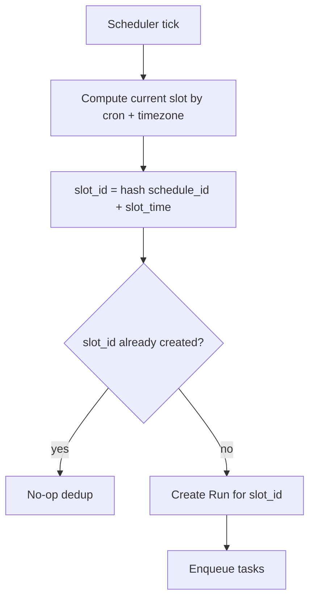
```mermaid
flowchart TD
    A[Scheduler tick] --> B[Compute current slot by cron + timezone]
    B --> C[slot_id = hash schedule_id + slot_time]
    C --> D{slot_id already created?}
    D -->|yes| E[No-op dedup]
    D -->|no| F[Create Run for slot_id]
    F --> G[Enqueue tasks]
```

**Dedupe Guarantee**: Same schedule + same slot_time = same slot_id = no duplicate run

### Repeat Fixed-Delay Non-Overlap - UNIQUE

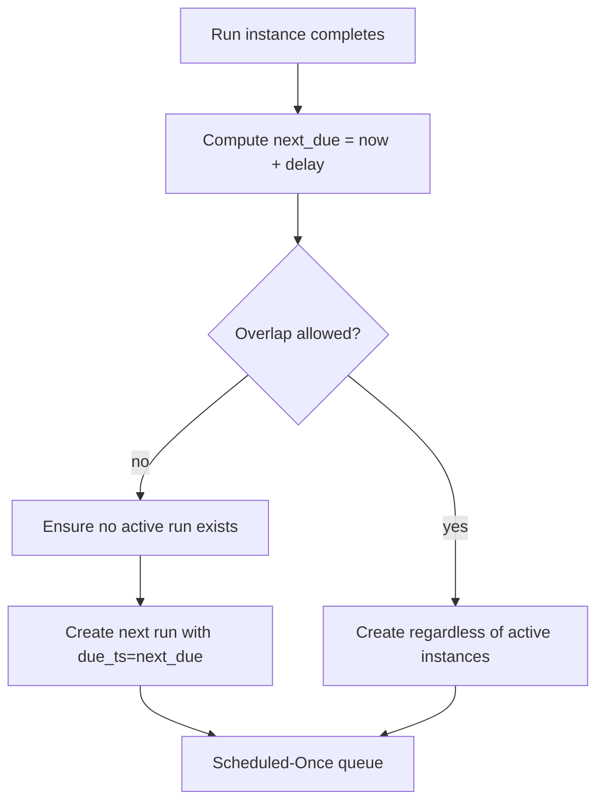
```mermaid
flowchart TD
    A[Run instance completes] --> B[Compute next_due = now + delay]
    B --> C{Overlap allowed?}
    C -->|no| D[Ensure no active run exists]
    D --> E[Create next run with due_ts=next_due]
    C -->|yes| F[Create regardless of active instances]
    E --> G[Scheduled-Once queue]
    F --> G
```

**Overlap Policies**:
- `allow_overlap`: Multiple concurrent instances allowed
- `skip_if_running`: Skip if previous instance still running
- `queue_after_completion`: Queue next run after current completes

### Catchup Policies - UNIQUE

| **Policy** | **Description** | **Behavior** |
|------------|-----------------|--------------|
| `none` | Skip missed runs | No catchup, continue with next scheduled |
| `latest` | Run only latest missed | Execute most recent missed run |
| `all` | Run all missed | Execute all missed runs in order |
| `bounded(n)` | Run up to n missed | Execute up to n most recent missed runs |

### Timezone Handling - UNIQUE

| **Aspect** | **Configuration** | **Behavior** |
|------------|-----------------|--------------|
| **Explicit Timezone** | `timezone: "America/Chicago"` | Schedule evaluated in specified timezone |
| **DST Transitions** | Automatic DST handling | Correct slot calculation across DST |
| **UTC Normalization** | Internal UTC storage | All times stored as UTC, displayed in local |

---

## Unique Distributed Systems Patterns

### Multi-Region Replication - UNIQUE

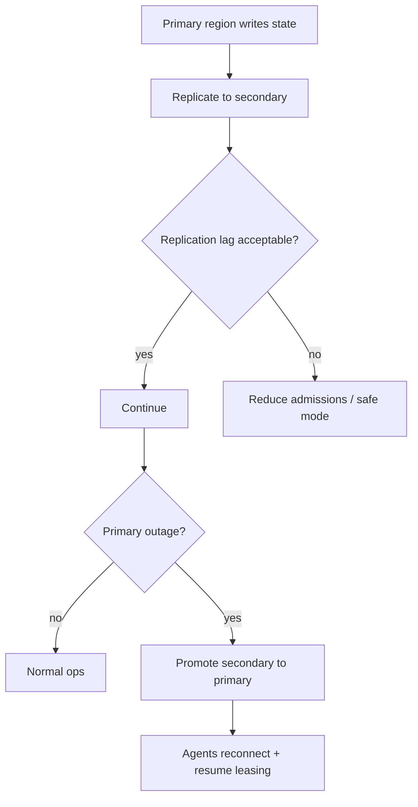
```mermaid
flowchart TD
    A[Primary region writes state] --> B[Replicate to secondary]
    B --> C{Replication lag acceptable?}
    C -->|yes| D[Continue]
    C -->|no| E[Reduce admissions / safe mode]
    D --> F{Primary outage?}
    F -->|no| G[Normal ops]
    F -->|yes| H[Promote secondary to primary]
    H --> I[Agents reconnect + resume leasing]
```

**Replication Strategies**:
- **Sync**: Block on write until replicated
- **Async**: Best-effort async replication
- **Semi-Sync**: Block until one replica confirms

### Disaster Recovery Restore - UNIQUE

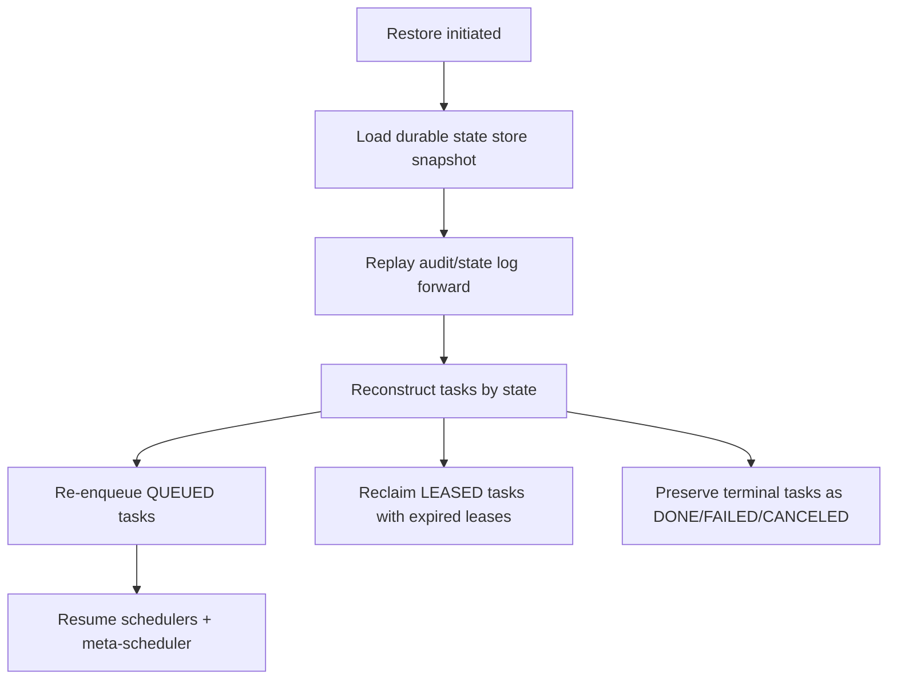
```mermaid
flowchart TD
    A[Restore initiated] --> B[Load durable state store snapshot]
    B --> C[Replay audit/state log forward]
    C --> D[Reconstruct tasks by state]
    D --> E[Re-enqueue QUEUED tasks]
    D --> F[Reclaim LEASED tasks with expired leases]
    D --> G[Preserve terminal tasks as DONE/FAILED/CANCELED]
    E --> H[Resume schedulers + meta-scheduler]
```

**Recovery Guarantees**:
- No lost committed state
- In-flight tasks are recovered or re-queued
- Terminal state is preserved

### Exactly-Once Within Internal State Transitions - UNIQUE

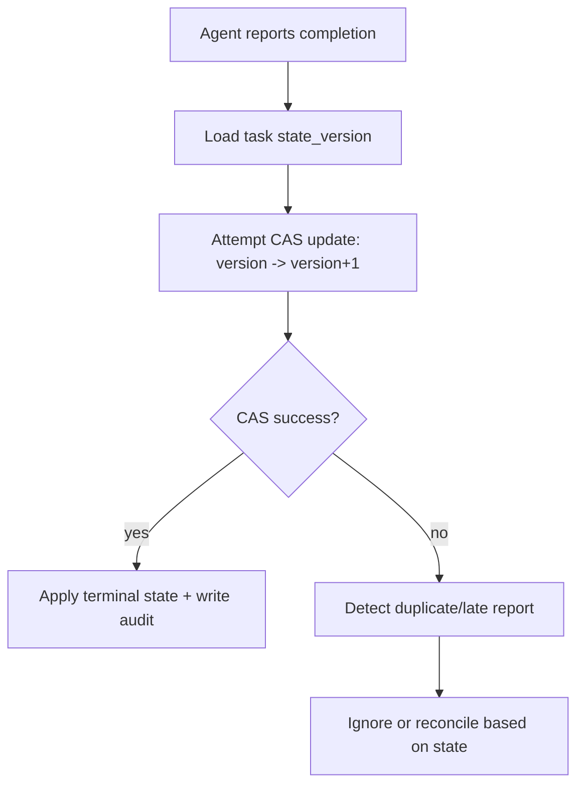
```mermaid
flowchart TD
    A[Agent reports completion] --> B[Load task state_version]
    B --> C[Attempt CAS update: version -> version+1]
    C --> D{CAS success?}
    D -->|yes| E[Apply terminal state + write audit]
    D -->|no| F[Detect duplicate/late report]
    F --> G[Ignore or reconcile based on state]
```

**CAS Guarantee**: Compare-and-swap ensures exactly-once state update

---

## Unique Operational Controls

### Queue Pause at Category Level - UNIQUE

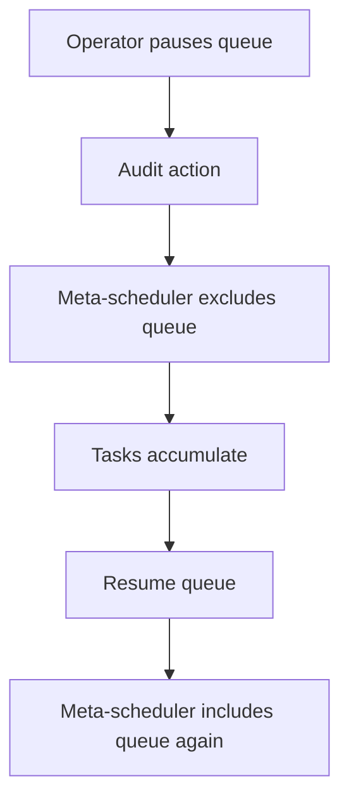
```mermaid
flowchart TD
    A[Operator pauses queue] --> B[Audit action]
    B --> C[Meta-scheduler excludes queue]
    C --> D[Tasks accumulate]
    D --> E[Resume queue]
    E --> F[Meta-scheduler includes queue again]
```

**Pause Scopes**:
- `single_queue`: Pause one specific queue
- `category`: Pause all queues in a category (e.g., all ASAP)
- `tenant`: Pause all queues for a tenant
- `system_wide`: Pause all queues (emergency)

### System-Wide Safe Mode - UNIQUE

```mermaid
flowchart TD
    A[Incident declared] --> B[Enable SAFE_MODE=true]
    B --> C[Admission control checks risk_tier]
    C --> D{risk_tier high?}
    D -->|yes| E[Reject or Human-Gate new tasks]
    D -->|no| F[Allow enqueue]
    E --> G[Notify + audit]
    F --> H[Continue processing low-risk tasks]
```

**Safe Mode Triggers**:
- Manual activation by operator
- Automatic on error rate spike
- Automatic on resource exhaustion

### Cancellation Propagation in DAG - UNIQUE

```mermaid
flowchart TD
    A[Cancel node X] --> B[Find downstream dependents]
    B --> C{Propagation mode}
    C -->|none| D[Only cancel X]
    C -->|downstream| E[Cancel all dependents]
    C -->|upstream| F[Cancel prerequisites rare]
    C -->|both| G[Cancel upstream + downstream]
    E --> H[Mark dependents CANCELED if not terminal]
    D --> I[Audit cancel graph]
    F --> I
    G --> I
```

**Propagation Modes**:
- `none`: Cancel only the specified node
- `downstream`: Cancel all dependent tasks
- `upstream`: Cancel prerequisite tasks (rare)
- `both`: Cancel in both directions

### Reprioritize While Queued - UNIQUE

```mermaid
flowchart TD
    A[Task QUEUED] --> B[Operator changes priority]
    B --> C[Write new priority + audit]
    C --> D[Recompute effective_priority]
    D --> E[Reinsert into priority structure preserving tie-break rules]
    E --> F[Meta-scheduler sees updated rank]
```

**Acceptance Criteria**:
- Priority change is immediate
- Original position is not preserved
- Change is audited

---

## Requirements Traceability

### Unique Requirements Summary

| **Unique Domain** | **Unique Requirements** | **Priority** |
|-------------------|------------------------|--------------|
| **Queue Categories & Levels** | QL-001 to QL-025 (25 levels) | P0-P1 |
| **Priority + Aging** | Q-012, anti-starvation | P0 |
| **Priority Inversion Guard** | Q-012, dependency boost | P1 |
| **Deadline Escalation** | Q-035, SLA-driven promotion | P1 |
| **Lease Management** | Q-005, Q-038, heartbeats | P0 |
| **Advanced Scheduling** | Q-034, WRR/DRR/EDF/Fair Share | P0 |
| **Backpressure** | Q-007, drop/spillover policies | P0 |
| **Admission Control** | Q-002, PENDING_ADMISSION state | P0 |
| **Rate Limiting** | Q-043, token bucket | P0 |
| **Quotas** | Q-044, multi-tenant allocation | P0 |
| **Work Stealing** | Q-037, cross-pool distribution | P1 |
| **Agent Pools** | Q-036, capability-based | P0 |
| **DLQ** | Q-009, triage/requeue | P0 |
| **Scheduled Windows** | QL-006, time-gated | P1 |
| **Cron Semantics** | Q-048, slot dedupe/catchup | P0 |
| **Spillover** | QL-023, overflow handling | P1 |
| **Queue Pausing** | Q-030, category-level pause | P1 |
| **Safe Mode** | Q-046, risk-based admission | P1 |
| **Cancellation Propagation** | Q-029, DAG-aware | P0 |
| **Multi-Region Replication** | Q-060, DR support | P1 |
| **Exactly-Once Outcome** | Q-025, CAS/outbox/inbox | P0 |
| **Hot-Shard Mitigation** | Q-037, rebalancing | P1 |
| **Per-Tenant Fair Share** | Q-034, weighted distribution | P1 |
| **Queue Groups** | Q-060, consumer groups | P1 |

### Total Unique Statistics

- **Unique Queue Levels**: 25 (QL-001 to QL-025)
- **Unique Requirements**: 60 requirements, all with queue-specific semantics
- **Priority Breakdown**: 30 P0 (critical), 30 P1 (high)
- **Unique Scheduling Algorithms**: 10 (WRR, DRR, EDF, Fair Share, Priority+Aging, etc.)
- **Unique Operational Controls**: 8 (pause, safe mode, cancellation, reprioritize, etc.)

---

## End of Document

This document captures **ONLY** the requirements unique to `agent-queue` that are not covered by `yaml-to-local-rust-agentsdk`. 

**Key Differentiation**:
- `agent-queue` = **Queue engine, scheduling, state management, operational coordination**
- `yaml-to-local-rust-agentsdk` = **Transpilation, code generation, model execution, LLM integration**

For the complete unified requirements including shared concepts (observability, logging, CLI, validation), see `requirements.md`.
