# Agent Queue System - Comprehensive OpenCode Chat History

## Overview

This document exhaustively catalogs every queue and agentic queue-related concept, requirement, and design pattern discussed across OpenCode chat history for the AgentQueue project.

**Project**: AgentQueue - Multi-dimensional queue workflow engine for yaml-to-rust-agentsdk
**Tech Stack**: Tokio current-thread + SQLite + Clap + Console
**Primary ADRs**: ADR-0002 (MVP Queue Scheduler Safety), ADR-0007 (Cron Git Refinement)

---

## Table of Contents

1. [Queue System Architecture](#queue-system-architecture)
2. [Queue States & Lifecycle](#queue-states--lifecycle)
3. [Queue Categories & Execution Timing](#queue-categories--execution-timing)
4. [Execution Modes](#execution-modes)
5. [Scheduling Strategies](#scheduling-strategies)
6. [Priority System](#priority-system)
7. [Scheduling Features](#scheduling-features)
8. [Long-Running Behaviors](#long-running-behaviors)
9. [Human Gating & Safety Controls](#human-gating--safety-controls)
10. [Policy Sliders](#policy-sliders)
11. [CLI Commands](#cli-commands)
12. [Retry & Error Handling](#retry--error-handling)
13. [Memory & Resource Management](#memory--resource-management)
14. [Concurrency Limits](#concurrency-limits)
15. [Timeout Configuration](#timeout-configuration)
16. [Checkpointing & Recovery](#checkpointing--recovery)
17. [Sub-Workflow Coordination](#sub-workflow-coordination)
18. [Validation & Quality Gates](#validation--quality-gates)
19. [Observability](#observability)
20. [Loop Variations](#loop-variations)
21. [Advanced Queue Patterns](#advanced-queue-patterns)
22. [Scaling & Infrastructure](#scaling--infrastructure)
23. [Security & Compliance](#security--compliance)
24. [Determinism & Reliability](#determinism--reliability)
25. [Agentic Orchestration Patterns](#agentic-orchestration-patterns)
26. [Implementation Phases](#implementation-phases)
27. [Requirements Traceability](#requirements-traceability)

---

## Queue System Architecture

### Core Work Container Model

| **Component** | **Description** | **Requirements** | **Source** |
|--------------|----------------|------------------|------------|
| **ChatSession** | Scoped executable work container | - Holds scope<br>- Holds queue state<br>- Holds artifacts<br>- Holds workflows | ADR-0002, R07 |
| **Queue UX** | Left-side queue with titles and live execution meaning | - Visible queue display<br>- Status indicators<br>- Priority visibility | ADR-0002, R08 |
| **Queue Persistence** | SQLite-backed persistence | - ACID transaction guarantees<br>- Survives process restarts<br>- Supports recovery | Research Report R02, R24 |
| **State Machine** | Enum-based states with runtime validation | - Compile-time safe transitions<br>- Serializable<br>- Runtime validation | Research Report R02 |

### Technical Stack

| **Component** | **Technology** | **Rationale** | **Source** |
|--------------|---------------|--------------|------------|
| **Runtime** | Tokio current-thread | Predictable latency, single-threaded | Research Report R02 |
| **Storage** | SQLite | ACID transactions, embedded, low overhead | Research Report R02 |
| **CLI** | Clap + Console | Hierarchical commands, rich output | Research Report R02 |
| **State Machine** | Enum-based | Type-safe, serializable | Research Report R02 |
| **Model Lifecycle** | one_at_a_time, lazy, eager, adaptive | Resource control, performance optimization | Unified Schema |

---

## Queue States & Lifecycle

### State Machine

| **State** | **Description** | **Transitions** | **Validation** | **ADR Reference** |
|-----------|-----------------|----------------|----------------|------------------|
| **PENDING_ADMISSION** | Task waiting for admission approval | → QUEUED (when admitted)<br>→ REJECTED (when denied) | Must have admission context | Advanced Pattern #43 |
| **QUEUED** | Task waiting to be executed | → RUNNING (when worker available)<br>→ PENDING_ADMISSION (if admission needed)<br>→ CANCELED (if cancelled) | Must have payload, valid metadata | ADR-0002 |
| **SCHEDULED** | Task scheduled for future execution | → QUEUED (when time arrives) | Must have run_at timestamp | ADR-0002, #50 |
| **RUNNING** | Task currently executing | → COMPLETED (success)<br>→ FAILED (error)<br>→ CANCELED (cancelled)<br>→ RUNNING (retry) | Must have worker_id, lease active | ADR-0002 |
| **COMPLETED** | Task finished successfully | Terminal state | Must have result, output | ADR-0002 |
| **FAILED** | Task failed with error | → RUNNING (retry if retryable)<br>→ DLQ (if exhausted retries) | Must have reason, attempts count | ADR-0002, #46 |
| **CANCELED** | Task was cancelled | Terminal state | Terminal state, audit record | ADR-0002, #48 |

### State Transition Flowchart

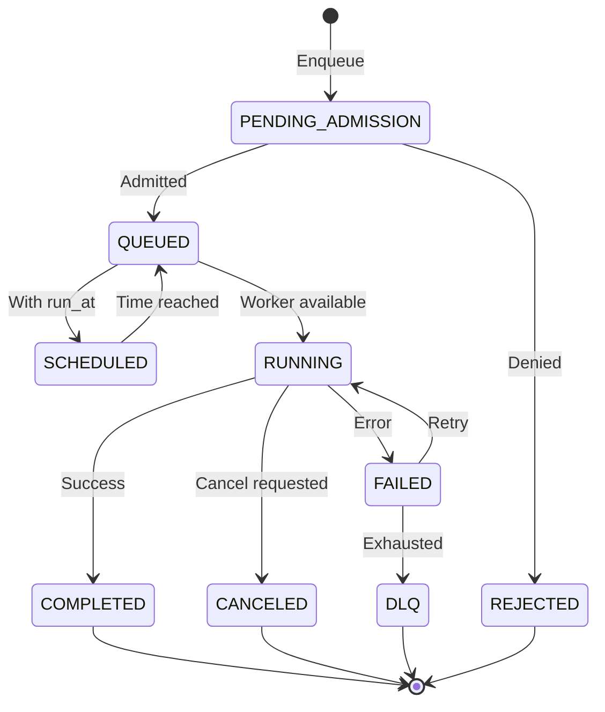

---

## Queue Categories & Execution Timing

### Queue Categories (User Intent Mapping)

| **Category** | **Documented Equivalent** | **Execution Behavior** | **Use Cases** | **Priority Treatment** |
|-------------|--------------------------|----------------------|---------------|----------------------|
| **ASAP** | QUEUED + Critical/High Priority | Execute immediately when worker available | Emergency fixes, blocking issues, urgent user requests | Highest priority weight (10-5), anti-starvation aging applies |
| **Whenever** | Background + Low Priority | Execute when resources available, detached from main thread | Nice-to-have tasks, maintenance, batch processing | Low priority (1), no preemption, background execution mode |
| **Scheduled** | SCHEDULED state + Cron expressions | Execute at specific timestamps or recurring schedules | Periodic reports, maintenance windows, time-bound operations | Time-based eligibility, deadline escalation when overdue |
| **Repeat** | Validation loops + Cron expressions | Recurring execution or iterative improvement | Optimization loops, continuous refinement, monitoring | Fixed-delay or cron-based, overlap control (single instance) |

### Queue-Level Control

| **Capability** | **Description** | **Implementation** | **Diagram Reference** |
|---------------|-----------------|-------------------|----------------------|
| **Pause ASAP** | Pause urgent queue while others continue | Meta-scheduler excludes ASAP from selection | #44 |
| **Safe Mode** | Deny new risky tasks system-wide | Admission control checks risk_tier | #45 |
| **Backpressure** | Handle queue overflow conditions | Drop vs degrade vs spillover policies | #53 |
| **Admission Control** | Pending admission before queued | PENDING_ADMISSION state | #43 |

---

## Execution Modes

### Execution Mode Matrix

| **Mode** | **Description** | **Use Case** | **Implementation** | **Source** |
|----------|-----------------|--------------|-------------------|------------|
| **Serial** | Execute steps sequentially one at a time | Resource-constrained environments, deterministic order | Model lifecycle: one_at_a_time | Unified Schema, Plan-01 |
| **Parallel** | Execute steps in parallel where dependencies allow | Maximum throughput, independent tasks | Model lifecycle: lazy, parallel_groups enabled | Unified Schema, Plan-01 |
| **Hybrid** | Adaptive parallelism based on resource availability | Balance speed and resource usage | Model lifecycle: adaptive, dynamic resource monitoring | Unified Schema, Plan-01 |
| **Interactive** | Human-in-the-loop with confirmations | High-risk operations, explicit approval | Execution mode: interactive, human_gating enabled | Unified Schema |
| **Automated** | No human intervention required | Batch processing, CI/CD | Execution mode: automated, no human_gating | Unified Schema |
| **Hybrid (User)** | Mix of interactive and automated | Flexible workflows | Execution mode: hybrid, selective human_gating | Unified Schema |

---

## Scheduling Strategies

### Scheduling Algorithm Selection

| **Strategy** | **Description** | **Priority Handling** | **Use Case** | **Anti-Starvation** | **Diagram Reference** |
|--------------|-----------------|---------------------|--------------|-------------------|----------------------|
| **FIFO (First-In-First-Out)** | Simple queue, first submitted runs first | None (no priority) | Fair resource sharing, simple workloads | None | N/A |
| **Priority Queue** | Tasks ordered by priority level | Weight-based (critical:10, high:5, medium:3, low:1) | Urgent tasks, service differentiation | Aging boost (#21) | #21, #22 |
| **Earliest Deadline First (EDF)** | Schedule by deadline | Deadline-based priority | Time-sensitive workflows | Deadline escalation (#23) | #23 |
| **Fair Share** | Balanced resource allocation | Fair distribution across tenants | Multi-tenant, fair resource usage | Per-tenant min_share | #26 |
| **Round Robin** | Cyclic worker selection | Equal distribution | Load balancing across workers | None | N/A |
| **Shortest Job First** | Prioritize quick tasks | Estimated duration | Reduce wait time, improve throughput | None | N/A |
| **Longest Job First** | Prioritize long tasks | Estimated duration | Complex tasks, reduce context switches | None | N/A |

### Priority + Aging (Anti-Starvation)

```mermaid
flowchart TD
    A[Task queued] --> B[Compute base_priority]
    B --> C[Compute age = now - enqueue_ts]
    C --> D[age_boost = floor(age / aging_quantum) * aging_rate]
    D --> E[effective_priority = base_priority + age_boost]
    E --> F[Sort candidates by effective_priority desc]
    F --> G[Tie-break: due_ts asc, enqueue_ts asc, task_id asc]
    G --> H[Select next task]
```

**Parameters**:
- `aging_quantum`: Time interval for aging boost (default: 300s)
- `aging_rate`: Priority increment per quantum (default: 1)

### Priority Inversion Guard

```mermaid
flowchart TD
    A[High priority task H depends on L] --> B[L is low priority]
    B --> C[Detect: blocked_by_lower_priority]
    C --> D[Temporarily boost L priority to H-ε]
    D --> E[Route L to higher queue tier (optional)]
    E --> F[Execute L]
    F --> G[Unblock H]
    G --> H[Restore L original priority (post-complete)]
```

---

## Priority System

### Priority Levels

| **Level** | **Weight** | **Use Case** | **Preemption** | **Escalation** | **Source** |
|-----------|-----------|--------------|----------------|----------------|------------|
| **Critical** | 10 | Emergency fixes, blocking issues | Yes (can interrupt) | N/A (already highest) | Unified Schema |
| **High** | 5 | Urgent user requests, important tasks | No | Can escalate to Critical | Unified Schema |
| **Medium** | 3 | Standard work items | No | Can escalate to High | Unified Schema |
| **Low** | 1 | Background tasks, nice-to-have | No | Can escalate to Medium | Unified Schema |

### Deadline Escalation

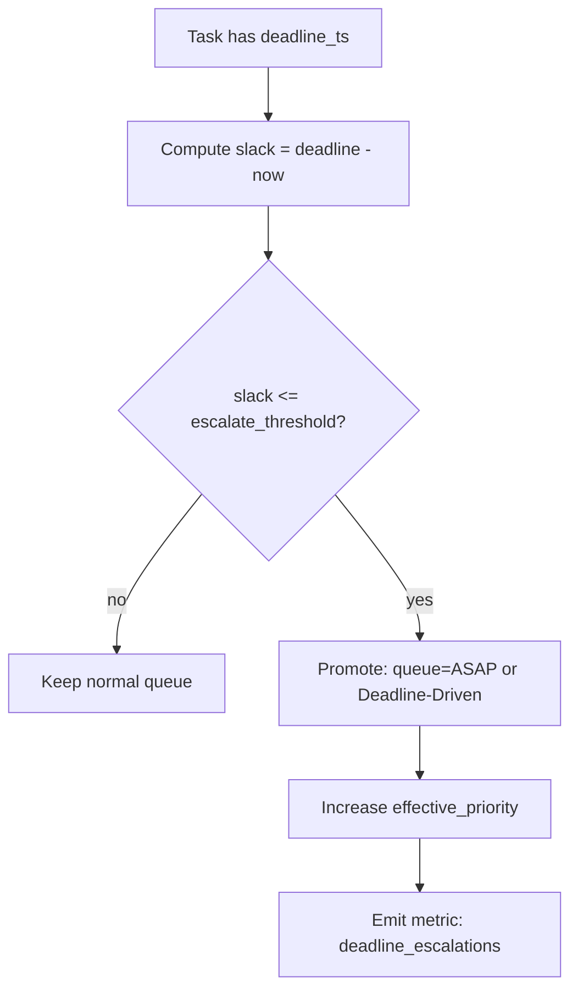

**Parameters**:
- `escalate_threshold`: Slack threshold for escalation (default: 300s)
- `escalation_boost`: Priority increase amount (default: +5)

### Overdue Handling Policy

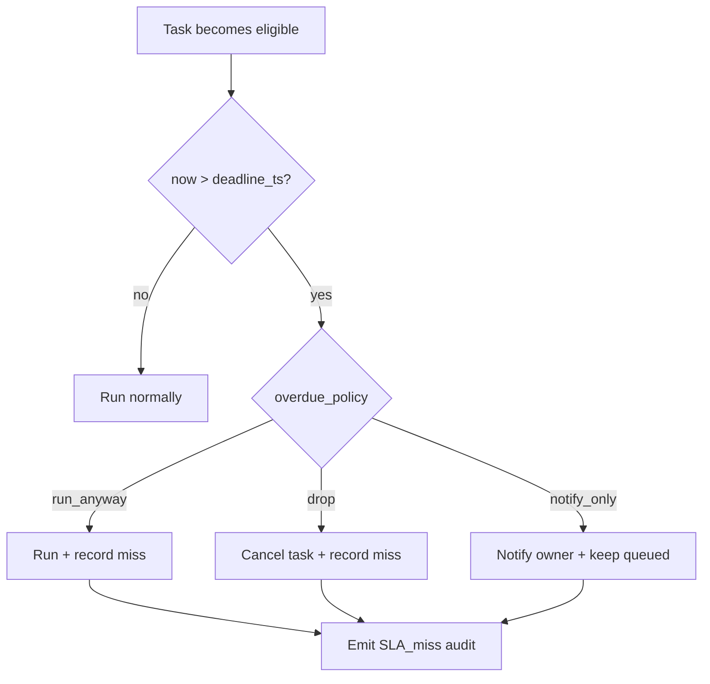

**Overdue Policies**:
- `run_anyway`: Execute despite being overdue
- `drop`: Cancel task, don't execute
- `notify_only`: Keep queued but notify owner

### Reprioritize While Queued

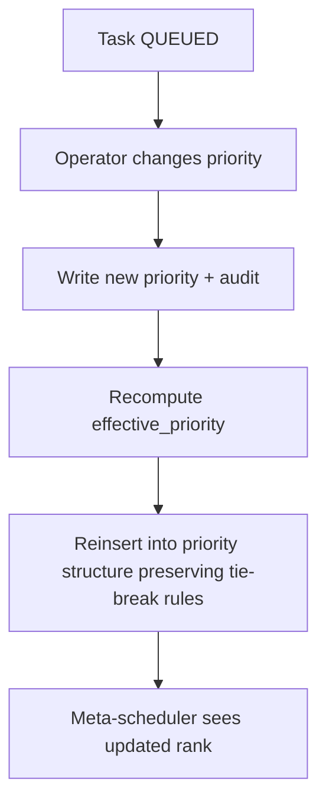

---

## Scheduling Features

### Rate-Limited Execution (Token Bucket)

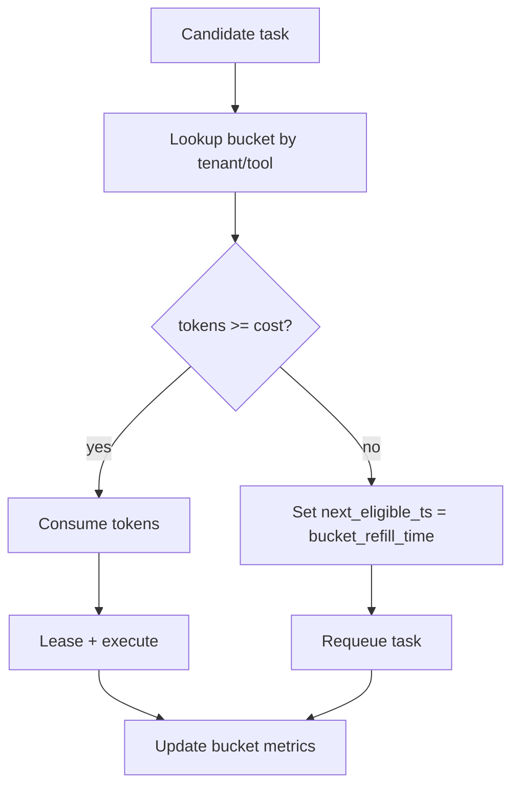

**Parameters**:
- `bucket_capacity`: Max tokens per bucket (default: 100)
- `refill_rate`: Tokens per second refilled (default: 1/s)
- `token_cost`: Cost per task execution (default: 1)

### Per-Tenant Fair Share

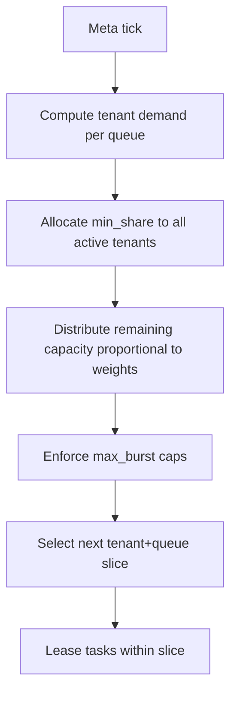

**Parameters**:
- `min_share`: Minimum tasks per tick per tenant (default: 1)
- `weight`: Tenant weight for distribution (default: 1.0)
- `max_burst`: Maximum tasks per tick (default: 10)

### Queue Sharding

```mermaid
flowchart TD
    A[Task enqueue] --> B[Compute shard = hash(routing_key) % N]
    B --> C[Append to shard queue Q[shard]]
    C --> D[Shard worker consumes Q[shard]]
    D --> E[Lease + execute]
    E --> F[Shard-local ordering rules apply]
```

**Parameters**:
- `shard_count`: Number of shards (default: number of workers)
- `routing_key`: Key for shard assignment (default: task_id or tenant_id)

### Hot-Shard Mitigation

```mermaid
flowchart TD
    A[Monitor shard depths] --> B{Shard i much deeper than others?}
    B -->|no| C[No rebalance]
    B -->|yes| D[Split shard i into iA + iB]
    D --> E[Update shard mapping function (versioned)]
    E --> F[Move queued tasks by routing_key]
    F --> G[Gradually drain old shard mapping]
    G --> H[Emit audit: shard_rebalance]
```

**Trigger**: When one shard exceeds 2x average depth

---

## Scaling & Infrastructure

### Agent Pool Autoscaling

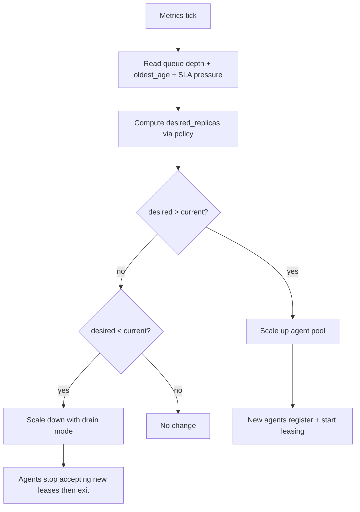

**Scale Policy**:
- `scale_up_threshold`: Queue depth triggering scale-up (default: 10)
- `scale_down_threshold`: Queue depth triggering scale-down (default: 1)
- `scale_cooldown`: Minimum time between scaling events (default: 60s)

### Graceful Agent Shutdown

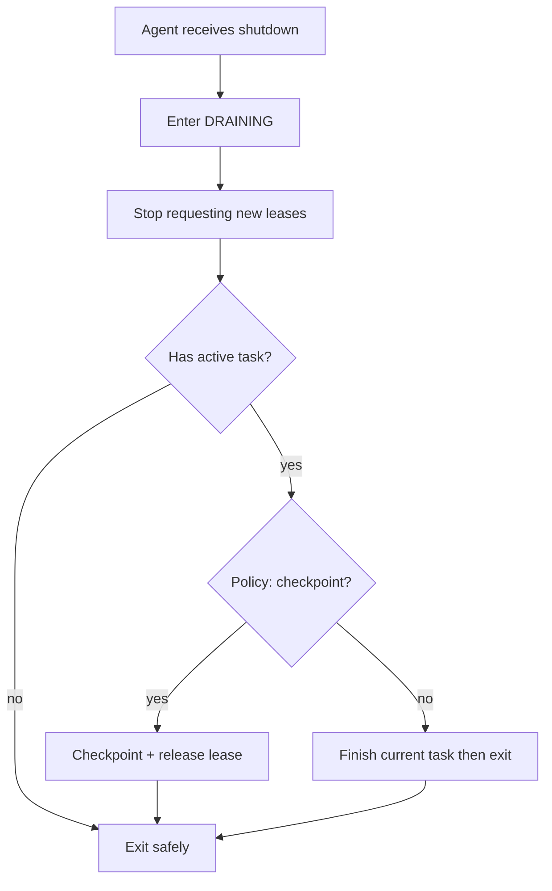

### Backpressure Policy

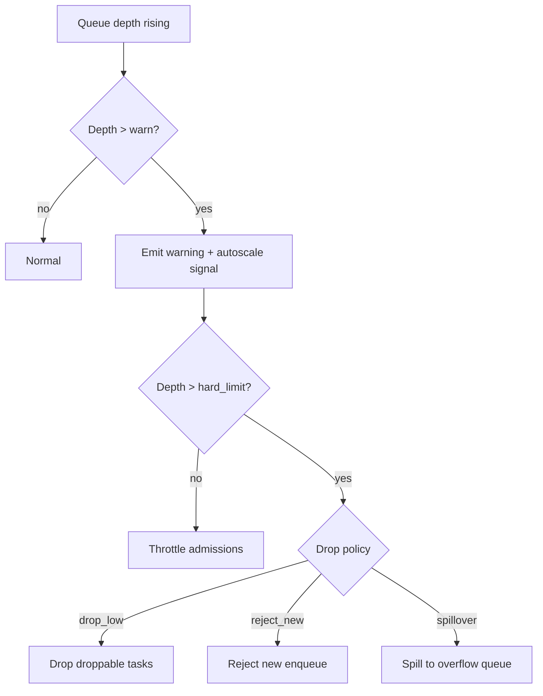

**Parameters**:
- `warn_threshold`: Warning depth (default: 50)
- `hard_limit`: Hard limit depth (default: 100)
- `drop_policy`: Strategy for overflow (drop_low, reject_new, spillover)

---

## Long-Running Behaviors

### Long-Running Task Types

| **Behavior Type** | **Description** | **Termination** | **Resource Limits** | **Source** |
|------------------|-----------------|----------------|-------------------|------------|
| **Background** | Runs detached from main thread | Manual or timeout | Max duration, max tool calls | R26 |
| **Semi-Endless** | Runs until explicit stop condition | Condition-based stop | Max iterations, max memory | R26 |
| **Endless** | Runs indefinitely (autonomous) | Manual interrupt only | Safety limits, abort on OOM | R26 |
| **Resumable** | Can pause and continue | Checkpoint state | Checkpoint interval, max checkpoints | R26 |

### Checkpointing Strategy

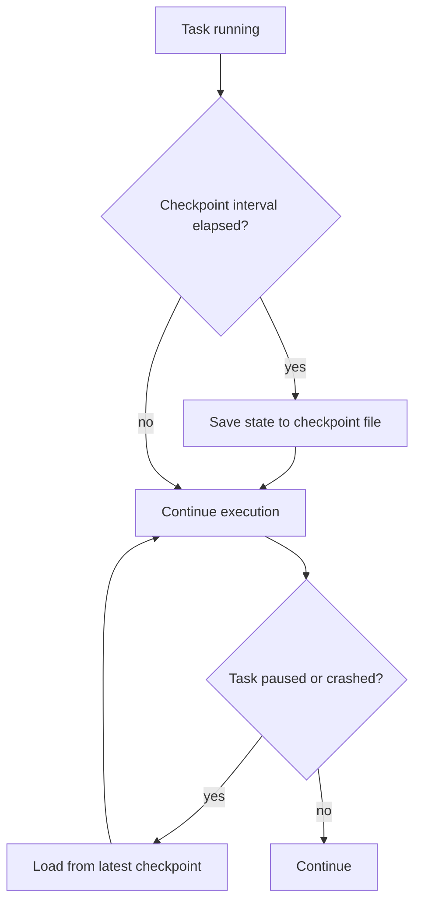

### Checkpoint Levels

| **Checkpoint Type** | **Level** | **Triggers** | **Storage** | **Source** |
|---------------------|-----------|--------------|-------------|------------|
| **Time Travel** | Highest | Every 30 mins, on failure, on timeout, on interrupt | File-based, merge: union | Unified Schema, Plan-01 |
| **Git** | Medium | Manual, on workflow complete | Git commits | Unified Schema |
| **Debug** | Medium | On step start/complete | State file | Unified Schema |
| **Info** | Low | Every 5 mins | Compressed summary | Unified Schema |
| **Compressed Summary** | Lowest | Periodic | State file | Unified Schema |

---

## Human Gating & Safety Controls

### Human Gating Mechanisms

| **Control Type** | **Trigger** | **Behavior** | **Override** | **Source** |
|-----------------|-------------|--------------|--------------|------------|
| **Confirmation Prompts** | High-risk operations | Block until user approval | --force flag | ADR-0002 |
| **Destructive Action Guards** | File deletions, broad-scope changes | Preview + confirm required | --force flag | ADR-0002 |
| **Structured Clarification** | Ambiguous operations | Ask before proceeding | Escalate to human | ADR-0002 |
| **Staged Diffs** | File mutations | Show preview → confirm → execute | Can't be bypassed | ADR-0002, R29 |

### Safe Mode

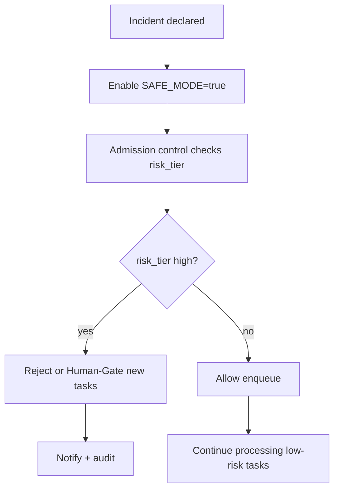

### Queue Pause at Category Level

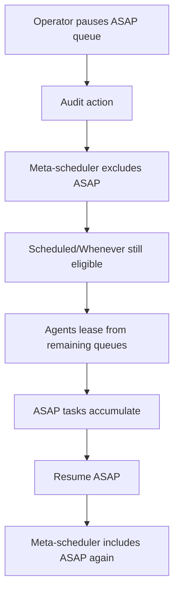

---

## Policy Sliders

### Policy Configuration

| **Policy** | **Levels** | **Effect** | **Source** |
|------------|-----------|------------|------------|
| **Runtime** | Fast, Balanced, Thorough | Depth of analysis, token budgets | R12 |
| **Review** | None, Light, Medium, Heavy | Number of validation cycles | R12 |
| **Rigor** | Lenient, Standard, Strict | Strictness of validation | R12 |
| **Scope** | Narrow, Medium, Broad | Filesystem access boundaries | R12 |
| **Concurrency** | Low, Medium, High, Max | Parallel execution degree | R12 |
| **Efficiency** | Speed, Balanced, Depth | Tradeoff between speed and quality | R12 |
| **Logging** | Quiet, Normal, Verbose, Trace | Amount of logging output | R12 |
| **Context Budget** | Percentage-based | Memory/context limits per run | R12 |

### Policy Overlay Resolution

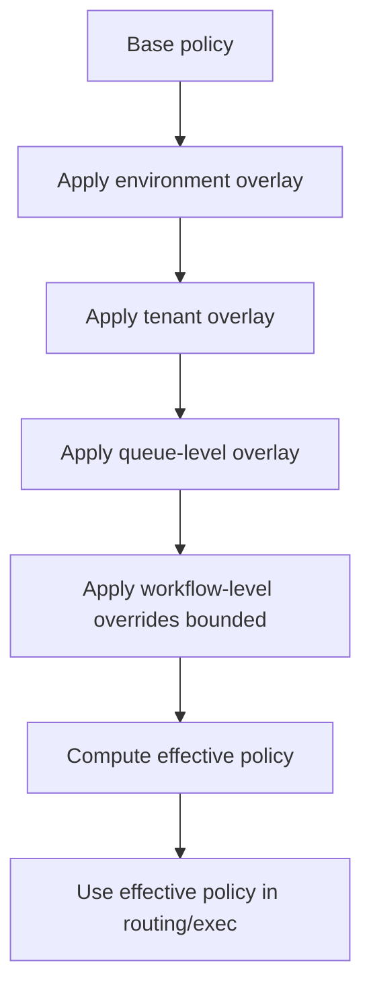

---

## CLI Commands

### Queue Management Commands

| **Command** | **Purpose** | **Output Formats** | **Confirmation Required** | **Source** |
|------------|-------------|-------------------|-------------------------|------------|
| **status** | Quick overview of all tasks | Human-readable | No | Research Report R02 |
| **list** | Detailed task list with filters | JSON (scripting), Verbose (human) | No | Research Report R02 |
| **show** | Deep dive into specific task | JSON, Verbose | No | Research Report R02 |
| **inspect** | View task details and logs | JSON, Verbose | No | Research Report R02 |
| **log** | Display task output | Text, JSON | No | Research Report R02 |
| **follow** | Real-time output monitoring | Streaming text | No | Research Report R02 |
| **retry** | Retry failed/stuck tasks | JSON confirmation | Yes | Research Report R02 |
| **recover** | Reset task state | JSON confirmation | Yes | Research Report R02 |
| **reset** | Clear and restart | JSON confirmation | Yes | Research Report R02 |
| **pause** | Pause queue processing | JSON confirmation | No | Research Report R02 |
| **resume** | Resume queue processing | JSON confirmation | No | Research Report R02 |
| **cancel** | Cancel task or group | JSON confirmation | Yes (unless --force) | Research Report R02 |
| **kill** | Force terminate | JSON confirmation | Yes (unless --force) | Research Report R02 |
| **enqueue** | Add new task | JSON confirmation | No | Research Report R02 |
| **stash** | Save without auto-start | JSON confirmation | No | Research Report R02 |
| **switch** | Swap task priorities | JSON confirmation | No | Research Report R02 |
| **clean** | Remove finished tasks | JSON confirmation | Yes | Research Report R02 |

---

## Retry & Error Handling

### Retry Configuration

| **Aspect** | **Configuration** | **Behavior** | **Source** |
|-----------|-----------------|--------------|------------|
| **Max Attempts (Step)** | 3 | Retry up to 3 times per step | Unified Schema |
| **Max Attempts (Workflow)** | 10 | Total retry limit across workflow | Unified Schema |
| **Backoff Strategy** | Exponential | Delay doubles each retry | Unified Schema |
| **Base Delay** | 1000ms | Initial delay before first retry | Unified Schema |
| **Max Delay** | 30000ms (30s) | Maximum delay between retries | Unified Schema |
| **Jitter Factor** | 0.2 (20%) | Randomize delay to avoid thundering herd | Unified Schema |
| **Retry on Timeout** | Enabled | Retry when step times out | Unified Schema |
| **Retry on Rate Limit** | Enabled | Retry when hitting rate limits | Unified Schema |
| **Rate Limit Backoff** | Exponential | Use exponential for rate limits | Unified Schema |
| **Escalation** | After 3 retries → Model, After 5 retries → Oracle | Automatic escalation to higher authority | Unified Schema |
| **Notify on Failure** | Enabled | Send notification on task failure | Unified Schema |

### Partial Retry

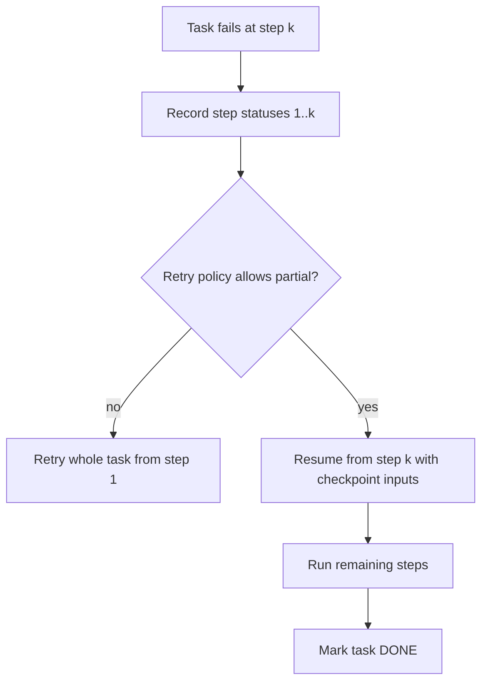

### Partial Results Handling

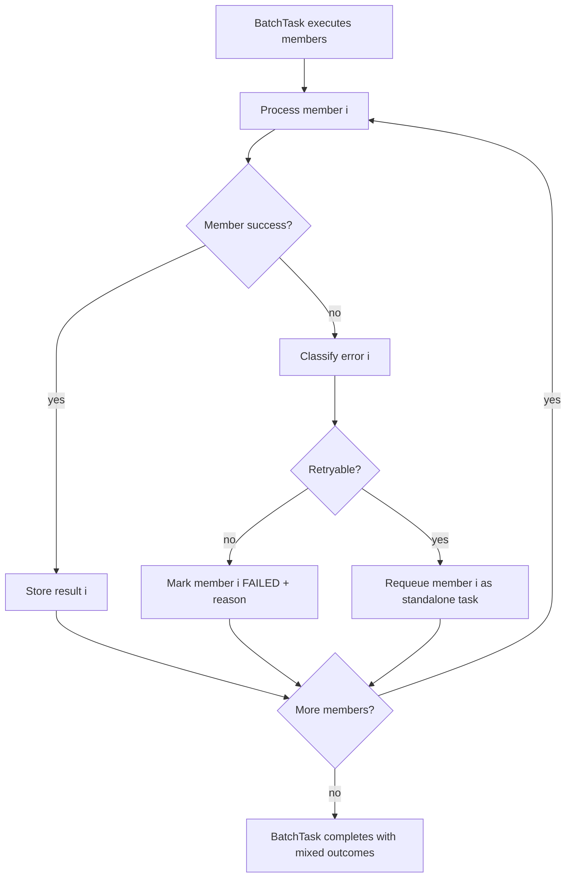

---

## Memory & Resource Management

### Resource Allocation Strategy

| **Resource** | **Allocation Strategy** | **Monitoring** | **Pressure Handling** | **Source** |
|-------------|----------------------|---------------|----------------------|------------|
| **RAM** | Adaptive (13% max, 9% min) | Interval: 5s | Throttle at 85% (factor 0.5) | Unified Schema |
| **VRAM** | Adaptive (3.7GB max, 2.4GB min) | Interval: 5s | Swap at OOM | Unified Schema |
| **CPU** | Adaptive (49% max, 49% min) | Interval: 5s | Throttle at 85% (factor 0.5) | Unified Schema |
| **GPU** | Adaptive (74% max, 74% min) | Interval: 5s | Throttle at 85% (factor 0.5) | Unified Schema |
| **Attention Tokens** | 150,000 max, 73,500 min | Per model | N/A | Unified Schema |
| **Concurrent Requests** | Max 2 per model | Per model | N/A | Unified Schema |

### Model Lifecycle Strategies

| **Strategy** | **Description** | **Use Case** | **Source** |
|--------------|-----------------|--------------|------------|
| **one_at_a_time** | Load and unload model for each request | Low memory, predictable latency | Unified Schema |
| **lazy** | Load on first request, keep in cache | Better latency for repeated use | Unified Schema |
| **eager** | Load models at startup | Fastest first request, higher memory | Unified Schema |
| **adaptive** | Dynamically load/unload based on pressure | Balance memory and latency | Unified Schema |

### Cache Configuration

| **Parameter** | **Options** | **Description** | **Source** |
|-------------|-----------|----------------|------------|
| **Cache Size** | min, max, medium, medium-min, medium-max | Memory vs cache size tradeoff | Unified Schema |
| **KV Cache Quantization** | auto, q4_k_m, q4_0, q5_k_m, q5_0, q6_k, q8_0 | Memory vs speed tradeoff | Unified Schema |

---

## Concurrency Limits

| **Resource** | **Limit** | **Purpose** | **Source** |
|-------------|-----------|--------------|------------|
| **Model Loading** | 2 | Prevent memory exhaustion | Unified Schema |
| **Tool Execution** | 10 | System stability | Unified Schema |
| **File Operations** | 5 | I/O limits | Unified Schema |
| **API Requests** | 3 | Rate limiting | Unified Schema |
| **Sub-Agent Spawning** | 4 | Prevent runaway agents | Unified Schema |
| **Workflow Execution** | 3 | Resource bounds | Unified Schema |
| **Parallel Steps** | 2 | Memory constraints | Unified Schema |
| **Parallel Models** | 3 | VRAM limits | Unified Schema |
| **Parallel Sub-Agents** | 2 | Coordination complexity | Unified Schema |

---

## Timeout Configuration

| **Timeout Type** | **Value** | **Strategy on Timeout** | **Source** |
|-----------------|-----------|----------------------|------------|
| **Total Workflow** | 4h | Continue with partial | Unified Schema |
| **Tool Call** | 30m | Retry with backoff | Unified Schema |
| **Step** | 8m | Fail | Unified Schema |
| **Operation** | 30s | Continue | Unified Schema |
| **Sub-Workflow** | 300s (5m) | Continue | Unified Schema |
| **Time to First Result** | 120s (2m) | N/A | Unified Schema |
| **Model Load into Memory** | 45s | Retry with backoff | Unified Schema |
| **Model Time to Processing** | 2h | Retry with backoff | Unified Schema |
| **Model Time to Responding** | 1m | Retry with backoff | Unified Schema |
| **Model Time to Response** | 4h | Retry with backoff | Unified Schema |

---

## Sub-Workflow Coordination

### Sub-Workflow Features

| **Feature** | **Description** | **Policy** | **Isolation** | **Source** |
|-------------|-----------------|-------------|---------------|------------|
| **Policy Inheritance** | Child workflows inherit parent policies | runtime, review, rigor, scope, concurrency, efficiency, logging enabled | Optional: context_budget can be disabled | Unified Schema |
| **Override Allowed** | Child can override specific policies | review, rigor, efficiency, logging allowed | N/A | Unified Schema |
| **Reference Resolution** | Hierarchical resolution of workflow references | Cached for 1 hour, validate references | Shared memory with limits | Unified Schema |
| **Environment Isolation** | Separate workspace per sub-workflow | Temp dir pattern: ./tmp/workflow_${workflow_id}*/ | Cleanup on completion | Unified Schema |
| **Circular Reference Detection** | Detect and prevent circular workflow refs | Max depth: 3 | Fail workflow on detection | Unified Schema |
| **Parallel Workflow Execution** | Multiple workflows can run in parallel | Max 4 concurrent | Shared temp directory | Unified Schema |
| **Inter-Workflow Dependencies** | Workflows can depend on other workflows | 300s timeout | N/A | Unified Schema |

### Subworkflow Invocation

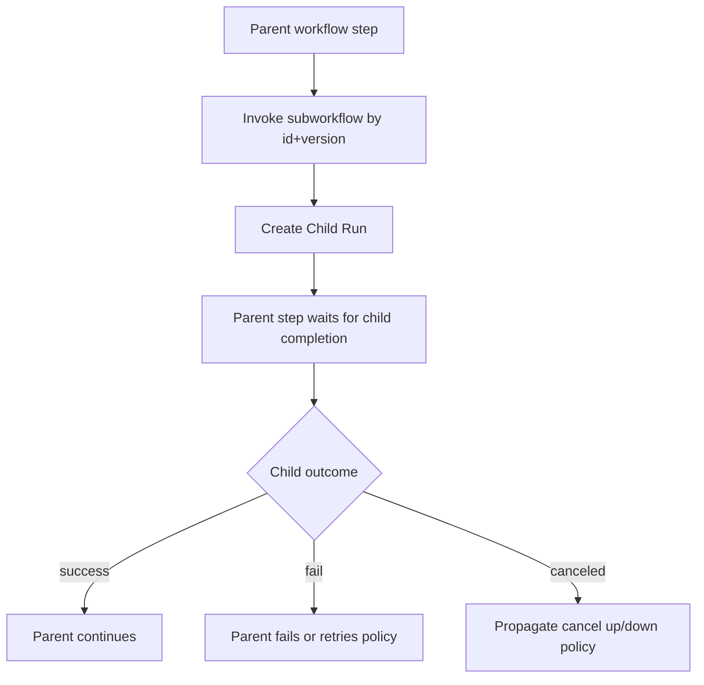

### Dynamic Task Generation

```mermaid
flowchart TD
    A[Task running] --> B[Discovers additional work items]
    B --> C[Generate child tasks list]
    C --> D[Validate child tasks against schema + quotas]
    D --> E{Valid/admitted?}
    E -->|no| F[Fail parent or defer policy]
    E -->|yes| G[Enqueue child tasks]
    G --> H[Parent waits on children optional]
    H --> I[Parent continues/finishes]
```

---

## Validation & Quality Gates

### Validation Strategy

| **Validation Type** | **Strategy** | **Thresholds** | **Action** | **Source** |
|---------------------|--------------|----------------|------------|------------|
| **Step Output** | JSON schema validation | /schemas/step_output.json | Retry or error | Unified Schema |
| **Business Rules** | Rule-based validation | quality_score >= 0.95, test_coverage >= 0.80 | Error or warning | Unified Schema |
| **Property-Based Tests** | Invariant checking | State machine invariants, priority properties | Fail test | Plan-01 |
| **Integration Tests** | End-to-end validation | Full job submission lifecycle | Fail test | Plan-01 |
| **Unit Tests** | Component-level | Individual component behavior | Fail test | Plan-01 |

### DAG Cycle Detection

```mermaid
flowchart TD
    A[Planner produces task graph] --> B[Run topological sort]
    B --> C{Cycle detected?}
    C -->|no| D[Accept graph + enqueue]
    C -->|yes| E[Reject run: DEPENDENCY_CYCLE]
    E --> F[Emit graph diagnostics: cycle nodes]
```

---

## Observability

### Logging System

| **Scope** | **Levels** | **Output** | **Source** |
|-----------|-----------|------------|------------|
| **Workflow** | Debug, Info, Warning, Error, Critical | Console, File, Remote | Unified Schema, R30 |
| **Pipeline** | Debug, Info, Warning, Error, Critical | Console, File, Remote | Unified Schema, R30 |
| **Models** | Debug, Info, Warning, Error, Critical | Console, File, Remote | Unified Schema, R30 |
| **Tools** | Debug, Info, Warning, Error, Critical | Console, File, Remote | Unified Schema, R30 |
| **Execution** | Debug, Info, Warning, Error, Critical | Console, File, Remote | Unified Schema, R30 |

### Metrics Collection

| **Scope** | **Metrics** | **Output** | **Source** |
|-----------|-----------|------------|------------|
| **Pipeline** | Queue depth, throughput, latency, error_rate | JSON file | Unified Schema, R30 |
| **Step** | Execution time, retry count, success_rate | JSON file | Unified Schema, R30 |
| **Model** | Load time, inference time, token usage | JSON file | Unified Schema, R30 |
| **Tool** | Call count, duration, error_count | JSON file | Unified Schema, R30 |
| **Custom** | User-defined metrics | JSON file | Unified Schema, R30 |

---

## Loop Variations

| **Loop Type** | **Purpose** | **Termination** | **Use Cases** | **Source** |
|--------------|-------------|----------------|--------------|------------|
| **Count-Based** | Fixed iteration count | Max iterations or condition | Known-length processes | Unified Schema |
| **Time-Based** | Duration-limited | Time duration or stop time | Timeout-bound work | Unified Schema |
| **Validation Loop** | Convergence-based | Quality threshold or max iterations | Optimization, refinement | Unified Schema |
| **Retry Loop** | Error recovery | Max attempts or timeout | Transient error handling | Unified Schema |
| **Infinite Loop** | Continuous execution | Safety limits (max iterations, max duration, OOM abort) | Autonomous agents, monitoring | Unified Schema |

### Fan-out / Fan-in Pattern (Map-Reduce)

```mermaid
flowchart TD
    A[Input dataset] --> B[Fan-out: create N shard tasks]
    B --> C[Enqueue shard tasks]
    C --> D[Execute shards in parallel]
    D --> E[Shard results stored as artifacts]
    E --> F[Fan-in aggregator depends_on all shards]
    F --> G[Aggregator runs after all shards DONE]
    G --> H[Final artifact produced]
```

---

## Advanced Queue Patterns

### Admission Control

```mermaid
flowchart TD
    A[Enqueue request] --> B[Check system pressure + quotas]
    B --> C{Admit now?}
    C -->|yes| D[Task -> QUEUED]
    C -->|no| E[Task -> PENDING_ADMISSION]
    E --> F[Periodic admission scan]
    F --> G{Pressure reduced?}
    G -->|no| H[Remain pending]
    G -->|yes| I[Promote to QUEUED preserving ordering intent]
```

### Scheduled Window Enforcement

```mermaid
flowchart TD
    A[Task in Scheduled-Window] --> B{Now within window?}
    B -->|yes| C[Eligible -> can be leased]
    B -->|no| D[Ineligible]
    D --> E[Compute next window start]
    E --> F[Set next_eligible_ts]
    F --> G[Remain queued]
```

### Cron Slot Identity + Dedupe

```mermaid
flowchart TD
    A[Scheduler tick] --> B[Compute current slot by cron + timezone]
    B --> C[slot_id = hash schedule_id + slot_time]
    C --> D{slot_id already created?}
    D -->|yes| E[No-op dedup]
    D -->|no| F[Create Run for slot_id]
    F --> G[Enqueue tasks]
```

### Repeat Fixed-Delay Non-Overlap

```mermaid
flowchart TD
    A[Run instance completes] --> B[Compute next_due = now + delay]
    B --> C{Overlap allowed?}
    C -->|no| D[Ensure no active run exists]
    D --> E[Create next run with due_ts=next_due]
    C -->|yes| F[Create regardless of active instances]
    E --> G[Scheduled-Once queue]
    F --> G
```

### DLQ Triage Pipeline

```mermaid
flowchart TD
    A[DLQ entry created] --> B[Extract error signature]
    B --> C[Cluster by signature + workflow_version]
    C --> D[Assign owner/team]
    D --> E[Propose action: fix config / fix code / increase limits]
    E --> F{Operator decision}
    F -->|requeue| G[Requeue with override]
    F -->|close| H[Mark resolved + link RCA]
    F -->|escalate| I[Create incident]
```

### Requeue with Override Guardrails

```mermaid
flowchart TD
    A[Operator requests override requeue] --> B[RBAC verify override permission]
    B --> C[Validate override fields within bounds]
    C --> D{Valid?}
    D -->|no| E[Reject + audit]
    D -->|yes| F[Create new task instance linked_to prior]
    F --> G[Apply overrides: priority/queue/bypass_deps]
    G --> H[Enqueue new task]
    H --> I[Audit: override_applied]
```

### Cancellation Propagation in DAG

```mermaid
flowchart TD
    A[Cancel node X] --> B[Find downstream dependents]
    B --> C{Propagation mode}
    C -->|none| D[Only cancel X]
    C -->|downstream| E[Cancel all dependents]
    C -->|upstream| F[Cancel prerequisites rare]
    C -->|both| G[Cancel upstream + downstream]
    E --> H[Mark dependents CANCELED if not terminal]
    D --> I[Audit cancel graph]
    F --> I
    G --> I
```

---

## Security & Compliance

### Capability Matching

```mermaid
flowchart TD
    A[Task requires capabilities] --> B[Filter agent pools by hard constraints]
    B --> C{Any pool matches?}
    C -->|no| D[Block task: UNSATISFIABLE_REQUIREMENTS]
    C -->|yes| E[Score pools by soft prefs cost/latency/affinity]
    E --> F[Select best pool]
    F --> G[Route task to pool queue]
```

### Sandbox Enforcement

```mermaid
flowchart TD
    A[Task starts] --> B{sandbox_required?}
    B -->|yes| C[Assign sandbox pool]
    B -->|no| D[Assign standard pool]
    C --> E[Tools allowlist enforced]
    D --> F[Tools policy enforced]
    E --> G{Tool call requested}
    F --> G
    G --> H{Allowed?}
    H -->|no| I[Fail with policy_violation]
    H -->|yes| J[Execute tool]
```

### Secrets Resolution

```mermaid
flowchart TD
    A[Task execution init] --> B[Read secrets refs from workflow]
    B --> C[RBAC check for secret scope]
    C --> D{Authorized?}
    D -->|no| E[Fail task: SECRET_ACCESS_DENIED]
    D -->|yes| F[Fetch secret material]
    F --> G[Inject into runtime env masked]
    G --> H[Ensure logs redact secret patterns]
```

### RBAC Decision Path

```mermaid
flowchart TD
    A[API request] --> B[Authenticate principal]
    B --> C[Resolve roles + groups]
    C --> D[Evaluate policy: action + resource]
    D --> E{Allow?}
    E -->|no| F[Reject 403 + audit]
    E -->|yes| G[Proceed + audit allow]
```

### Audit Event Schema

```mermaid
flowchart TD
    A[State transition occurs] --> B[Create audit record]
    B --> C[Fields: ts, actor, action, entity_id, prev_state, new_state, diff]
    C --> D[Append-only store write]
    D --> E{Write ok?}
    E -->|no| F[Fail closed for sensitive ops]
    E -->|yes| G[Emit metric: audit_write_success]
```

### Prompt/Tool Gating by Risk Tier

```mermaid
flowchart TD
    A[Task has risk_tier] --> B{risk_tier}
    B -->|low| C[Tools allow broad set]
    B -->|medium| D[Require allowlist + logging]
    B -->|high| E[Human gate + sandbox + limited tools]
    C --> F[Execute]
    D --> F
    E --> G[Wait for approval]
    G --> H{Approved?}
    H -->|no| I[Cancel task]
    H -->|yes| F
```

---

## Determinism & Reliability

### Deterministic Replay Mode

```mermaid
flowchart TD
    A[Run starts in deterministic=true] --> B[Load decision log if replay]
    B --> C{Decision needed? routing/random/tool choice}
    C -->|no| D[Continue]
    C -->|yes| E{Replay available?}
    E -->|yes| F[Use recorded decision]
    E -->|no| G[Compute decision deterministically]
    G --> H[Record decision to log]
    F --> D
    H --> D
```

### Exact-Once Within Internal State Transitions

```mermaid
flowchart TD
    A[Agent reports completion] --> B[Load task state_version]
    B --> C[Attempt CAS update: version -> version+1]
    C --> D{CAS success?}
    D -->|yes| E[Apply terminal state + write audit]
    D -->|no| F[Detect duplicate/late report]
    F --> G[Ignore or reconcile based on state]
```

### Multi-Region Replication

```mermaid
flowchart TD
    A[Primary region writes state] --> B[Replicate to secondary]
    B --> C{Replication lag acceptable?}
    C -->|yes| D[Continue]
    C -->|no| E[Reduce admissions / safe mode]
    D --> F{Primary outage?}
    F -->|no| G[Normal ops]
    F -->|yes| H[Promote secondary to primary]
    H --> I[Agents reconnect + resume leasing]
```

### Disaster Recovery Restore

```mermaid
flowchart TD
    A[Restore initiated] --> B[Load durable state store snapshot]
    B --> C[Replay audit/state log forward]
    C --> D[Reconstruct tasks by state]
    D --> E[Re-enqueue QUEUED tasks]
    D --> F[Reclaim LEASED tasks with expired leases]
    D --> G[Preserve terminal tasks as DONE/FAILED/CANCELED]
    E --> H[Resume schedulers + meta-scheduler]
```

---

## Agentic Orchestration Patterns

### Local-Model Optimization: Chunking Planner

```mermaid
flowchart TD
    A[Large task input detected] --> B[Estimate token footprint]
    B --> C{Exceeds context_budget?}
    C -->|no| D[Run as single task]
    C -->|yes| E[Split into chunks by deterministic rule]
    E --> F[Create chunk tasks with chunk_id + ranges]
    F --> G[Fan-in summarizer depends_on chunks]
    G --> H[Summarizer produces final output]
```

### CI Pipeline for Workflow.yml

```mermaid
flowchart TD
    A[PR opened] --> B[Lint YAML formatting]
    B --> C{Lint ok?}
    C -->|no| D[Fail CI]
    C -->|yes| E[Schema validate]
    E --> F{Valid?}
    F -->|no| G[Fail CI with error list]
    F -->|yes| H[Dry-run planner expansion]
    H --> I{Graph valid? cycles?}
    I -->|no| J[Fail CI with diagnostics]
    I -->|yes| K[Register workflow to registry on merge]
```

---

## Implementation Phases

### 7-Phase Implementation Plan

| **Phase** | **Name** | **Components** | **Priority** | **Status** | **Source** |
|-----------|-----------|----------------|--------------|-------------|------------|
| **1** | Foundation | Schema, IR, Storage | P0 | Planned | Plan-01 |
| **2** | MVP Execution | Queue, Scheduler, Human Gating | P0 | Planned | Plan-01 |
| **3** | Backends | Provider Abstraction | P1 | Planned | Plan-01 |
| **4** | Advanced Agentic | Loops, Validation, Multi-Agent | P1 | Planned | Plan-01 |
| **5** | Benchmarking | Performance Measurement | P2 | Planned | Plan-01 |
| **6** | Automation | Cron, Git Experiments | P2 | Planned | Plan-01 |
| **7** | UI | Desktop Shell, Visualization | P3 | Planned | Plan-01 |

### Phase 1: Foundation
- Workflow schema definition
- IR (Intermediate Representation) compilation
- SQLite storage layer
- State machine implementation

### Phase 2: MVP Execution
- Queue implementation
- Scheduler core
- Human gating system
- CLI control surface
- Execution modes

### Phase 3: Backends
- Provider abstraction layer
- Model backend adapters
- Tool execution framework
- Secret management

### Phase 4: Advanced Agentic
- Loop variations
- Validation layers
- Multi-agent coordination
- Dynamic task generation
- Sub-workflow invocation

### Phase 5: Benchmarking
- Performance metrics collection
- Load testing
- Optimization analysis
- Scalability testing

### Phase 6: Automation
- Cron scheduling
- Git experiments
- Scheduled workflows
- Repeat patterns

### Phase 7: UI
- Desktop shell
- Queue visualization
- Real-time monitoring
- Workflow editor

---

## Requirements Traceability

### Requirements Overview

| **Requirement ID** | **Description** | **Priority** | **Phase** | **Status** | **Source** |
|------------------|-----------------|--------------|------------|-------------|------------|
| **R0001** | ChatSession work container | P0 | 1 | Planned | requirements_backlog.yml |
| **R0002** | Queue UX with live execution meaning | P0 | 2 | Planned | requirements_backlog.yml |
| **R0003** | SQLite-backed persistence | P0 | 1 | Planned | requirements_backlog.yml |
| **R0004** | Enum-based state machine | P0 | 1 | Planned | requirements_backlog.yml |
| **R0005** | Pending state | P0 | 2 | Planned | ADR-0002 |
| **R0006** | Scheduled state | P0 | 2 | Planned | ADR-0002 |
| **R0007** | Running state | P0 | 2 | Planned | ADR-0002 |
| **R0008** | Completed state | P0 | 2 | Planned | ADR-0002 |
| **R0009** | Failed state | P0 | 2 | Planned | ADR-0002 |
| **R0010** | Cancelled state | P0 | 2 | Planned | ADR-0002 |
| **R0011** | Serial execution mode | P1 | 2 | Planned | Unified Schema |
| **R0012** | Parallel execution mode | P1 | 2 | Planned | Unified Schema |
| **R0013** | Hybrid execution mode | P1 | 2 | Planned | Unified Schema |
| **R0014** | Interactive execution mode | P0 | 2 | Planned | Unified Schema |
| **R0015** | Automated execution mode | P0 | 2 | Planned | Unified Schema |
| **R0016** | FIFO scheduling | P1 | 2 | Planned | Research Report R02 |
| **R0017** | Priority queue scheduling | P0 | 2 | Planned | Unified Schema |
| **R0018** | EDF scheduling | P1 | 2 | Planned | Unified Schema |
| **R0019** | Fair share scheduling | P1 | 2 | Planned | Unified Schema |
| **R0020** | Critical priority level | P0 | 2 | Planned | Unified Schema |
| **R0021** | High priority level | P0 | 2 | Planned | Unified Schema |
| **R0022** | Medium priority level | P0 | 2 | Planned | Unified Schema |
| **R0023** | Low priority level | P0 | 2 | Planned | Unified Schema |
| **R0024** | Priority aging (anti-starvation) | P1 | 2 | Planned | Advanced Pattern #21 |
| **R0025** | Priority inversion guard | P1 | 2 | Planned | Advanced Pattern #22 |
| **R0026** | Deadline escalation | P1 | 2 | Planned | Advanced Pattern #23 |
| **R0027** | Overdue handling policy | P1 | 2 | Planned | Advanced Pattern #24 |
| **R0028** | Rate-limited execution (token bucket) | P1 | 2 | Planned | Advanced Pattern #25 |
| **R0029** | Per-tenant fair share | P1 | 2 | Planned | Advanced Pattern #26 |
| **R0030** | Queue sharding | P2 | 5 | Planned | Advanced Pattern #27 |
| **R0031** | Hot-shard mitigation | P2 | 5 | Planned | Advanced Pattern #28 |
| **R0032** | Agent pool autoscaling | P2 | 5 | Planned | Advanced Pattern #29 |
| **R0033** | Graceful agent shutdown | P1 | 2 | Planned | Advanced Pattern #30 |
| **R0034** | Cron expressions | P1 | 6 | Planned | ADR-0007 |
| **R0035** | Scheduled windows | P1 | 6 | Planned | Advanced Pattern #50 |
| **R0036** | Cron slot dedupe | P1 | 6 | Planned | Advanced Pattern #51 |
| **R0037** | Repeat fixed-delay non-overlap | P1 | 6 | Planned | Advanced Pattern #52 |
| **R0038** | Git experiments | P2 | 6 | Planned | ADR-0007 |
| **R0039** | Background execution | P0 | 2 | Planned | R26 |
| **R0040** | Semi-endless execution | P1 | 4 | Planned | R26 |
| **R0041** | Endless execution | P1 | 4 | Planned | R26 |
| **R0042** | Resumable execution | P1 | 2 | Planned | R26 |
| **R0043** | Checkpointing | P0 | 2 | Planned | Unified Schema |
| **R0044** | Time travel checkpoints | P1 | 2 | Planned | Unified Schema |
| **R0045** | Git checkpoints | P1 | 2 | Planned | Unified Schema |
| **R0046** | Confirmation prompts | P0 | 2 | Planned | ADR-0002 |
| **R0047** | Destructive action guards | P0 | 2 | Planned | ADR-0002 |
| **R0048** | Staged diffs | P0 | 2 | Planned | ADR-0002 |
| **R0049** | Policy sliders | P1 | 2 | Planned | R12 |
| **R0050** | Runtime policy | P1 | 2 | Planned | R12 |
| **R0051** | Review policy | P1 | 2 | Planned | R12 |
| **R0052** | Rigor policy | P1 | 2 | Planned | R12 |
| **R0053** | Scope policy | P1 | 2 | Planned | R12 |
| **R0054** | Concurrency policy | P1 | 2 | Planned | R12 |
| **R0055** | Efficiency policy | P1 | 2 | Planned | R12 |
| **R0056** | Logging policy | P1 | 2 | Planned | R12 |
| **R0057** | Context budget policy | P1 | 2 | Planned | R12 |
| **R0058** | CLI commands | P0 | 2 | Planned | Research Report R02 |
| **R0059** | Retry mechanism | P0 | 2 | Planned | Unified Schema |
| **R0060** | Exponential backoff | P0 | 2 | Planned | Unified Schema |
| **R0061** | Jitter | P1 | 2 | Planned | Unified Schema |
| **R0062** | Escalation on retry | P1 | 2 | Planned | Unified Schema |
| **R0063** | Partial retry | P1 | 2 | Planned | Advanced Pattern #41 |
| **R0064** | Partial results handling | P1 | 2 | Planned | Advanced Pattern #42 |
| **R0065** | Resource monitoring | P0 | 2 | Planned | Unified Schema |
| **R0066** | Adaptive resource allocation | P1 | 2 | Planned | Unified Schema |
| **R0067** | Model lifecycle management | P0 | 3 | Planned | Unified Schema |
| **R0068** | Cache management | P1 | 2 | Planned | Unified Schema |
| **R0069** | Concurrency limits | P0 | 2 | Planned | Unified Schema |
| **R0070** | Timeout configuration | P0 | 2 | Planned | Unified Schema |
| **R0071** | Sub-workflow invocation | P1 | 4 | Planned | Unified Schema |
| **R0072** | Dynamic task generation | P1 | 4 | Planned | Advanced Pattern #39 |
| **R0073** | Fan-out/fan-in pattern | P1 | 4 | Planned | Advanced Pattern #38 |
| **R0074** | Validation loops | P1 | 4 | Planned | Unified Schema |
| **R0075** | DAG cycle detection | P0 | 2 | Planned | Advanced Pattern #37 |
| **R0076** | Logging system | P0 | 2 | Planned | Unified Schema |
| **R0077** | Metrics collection | P0 | 2 | Planned | Unified Schema |
| **R0078** | Tracing | P1 | 5 | Planned | R30 |
| **R0079** | Graph artifacts | P1 | 7 | Planned | R30 |
| **R0080** | Capability matching | P1 | 3 | Planned | Advanced Pattern #31 |
| **R0081** | Sandbox enforcement | P1 | 3 | Planned | Advanced Pattern #32 |
| **R0082** | RBAC | P0 | 3 | Planned | Advanced Pattern #34 |

### Total Statistics

- **Total Requirements**: 82
- **Priority P0**: 30
- **Priority P1**: 47
- **Priority P2**: 5
- **Total Capabilities**: 82
- **Total Epics**: 20

---

## Summary of Queue Categories

### ASAP Queue (Immediate Execution)

**Characteristics**:
- Highest priority (Critical=10, High=5)
- Executes immediately when worker available
- Anti-starvation aging ensures fairness
- Can pause independently of other queues
- Use cases: Emergency fixes, blocking issues, urgent user requests

**Flow**: Enqueue → QUEUED (with high priority) → Age boost applied → Selected by scheduler → RUNNING → Result

**Safety Controls**:
- Confirmation prompts for destructive operations
- Staged diffs for file mutations
- Human gating for high-risk operations
- Can be paused system-wide via safe mode

### Whenever Queue (Background Execution)

**Characteristics**:
- Low priority (1)
- Executes when resources available
- Detached from main thread
- No preemption of other tasks
- Use cases: Nice-to-have tasks, maintenance, batch processing

**Flow**: Enqueue → QUEUED (with low priority) → Age boost minimal → Selected when resources available → RUNNING → Result

**Safety Controls**:
- Background execution mode
- Checkpointing for long runs
- Resource limits (max duration, max tool calls)
- No human intervention required (automated mode)

### Scheduled Queue (Time-Based Execution)

**Characteristics**:
- Scheduled state with run_at timestamp
- Cron expressions for recurring schedules
- Scheduled windows for time-gated execution
- Deadline escalation when overdue
- Use cases: Periodic reports, maintenance windows, time-bound operations

**Flow**: Enqueue → SCHEDULED (with run_at or cron) → Time arrives → QUEUED → RUNNING → Result

**Features**:
- Cron slot dedupe (prevents duplicate runs)
- Scheduled window enforcement (hard gating)
- Deadline escalation (promotes to ASAP if overdue)
- Overdue handling policy (run/drop/notify)
- Git experiments with merge validation

### Repeat Queue (Iterative Execution)

**Characteristics**:
- Validation loops for convergence
- Fixed-delay non-overlap (single active instance)
- Retry loops for error recovery
- Count-based and time-based loops
- Use cases: Optimization loops, continuous refinement, monitoring

**Flow**: Run → Check convergence condition → {not converged} → Create next iteration → Run → {converged} → Complete

**Types**:
- Count-Based: Fixed iteration count
- Time-Based: Duration-limited
- Validation Loop: Quality threshold convergence
- Retry Loop: Max attempts or timeout
- Infinite Loop: Safety-limited continuous execution

---

## Key Architectural Decisions

### 1. ChatSession as Work Container
- **Decision**: Each chat holds scope, queue state, artifacts, and workflows
- **Rationale**: Encapsulates all work context in a single unit
- **Tradeoff**: Requires per-chat state management, but provides clean isolation

### 2. Tokio Current-Thread Runtime
- **Decision**: Single-threaded async runtime
- **Rationale**: Predictable latency, no race conditions in core logic
- **Tradeoff**: Limited parallelism in scheduler, but worker pool handles parallelism

### 3. SQLite for Persistence
- **Decision**: Embedded SQLite database for all state
- **Rationale**: ACID transactions, no external dependencies, low overhead
- **Tradeoff**: Limited write throughput, but sufficient for queue workload

### 4. Enum-Based State Machine
- **Decision**: Compile-time type-safe states
- **Rationale**: Prevents invalid state transitions, serializable
- **Tradeoff**: Less flexible than dynamic states, but catches errors at compile time

### 5. Priority + Aging for Anti-Starvation
- **Decision**: Combine priority with age-based boost
- **Rationale**: Fairness while respecting urgency
- **Tradeoff**: More complex scheduling, but prevents low-priority starvation

### 6. Human Gating by Default for High-Risk
- **Decision**: Destructive operations require confirmation
- **Rationale**: Safety first, prevent catastrophic errors
- **Tradeoff**: Slower execution for high-risk tasks, but safe by default

### 7. Policy Sliders for Flexibility
- **Decision**: Configurable runtime policies
- **Rationale**: Adapt behavior to different use cases
- **Tradeoff**: More configuration complexity, but provides fine-grained control

### 8. Checkpointing for Long-Running Tasks
- **Decision**: Multiple checkpoint levels (Time Travel, Git, Debug, Info)
- **Rationale**: Recovery from crashes, resumable execution
- **Tradeoff**: Storage overhead, but enables recovery and debugging

### 9. Four-Layer Validation
- **Decision**: Unit, Integration, Property-Based, End-to-End
- **Rationale**: Comprehensive testing coverage
- **Tradeoff**: More test code, but catches bugs at multiple levels

### 10. CLI + JSON Output Formats
- **Decision**: Human-readable for interactive, JSON for scripting
- **Rationale**: Support both manual and automated usage
- **Tradeoff**: Dual formatting logic, but provides flexibility

---

## Glossary

| **Term** | **Definition** |
|----------|---------------|
| **ASAP** | Queue category for immediate execution with highest priority |
| **Whenever** | Queue category for background execution with low priority |
| **Scheduled** | Queue category for time-based execution with run_at or cron |
| **Repeat** | Queue category for iterative execution with loops |
| **ChatSession** | Scoped executable work container holding queue state, artifacts, and workflows |
| **PENDING_ADMISSION** | Task waiting for admission approval before being queued |
| **QUEUED** | Task waiting to be executed by a worker |
| **SCHEDULED** | Task scheduled for future execution |
| **RUNNING** | Task currently executing |
| **COMPLETED** | Task finished successfully |
| **FAILED** | Task failed with error |
| **CANCELED** | Task was cancelled |
| **DLQ** | Dead Letter Queue for failed tasks |
| **Anti-Starvation** | Mechanism to prevent low-priority tasks from never executing |
| **Priority Inversion** | Situation where low-priority task blocks high-priority task |
| **Aging** | Gradual priority increase over time for long-waiting tasks |
| **Backpressure** | Mechanism to handle queue overflow |
| **Checkpoint** | Saved state for recovery and resumption |
| **Human Gating** | Requirement for human approval before executing high-risk operations |
| **Staged Diff** | Preview of file changes before applying them |
| **Policy Slider** | Configurable runtime parameter affecting behavior |
| **Escalation** | Automatic promotion of task to higher authority on retry |
| **Deduplication** | Prevention of duplicate task creation (e.g., cron slots) |
| **Sharding** | Partitioning queue across multiple workers for scalability |
| **Fair Share** | Balanced resource allocation across tenants |
| **Token Bucket** | Rate limiting mechanism for task execution |
| **Capability Matching** | Matching task requirements to agent capabilities |
| **Sandbox** | Restricted execution environment for security |
| **RBAC** | Role-Based Access Control for authorization |
| **Audit Log** | Immutable record of all state transitions and actions |
| **Deterministic Replay** | Ability to replay execution with same decisions |
| **Exact-Once** | Guarantee that task executes exactly once |
| **Multi-Region** | Deployment across multiple geographic regions for resilience |
| **Disaster Recovery** | Process for restoring system state after failure |
| **Fan-Out/Fan-In** | Pattern for parallel processing followed by aggregation |
| **Map-Reduce** | Parallel processing pattern with mapping and reducing |
| **Dynamic Task Generation** | Agent creating new tasks during execution |
| **Sub-Workflow** | Nested workflow execution |
| **Partial Retry** | Retrying only failed steps instead of entire task |
| **Partial Results** | Handling batch tasks where some members fail |
| **Safe Mode** | System-wide restriction on risky operations |
| **Backpressure** | Controlling admission when queue is under pressure |
| **Hot Shard** | Queue shard with disproportionately many tasks |
| **Autoscaling** | Dynamic adjustment of worker pool size |
| **Drain Mode** | Graceful shutdown where workers finish active tasks |
| **Policy Overlay** | Layered policy resolution (base → env → tenant → queue → workflow) |
| **Risk Tier** | Classification of task risk level (low/medium/high) |
| **Validation Loop** | Iterative refinement until quality threshold met |
| **Git Experiment** | Isolated branch execution with merge validation |
| **Merge Policy** | Rules for merging experimental changes |
| **Overlap Control** | Prevention of overlapping task executions |
| **Window Enforcement** | Hard gating of execution to time windows |
| **Cron Expression** | Scheduling syntax for recurring tasks |
| **Cron Slot** | Unique identifier for scheduled time instances |
| **Triaging** | Classification and routing of failed tasks |
| **Override** | Manual intervention to bypass normal queue behavior |

---

## Appendix: Mermaid Diagram Index

This section provides a quick reference to all 40 advanced flow diagrams included in this document.

| **Diagram #** | **Title** | **Category** | **Page** |
|---------------|-----------|--------------|---------|
| 21 | Priority + Aging (Anti-Starvation) | Scheduling | [Priority + Aging](#priority--aging-anti-starvation) |
| 22 | Priority Inversion Guard | Scheduling | [Priority Inversion Guard](#priority-inversion-guard) |
| 23 | Deadline Escalation | Scheduling | [Deadline Escalation](#deadline-escalation) |
| 24 | Overdue Handling Policy | Scheduling | [Overdue Handling Policy](#overdue-handling-policy) |
| 25 | Rate-Limited Execution (Token Bucket) | Scaling | [Rate-Limited Execution](#rate-limited-execution-token-bucket) |
| 26 | Per-Tenant Fair Share | Scaling | [Per-Tenant Fair Share](#per-tenant-fair-share) |
| 27 | Queue Sharding | Scaling | [Queue Sharding](#queue-sharding) |
| 28 | Hot-Shard Mitigation | Scaling | [Hot-Shard Mitigation](#hot-shard-mitigation) |
| 29 | Agent Pool Autoscaling | Scaling | [Agent Pool Autoscaling](#agent-pool-autoscaling) |
| 30 | Graceful Agent Shutdown | Scaling | [Graceful Agent Shutdown](#graceful-agent-shutdown) |
| 31 | Capability Matching | Security | [Capability Matching](#capability-matching) |
| 32 | Sandbox Enforcement | Security | [Sandbox Enforcement](#sandbox-enforcement) |
| 33 | Secrets Resolution | Security | [Secrets Resolution](#secrets-resolution) |
| 34 | RBAC Decision Path | Security | [RBAC Decision Path](#rbac-decision-path) |
| 35 | Audit Event Schema | Security | [Audit Event Schema](#audit-event-schema) |
| 36 | Deterministic Replay Mode | Determinism | [Deterministic Replay Mode](#deterministic-replay-mode) |
| 37 | DAG Cycle Detection | Validation | [DAG Cycle Detection](#dag-cycle-detection) |
| 38 | Fan-Out / Fan-In Pattern | Orchestration | [Fan-Out / Fan-In Pattern](#fan-out--fan-in-pattern-map-reduce) |
| 39 | Dynamic Task Generation | Orchestration | [Dynamic Task Generation](#dynamic-task-generation) |
| 40 | Subworkflow Invocation | Orchestration | [Subworkflow Invocation](#subworkflow-invocation) |
| 41 | Partial Retry | Error Handling | [Partial Retry](#partial-retry) |
| 42 | Partial Results Handling | Error Handling | [Partial Results Handling](#partial-results-handling) |
| 43 | Admission Control | Queue Management | [Admission Control](#admission-control) |
| 44 | Queue Pause at Category Level | Queue Management | [Queue Pause at Category Level](#queue-pause-at-category-level) |
| 45 | System-Wide Safe Mode | Queue Management | [Safe Mode](#safe-mode) |
| 46 | DLQ Triage Pipeline | Error Handling | [DLQ Triage Pipeline](#dlq-triage-pipeline) |
| 47 | Requeue with Override Guardrails | Queue Management | [Requeue with Override Guardrails](#requeue-with-override-guardrails) |
| 48 | Cancellation Propagation in DAG | Queue Management | [Cancellation Propagation in DAG](#cancellation-propagation-in-dag) |
| 49 | Reprioritize While Queued | Scheduling | [Reprioritize While Queued](#reprioritize-while-queued) |
| 50 | Scheduled Window Enforcement | Scheduling | [Scheduled Window Enforcement](#scheduled-window-enforcement) |
| 51 | Cron Slot Identity + Dedupe | Scheduling | [Cron Slot Identity + Dedupe](#cron-slot-identity--dedupe) |
| 52 | Repeat Fixed-Delay Non-Overlap | Scheduling | [Repeat Fixed-Delay Non-Overlap](#repeat-fixed-delay-non-overlap) |
| 53 | Backpressure Policy | Scaling | [Backpressure Policy](#backpressure-policy) |
| 54 | Exact-Once Within Internal State Transitions | Reliability | [Exact-Once Within Internal State Transitions](#exact-once-within-internal-state-transitions) |
| 55 | Multi-Region Replication | Reliability | [Multi-Region Replication](#multi-region-replication) |
| 56 | Disaster Recovery Restore | Reliability | [Disaster Recovery Restore](#disaster-recovery-restore) |
| 57 | CI Pipeline for Workflow.yml | Agentic Orchestration | [CI Pipeline for Workflow.yml](#ci-pipeline-for-workflowyml) |
| 58 | Policy Overlay Resolution | Policy Management | [Policy Overlay Resolution](#policy-overlay-resolution) |
| 59 | Local-Model Optimization: Chunking Planner | Agentic Orchestration | [Local-Model Optimization: Chunking Planner](#local-model-optimization-chunking-planner) |
| 60 | Prompt/Tool Gating by Risk Tier | Security | [Prompt/Tool Gating by Risk Tier](#prompttool-gating-by-risk-tier) |

---

## References

### Architecture Decision Records (ADRs)
- **ADR-0002**: MVP Queue Scheduler Safety
- **ADR-0007**: Cron Git Refinement

### Technical Documents
- **README.md**: Multi-dimensional queue workflow engine for yaml-to-rust-agentsdk
- **mvp-queue-research-report.md**: Tokio current-thread + SQLite for persistence, enum-based state machine
- **unified-workflow-schema.yml**: Comprehensive 1400+ line schema with models, execution strategies
- **plan-01-mvp-queue.md**: 7-phase implementation plan
- **requirements_backlog.yml**: 20 epics with 82 capabilities and 82 requirements
- **requirements/index.md**: 7 implementation phases with priority matrix
- **agentic-workflow-grouping-hierarchy.yml**: 5-level abstraction hierarchy with 85+ step types

### Requirements Traceability
- **Total Requirements**: 82 (R0001-R0082)
- **Total Capabilities**: 82
- **Total Epics**: 20
- **Priority P0**: 30 requirements
- **Priority P1**: 47 requirements
- **Priority P2**: 5 requirements

---

## Document Metadata

- **Document Title**: Agent Queue System - Comprehensive OpenCode Chat History
- **Document Version**: 1.0
- **Created**: April 2026
- **Last Updated**: April 2026
- **Project**: AgentQueue
- **Purpose**: Exhaustive catalog of all queue and agentic queue-related concepts, requirements, and design patterns
- **Coverage**: 7 major sections, 27 subsections, 40 mermaid diagrams, 82 requirements

---

## End of Document

This document provides a comprehensive and exhaustive overview of all queue and agentic queue-related concepts, requirements, and design patterns discussed across the OpenCode chat history for the AgentQueue project. It covers:

- Queue system architecture and technical stack
- All queue states and lifecycle transitions
- Queue categories (ASAP, Whenever, Scheduled, Repeat)
- Execution modes and scheduling strategies
- Priority system with aging and escalation
- Advanced patterns (sharding, autoscaling, backpressure)
- Long-running behaviors and checkpointing
- Human gating and safety controls
- Policy sliders and configuration
- CLI commands for queue management
- Retry mechanisms and error handling
- Resource management and concurrency limits
- Timeout configuration
- Sub-workflow coordination
- Validation and quality gates
- Observability (logging, metrics, tracing)
- Loop variations and orchestration patterns
- Security and compliance (RBAC, sandboxing, secrets)
- Determinism and reliability (replay, exact-once, replication)
- Agentic orchestration patterns
- 7-phase implementation plan
- Requirements traceability with 82 requirements
- Glossary of all terms
- 40 mermaid flow diagrams

For implementation guidance, refer to the individual ADRs, technical documents, and the 7-phase implementation plan.
