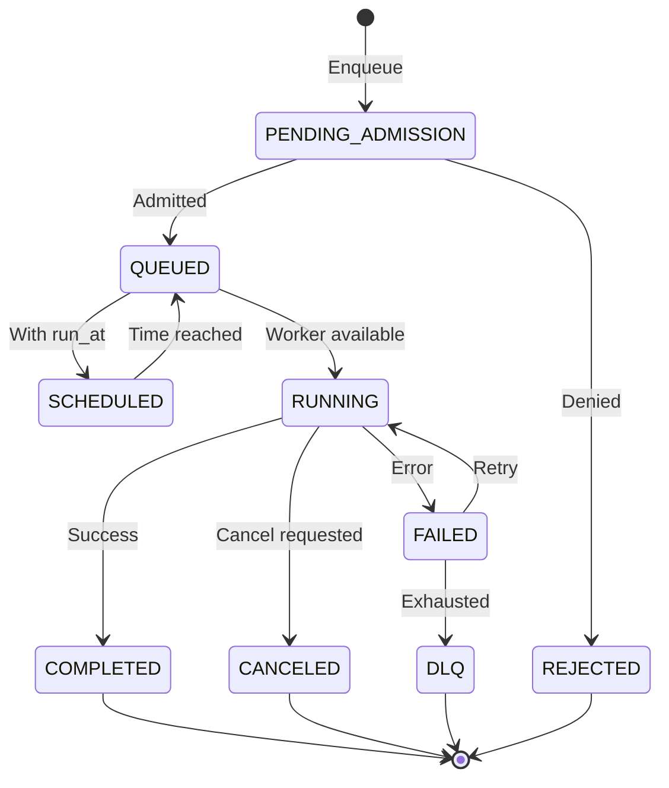
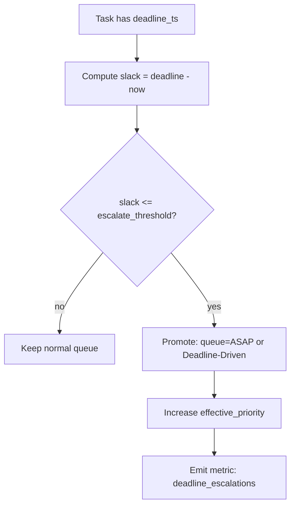
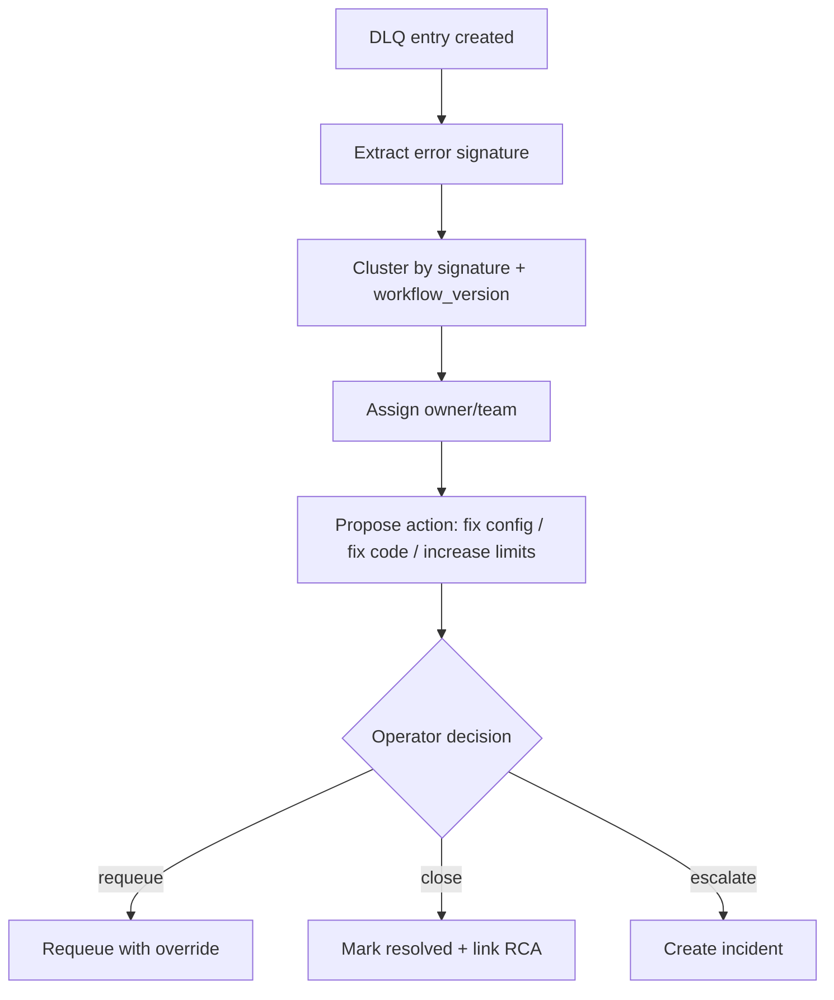
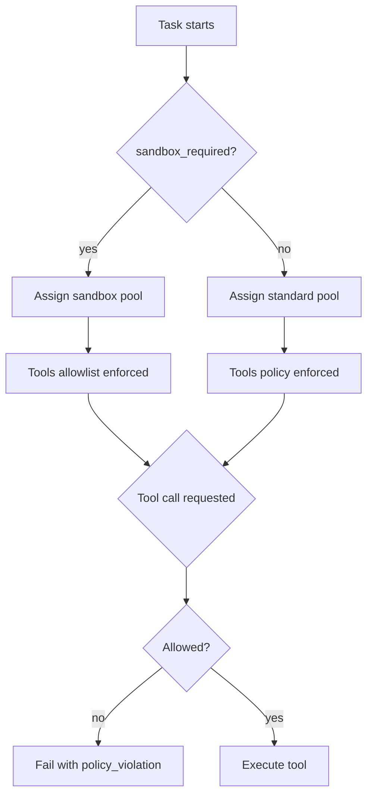
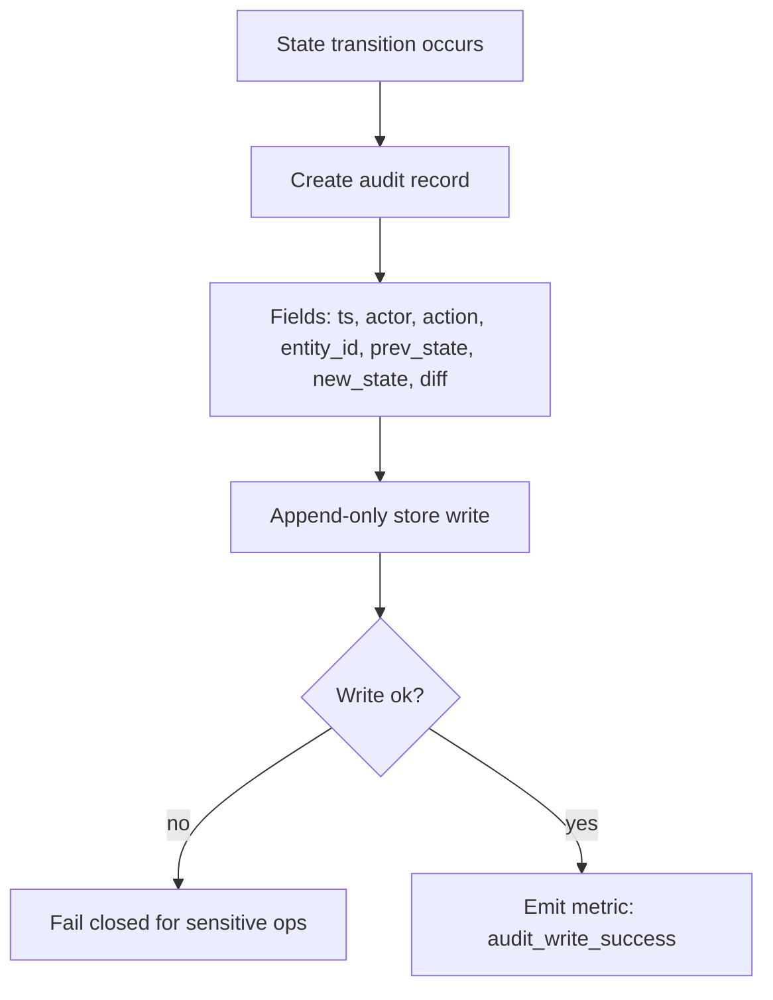
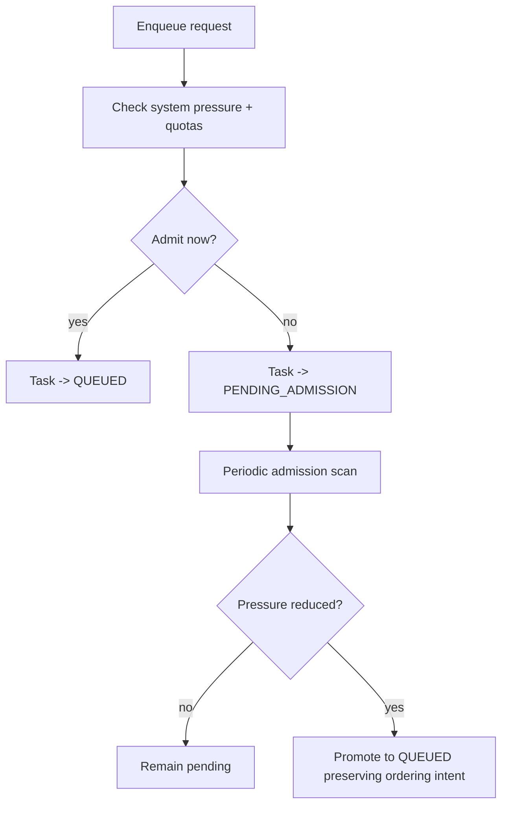
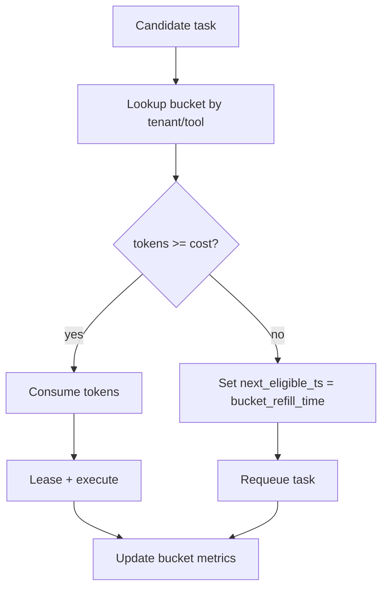
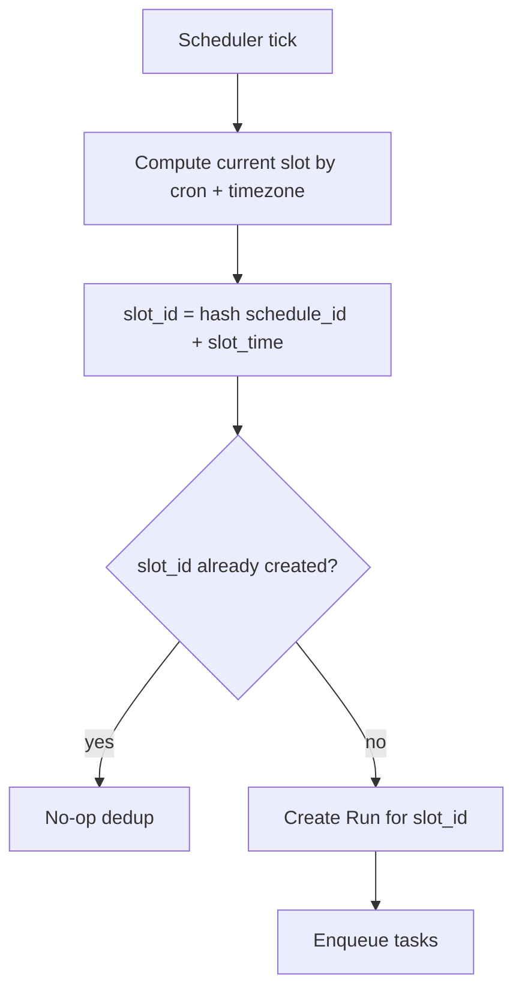
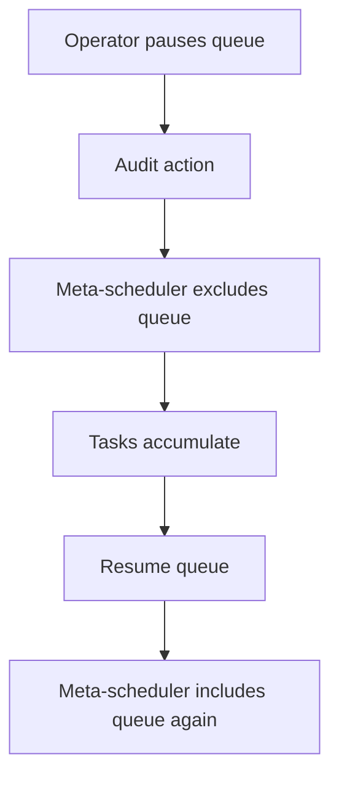

# Agent Queue System - Comprehensive Requirements

## Table of Contents

1. [Overview](#overview)
2. [Queue System Architecture](#queue-system-architecture)
3. [Queue Categories & Levels](#queue-categories--levels)
4. [Scheduling Strategies](#scheduling-strategies)
5. [State Machine & Lifecycle](#state-machine--lifecycle)
6. [Execution Modes](#execution-modes)
7. [Priority System](#priority-system)
8. [Retry & Error Handling](#retry--error-handling)
9. [Resource Management](#resource-management)
10. [Security & Governance](#security--governance)
11. [Observability](#observability)
12. [Advanced Patterns](#advanced-patterns)
13. [Implementation Phases](#implementation-phases)
14. [Requirements Traceability](#requirements-traceability)
15. [Glossary](#glossary)

---

## Overview

**Project**: AgentQueue - Multi-dimensional queue workflow engine for yaml-to-rust-agentsdk
**Tech Stack**: Tokio current-thread + SQLite + Clap + Console
**Primary ADRs**: ADR-0002 (MVP Queue Scheduler Safety), ADR-0007 (Cron Git Refinement)

This document provides a comprehensive, deduplicated specification of all queue and agentic queue-related requirements from both ChatGPT and OpenCode chat histories.

### Related Documentation

- **[REQUIREMENTS_SUMMARY.md](./REQUIREMENTS_SUMMARY.md)** - Executive summary with quick statistics, Mermaid diagrams, and consolidated tables for quick reference. Includes category breakdown, core architecture overview, and concise representation of all requirements.
- **[chatgpt-requirements.md](./chatgpt-requirements.md)** - Original ChatGPT requirements table with 60 items (Q-001 to Q-060) covering the full breadth of queue system requirements, plus the narrow-scope table (QL-001 to QL-025) focused on meta-level queue operation and queue categories.
- **[opencode-chat-history.md](./opencode-chat-history.md)** - Exhaustive catalog of every queue and agentic queue-related concept, requirement, and design pattern discussed across OpenCode chat history, including 27 comprehensive sections covering architecture, state machine, scheduling, priority systems, long-running behaviors, human gating, policy sliders, CLI commands, retry handling, resource management, concurrency, timeouts, checkpointing, sub-workflow coordination, validation, observability, loop variations, advanced queue patterns, scaling, security, determinism, agentic orchestration, implementation phases, and requirements traceability.

### Source Documentation Hierarchy

This file (`requirements.md`) serves as the unified specification that synthesizes requirements from multiple sources:

1. **REQUIREMENTS_SUMMARY.md** - Executive summary and quick reference
2. **ChatGPT Requirements** (`chatgpt-requirements.md`) - Original 60-item requirements table
3. **OpenCode Chat History** (`opencode-chat-history.md`) - Comprehensive design patterns and architectural decisions
4. **Flow Diagrams** (`../diagrams/`) - 80+ Mermaid diagrams visualizing all queue patterns

---

## Queue System Architecture

### Core Components

| **Component** | **Description** | **Requirements** | **Source** |
|--------------|----------------|------------------|------------|
| **ChatSession** | Scoped executable work container | - Holds scope<br>- Holds queue state<br>- Holds artifacts<br>- Holds workflows | Q-001, R0001 |
| **Queue UX** | Visible queue with titles and live execution meaning | - Visible queue display<br>- Status indicators<br>- Priority visibility | Q-002, R0002 |
| **Queue Persistence** | SQLite-backed persistence | - ACID transaction guarantees<br>- Survives process restarts<br>- Supports recovery | Q-024, R0003 |
| **State Machine** | Enum-based states with runtime validation | - Compile-time safe transitions<br>- Serializable<br>- Runtime validation | Q-002, R0004 |

### Technical Stack

| **Component** | **Technology** | **Rationale** | **Source** |
|--------------|---------------|--------------|------------|
| **Runtime** | Tokio current-thread | Predictable latency, single-threaded | Q-058 |
| **Storage** | SQLite | ACID transactions, embedded, low overhead | Q-024 |
| **CLI** | Clap + Console | Hierarchical commands, rich output | Q-053 |
| **State Machine** | Enum-based | Type-safe, serializable | Q-002 |

---

## Queue Categories & Levels

### Queue Levels (Comprehensive)

| **Level_ID** | **Queue Level / Category** | **Meta-Level Semantics** | **Ordering Rule** | **SLA / Deadline Semantics** | **Preemption** | **Typical Use** | **YAML Fields (examples)** | **Acceptance / Invariants** |
|--------------|--------------------------|------------------------|--------------------|----------------------------|---------------|------------------|----------------------------|---------------------------|
| QL-001 | ASAP | Highest urgency; runs before lower classes when capacity exists | Priority desc, then FIFO | Optional "target latency" (soft SLA) | Optional | Incidents, hotfix automation, urgent user actions | `queue: asap`, `priority`, `sla_class` | Never starved by other classes |
| QL-002 | ASAP-Blocking | ASAP plus blocks a workflow until complete | Same as ASAP | Harder SLA expectations | Optional | Critical path steps that gate many dependents | `block_workflow: true` | Must not deadlock dependencies |
| QL-003 | Whenever | Best-effort background; uses idle capacity | FIFO or aged priority | No deadline; "eventual completion" | No | Backfills, indexing, cleanup | `queue: whenever`, `aging_rate` | Must not impact ASAP latency beyond caps |
| QL-004 | Whenever-Batch | Whenever but batch-optimized | Batch-key grouping | None | No | Embeddings, ETL chunks | `batch_key`, `batch_size`, `batch_window` | Batch must be deterministic & bounded |
| QL-005 | Scheduled-Once | Not eligible until `due_ts` | Earliest due time first (EDF) then FIFO | Due time is gate; may have SLA after due | No | "Run at 2am" tasks | `due_ts`, `timezone` | Must not execute before due time |
| QL-006 | Scheduled-Window | Eligible in a time window; outside window deferred | EDF within window | Window is hard constraint | No | Rate-limited partner APIs | `window: {start,end}`, `timezone` | Never runs outside window |
| QL-007 | Repeat-Cron | Creates runs on cron schedule | Per occurrence ordering | Catchup policy defines missed runs | No | Periodic reports, syncs | `schedule: {cron, catchup}` | Occurrences deduped by schedule+slot |
| QL-008 | Repeat-FixedDelay | Next run scheduled after completion + delay | Completion-time based | No fixed deadline | No | Polling loops | `repeat: {mode: fixed_delay, delay}` | Prevent overlapping unless allowed |
| QL-009 | Repeat-FixedRate | Runs at fixed wall-clock cadence | Time-slot based | Missed slots follow catchup rule | No | Heartbeat checks, rollups | `repeat: {mode: fixed_rate, interval, catchup}` | Slot identity stable for dedupe |
| QL-010 | Deadline-Driven | Prioritizes by closest deadline (EDF globally or per-queue) | EDF then FIFO | Deadline is primary | Optional | SLAs/contracts | `deadline_ts`, `strategy: edf` | Deadline misses recorded & alertable |
| QL-011 | Rate-Limited | Enforced throughput cap independent of priority | FIFO within rate bucket | SLA depends on cap | No | Vendor API calls | `rate_limit: {rps, burst}` | Never exceeds configured rate |
| QL-012 | Quota-Governed | Tenant quotas gate eligibility | Depends on base queue | SLA varies | No | Multi-tenant fairness | `tenant_id`, `quota_profile` | No tenant can exceed allocation |
| QL-013 | Human-Gated | Task waits for approval before eligible | FIFO after approval | SLA includes human time | No | Risky actions | `gate: {type: approval}` | Must not be leased pre-approval |
| QL-014 | Manual-Override | Operator can force priority/queue/routing | Override-defined | Override-defined | Optional | On-call triage | `override: {priority, queue}` | Override always audited |
| QL-015 | DLQ | Not executed automatically; triage-only | N/A | N/A | No | Failures | `dlq: {reason_codes}` | Entries immutable; requeue creates new task |
| QL-016 | Sandbox | Runs only on sandboxed agents | Queue ordering unchanged | SLA lower | No | Untrusted tool runs | `sandbox: strict` | Must never run on non-sandbox pool |
| QL-017 | Capability-Pinned | Eligible only for certain agent pools | Within-pool ordering | SLA depends on pool | No | GPU tasks, special tools | `agent_pool`, `requires` | Never leased by incompatible agent |
| QL-018 | Cost-Aware | Schedules to minimize cost under constraints | Weighted scoring | SLA respected | No | Spot instances | `cost_policy`, `weights` | Must not violate deadlines |
| QL-019 | Maintenance | Runs only during maintenance window | Window gating | No SLA | No | Reindexing, migrations | `window`, `maintenance: true` | Hard "no-run" outside window |
| QL-020 | Experiment | Low priority, can be dropped | FIFO best-effort | None | No | A/B jobs | `drop_policy: droppable` | Dropped tasks recorded |
| QL-021 | Meta-Scheduler Strategy | Selects which queue to pull from next | WRR/DRR/priority+aging | Cross-queue SLA aware | N/A | Whole system | `meta: {strategy, weights}` | Strategy deterministic per tick |
| QL-022 | Starvation Guard | Ensures low classes eventually progress | Aging boosts | SLA unaffected for ASAP | N/A | Fairness | `aging_rate`, `min_share` | Proves progress over time |
| QL-023 | Spillover | If queue full, spill to alternate | Alternate ordering | SLA may degrade | No | Burst handling | `spillover: {to_queue, when}` | No silent drops |
| QL-024 | Queue Paused | Temporarily ineligible | N/A | N/A | N/A | Ops | `pause: {scope, reason}` | Must not lease while paused |
| QL-025 | Scheduled Catchup Policy | Defines behavior for missed schedule slots | N/A | N/A | N/A | Cron | `catchup: none|latest|all|bounded(n)` | Catchup is explicit and testable |

### Queue Categories Summary

| **Category** | **Mapped Level** | **Execution Behavior** | **Priority** |
|-------------|------------------|----------------------|-------------|
| **ASAP** | QL-001, QL-002 | Execute immediately when worker available | Critical (10), High (5) |
| **Whenever** | QL-003, QL-004 | Execute when resources available | Low (1) |
| **Scheduled** | QL-005, QL-006, QL-007 | Execute at specific timestamps or recurring schedules | Time-based |
| **Repeat** | QL-008, QL-009 | Recurring execution or iterative improvement | Time/Delay-based |
| **Deadline-Driven** | QL-010 | Prioritizes by closest deadline | Deadline-based |
| **Rate-Limited** | QL-011 | Enforced throughput cap | FIFO within bucket |
| **Quota-Governed** | QL-012 | Tenant quotas gate eligibility | Tenant-based |

---

## Scheduling Strategies

### Scheduling Algorithms

| **Strategy** | **Description** | **Priority Handling** | **Use Case** | **Anti-Starvation** | **Source** |
|--------------|-----------------|---------------------|--------------|-------------------|------------|
| **FIFO (First-In-First-Out)** | Simple queue, first submitted runs first | None (no priority) | Fair resource sharing, simple workloads | None | Q-003, Q-034 |
| **Priority Queue** | Tasks ordered by priority level | Weight-based (critical:10, high:5, medium:3, low:1) | Urgent tasks, service differentiation | Aging boost | Q-012, Q-034 |
| **Earliest Deadline First (EDF)** | Schedule by deadline | Deadline-based priority | Time-sensitive workflows | Deadline escalation | Q-011, Q-035 |
| **Fair Share** | Balanced resource allocation | Fair distribution across tenants | Multi-tenant, fair resource usage | Per-tenant min_share | Q-034 |
| **Round Robin (RR)** | Cyclic worker selection | Equal distribution | Load balancing across workers | None | Q-034 |
| **Weighted Round Robin (WRR)** | Weighted cyclic selection | Weighted distribution | Tenant-weighted allocation | Aging + min_share | Q-034, QL-021 |
| **Deficit Round Robin (DRR)** | Fair deficit-based selection | Fairness-focused | Bandwidth allocation | Aging + min_share | Q-034 |

### Priority + Aging (Anti-Starvation)

```mermaid
flowchart TD
    A[Task queued] --> B[Compute base_priority]
    B --> C[Compute age = now - enqueue_ts]
    C --> D[age_boost = floor(age / aging_quantum) * aging_rate]
    D --> E[effective_priority = base_priority + age_boost]
    E --> F[Sort candidates by effective_priority desc]
    F --> G[Tie-break: due_ts asc, enqueue_ts asc, task_id asc]
    G --> H[Select next task]
```

**Parameters**:
- `aging_quantum`: Time interval for aging boost (default: 300s)
- `aging_rate`: Priority increment per quantum (default: 1)

---

## State Machine & Lifecycle

### State Definitions

| **State** | **Description** | **Transitions** | **Validation** | **Source** |
|-----------|-----------------|----------------|----------------|------------|
| **PENDING_ADMISSION** | Task waiting for admission approval | → QUEUED (when admitted)<br>→ REJECTED (when denied) | Must have admission context | Q-002 |
| **QUEUED** | Task waiting to be executed | → RUNNING (when worker available)<br>→ PENDING_ADMISSION (if admission needed)<br>→ CANCELED (if cancelled) | Must have payload, valid metadata | Q-002 |
| **SCHEDULED** | Task scheduled for future execution | → QUEUED (when time arrives) | Must have run_at timestamp | Q-002 |
| **RUNNING** | Task currently executing | → COMPLETED (success)<br>→ FAILED (error)<br>→ CANCELED (cancelled)<br>→ RUNNING (retry) | Must have worker_id, lease active | Q-002 |
| **COMPLETED** | Task finished successfully | Terminal state | Must have result, output | Q-002 |
| **FAILED** | Task failed with error | → RUNNING (retry if retryable)<br>→ DLQ (if exhausted retries) | Must have reason, attempts count | Q-002 |
| **CANCELED** | Task was cancelled | Terminal state | Terminal state, audit record | Q-002 |
| **DLQ** | Dead letter queue | Terminal state (triage-only) | Immutable, searchable | Q-009 |

### State Transition Flowchart



---

## Execution Modes

### Execution Mode Matrix

| **Mode** | **Description** | **Use Case** | **Implementation** | **Source** |
|----------|-----------------|--------------|-------------------|------------|
| **Serial** | Execute steps sequentially one at a time | Resource-constrained environments, deterministic order | Model lifecycle: one_at_a_time | Q-058 |
| **Parallel** | Execute steps in parallel where dependencies allow | Maximum throughput, independent tasks | Model lifecycle: lazy, parallel_groups enabled | Q-058 |
| **Hybrid** | Adaptive parallelism based on resource availability | Balance speed and resource usage | Model lifecycle: adaptive, dynamic resource monitoring | Q-058 |
| **Interactive** | Human-in-the-loop with confirmations | High-risk operations, explicit approval | Execution mode: interactive, human_gating enabled | Q-047 |
| **Automated** | No human intervention required | Batch processing, CI/CD | Execution mode: automated, no human_gating | Q-047 |

---

## Priority System

### Priority Levels

| **Level** | **Weight** | **Use Case** | **Preemption** | **Escalation** | **Source** |
|-----------|-----------|--------------|----------------|----------------|------------|
| **Critical** | 10 | Emergency fixes, blocking issues | Yes (can interrupt) | N/A (already highest) | Q-012 |
| **High** | 5 | Urgent user requests, important tasks | No | Can escalate to Critical | Q-012 |
| **Medium** | 3 | Standard work items | No | Can escalate to High | Q-012 |
| **Low** | 1 | Background tasks, nice-to-have | No | Can escalate to Medium | Q-012 |

### Deadline Escalation



**Parameters**:
- `escalate_threshold`: Slack threshold for escalation (default: 300s)
- `escalation_boost`: Priority increase amount (default: +5)

---

## Retry & Error Handling

### Retry Configuration

| **Aspect** | **Configuration** | **Behavior** | **Source** |
|-----------|-----------------|--------------|------------|
| **Max Attempts (Step)** | 3 | Retry up to 3 times per step | Q-008 |
| **Max Attempts (Workflow)** | 10 | Total retry limit across workflow | Q-008 |
| **Backoff Strategy** | Exponential | Delay doubles each retry | Q-008 |
| **Base Delay** | 1000ms | Initial delay before first retry | Q-008 |
| **Max Delay** | 30000ms (30s) | Maximum delay between retries | Q-008 |
| **Jitter Factor** | 0.2 (20%) | Randomize delay to avoid thundering herd | Q-008 |
| **Retry on Timeout** | Enabled | Retry when step times out | Q-008 |
| **Retry on Rate Limit** | Enabled | Retry when hitting rate limits | Q-008 |
| **Escalation** | After 3 retries → Model, After 5 retries → Oracle | Automatic escalation to higher authority | Q-008 |

### Dead-Letter Queue (DLQ)



---

## Resource Management

### Concurrency Limits

| **Resource** | **Limit** | **Purpose** | **Source** |
|-------------|-----------|--------------|------------|
| **Global** | max_in_flight | System-wide concurrent tasks | Q-006 |
| **Per Queue** | per_queue_limit | Queue-specific concurrency | Q-006 |
| **Per Agent** | per_agent_limit | Agent-specific concurrency | Q-006 |
| **Per Workflow** | max_parallel_steps | Workflow parallelism | Q-006 |

### Resource Allocation Strategy

| **Resource** | **Allocation Strategy** | **Monitoring** | **Pressure Handling** |
|-------------|----------------------|---------------|----------------------|
| **Memory** | Adaptive | Interval: 5s | Throttle at 85% (factor 0.5) |
| **CPU** | Adaptive | Interval: 5s | Throttle at 85% (factor 0.5) |
| **GPU/VRAM** | Adaptive | Interval: 5s | Swap at OOM |
| **Storage** | Quota-based | Continuous | Over-quota blocks enqueue/lease |

---

## Security & Governance

### Multi-Tenancy

| **Aspect** | **Configuration** | **Behavior** | **Source** |
|------------|-----------------|--------------|------------|
| **Namespace Isolation** | tenant_id | No cross-tenant reads/writes | Q-018 |
| **Quota Profiles** | quota_profile | Per-tenant resource limits | Q-044 |
| **Fair Share** | min_share, weight | Balanced distribution | Q-034 |

### RBAC

| **Permission** | **Description** | **Roles** | **Source** |
|---------------|-----------------|-----------|------------|
| **enqueue** | Submit tasks to queue | operator, developer | Q-019 |
| **cancel** | Cancel tasks | operator, admin | Q-019 |
| **inspect** | View task details | operator, viewer | Q-019 |
| **override** | Modify priority/queue | admin, on-call | Q-019, QL-014 |

### Secrets Management

| **Aspect** | **Configuration** | **Behavior** | **Source** |
|------------|-----------------|--------------|------------|
| **Secret References** | secrets: [ref...] | Only references allowed, never inline | Q-017 |
| **RBAC Check** | RBAC for secret scope | Authorization required | Q-017 |
| **Log Redaction** | Automatic redaction | Secrets masked in logs | Q-017 |

### Sandbox Enforcement



---

## Observability

### Logging System

| **Scope** | **Levels** | **Output** | **Source** |
|-----------|-----------|------------|------------|
| **Workflow** | Debug, Info, Warning, Error, Critical | Console, File, Remote | Q-022 |
| **Pipeline** | Debug, Info, Warning, Error, Critical | Console, File, Remote | Q-022 |
| **Models** | Debug, Info, Warning, Error, Critical | Console, File, Remote | Q-022 |
| **Tools** | Debug, Info, Warning, Error, Critical | Console, File, Remote | Q-022 |
| **Execution** | Debug, Info, Warning, Error, Critical | Console, File, Remote | Q-022 |

### Metrics Collection

| **Scope** | **Metrics** | **Output** | **Source** |
|-----------|-----------|------------|------------|
| **Queue Depth** | queue_depth, queue_depth_per_queue | JSON file | Q-021 |
| **Throughput** | tasks_completed, tasks_failed, tasks_per_second | JSON file | Q-021 |
| **Latency** | queue_latency, execution_latency, end_to_end_latency | JSON file | Q-021 |
| **Retries** | retry_count, retry_success_rate, retry_backoff_distribution | JSON file | Q-021 |
| **Lease Expirations** | lease_expiry_count, lease_heartbeat_miss | JSON file | Q-021 |

### Audit Log



---

## Advanced Patterns

### Admission Control



### Rate-Limited Execution (Token Bucket)



### Cron Slot Identity + Dedupe



### Queue Pausing



---

## Implementation Phases

### 7-Phase Implementation Plan

| **Phase** | **Name** | **Components** | **Priority** | **Source** |
|-----------|-----------|----------------|--------------|------------|
| **1** | Foundation | Schema, IR, Storage | P0 | plan-01-mvp-queue.md |
| **2** | MVP Execution | Queue, Scheduler, Human Gating | P0 | plan-01-mvp-queue.md |
| **3** | Backends | Provider Abstraction | P1 | plan-01-mvp-queue.md |
| **4** | Advanced Agentic | Loops, Validation, Multi-Agent | P1 | plan-01-mvp-queue.md |
| **5** | Benchmarking | Performance Measurement | P2 | plan-01-mvp-queue.md |
| **6** | Automation | Cron, Git Experiments | P2 | plan-01-mvp-queue.md |
| **7** | UI | Desktop Shell, Visualization | P3 | plan-01-mvp-queue.md |

---

## Requirements Traceability

### Requirements Overview

| **Req_ID** | **Domain** | **Requirement** | **Priority** | **Source** |
|------------|-----------|----------------|--------------|------------|
| **Q-001** | Entities | Define canonical entities: Workflow, Run, Task, Step, Agent, Queue, Lease | P0 | ChatGPT |
| **Q-002** | State model | Enforce explicit lifecycle states for runs/tasks | P0 | ChatGPT |
| **Q-003** | Ordering | Stable ordering rules per queue level | P0 | ChatGPT |
| **Q-004** | Idempotency | Every task execution must be idempotent or have dedupe key | P0 | ChatGPT |
| **Q-005** | Leases | Claiming work uses leases with heartbeat | P0 | ChatGPT |
| **Q-006** | Concurrency | Concurrency limits at multiple scopes (global/queue/agent/workflow) | P0 | ChatGPT |
| **Q-007** | Backpressure | Queue applies backpressure + admission control | P0 | ChatGPT |
| **Q-008** | Retries | Structured retry policy with jitter, caps, and classification | P0 | ChatGPT |
| **Q-009** | Dead-letter | Dead-letter queue (DLQ) for exhausted retries | P0 | ChatGPT |
| **Q-010** | Dependencies | Task DAG dependencies + gating conditions | P0 | ChatGPT |
| **Q-011** | Time | First-class time semantics: due times, schedules, repeats | P0 | ChatGPT |
| **Q-012** | Priority | Priority bands + aging to prevent starvation | P0 | ChatGPT |
| **Q-013** | Preemption | Optional preemption rules per queue level | P1 | ChatGPT |
| **Q-014** | Batching | Batch compatible tasks to reduce overhead | P1 | ChatGPT |
| **Q-015** | Resource fits | Match tasks to agents by capabilities + resources | P0 | ChatGPT |
| **Q-016** | Tooling | Tool invocation constraints & sandbox policies per task | P0 | ChatGPT |
| **Q-017** | Secrets | Secret references only, never inline secrets | P0 | ChatGPT |
| **Q-018** | Multi-tenant | Namespace isolation and quotas | P0 | ChatGPT |
| **Q-019** | RBAC | Role-based permissions on enqueue, cancel, inspect, override | P0 | ChatGPT |
| **Q-020** | Audit | Immutable audit log for state changes and overrides | P0 | ChatGPT |
| **Q-021** | Observability | Metrics for queue depth, latency, success, retries, lease expiries | P0 | ChatGPT |
| **Q-022** | Logging | Structured logs with correlation IDs | P0 | ChatGPT |
| **Q-023** | Tracing | Distributed tracing across agent steps/tools | P1 | ChatGPT |
| **Q-024** | Storage | Durable persistence for workflow/run/task states | P0 | ChatGPT |
| **Q-025** | Exactly-once outcome | Support "exactly-once outcome" via idempotency + durable state | P0 | ChatGPT |
| **Q-026** | Versioning | Version YAML schemas + workflow definitions | P0 | ChatGPT |
| **Q-027** | Validation | Strict YAML validation with clear errors | P0 | ChatGPT |
| **Q-028** | Determinism | Deterministic execution for replayable workflows (optional mode) | P1 | ChatGPT |
| **Q-029** | Cancellation | Cancel at run/task/step level with propagation rules | P0 | ChatGPT |
| **Q-030** | Pausing | Pause/resume runs and queues | P1 | ChatGPT |
| **Q-031** | Overrides | Operator overrides: reprioritize, requeue, bypass deps | P0 | ChatGPT |
| **Q-032** | Queue routing | Route tasks to queue by policy (type, SLA, tenant, schedule) | P0 | ChatGPT |
| **Q-033** | Queue-of-queues | Meta-scheduler chooses among queues | P0 | ChatGPT |
| **Q-034** | Fairness | Strategies: WRR, deficit round robin, priority + aging | P0 | ChatGPT |
| **Q-035** | Deadlines | Deadline aware scheduling (EDF or SLA bucketing) | P1 | ChatGPT |
| **Q-036** | Agent pools | Pools by capability class | P0 | ChatGPT |
| **Q-037** | Work stealing | Optional work-stealing among pools/queues | P1 | ChatGPT |
| **Q-038** | Heartbeats | Heartbeat updates extend lease + report progress | P0 | ChatGPT |
| **Q-039** | Checkpointing | Persist intermediate state for long tasks | P1 | ChatGPT |
| **Q-040** | Artifact mgmt | Store outputs/artifacts per step with retention | P1 | ChatGPT |
| **Q-041** | Caching | Optional step/task caching keyed by inputs | P1 | ChatGPT |
| **Q-042** | Input hashing | Canonical input hashing for caching/dedupe | P1 | ChatGPT |
| **Q-043** | Rate limiting | Per-tenant and per-tool API rate limits | P0 | ChatGPT |
| **Q-044** | Quotas | Compute/storage quotas with enforcement and alerts | P0 | ChatGPT |
| **Q-045** | Security boundaries | Network egress rules per queue/task | P0 | ChatGPT |
| **Q-046** | Prompt/tool safety | Classify tasks by risk and require approvals | P1 | ChatGPT |
| **Q-047** | Human gates | Manual approval / review steps in workflows | P1 | ChatGPT |
| **Q-048** | Cron semantics | Cron-like scheduled triggers + missed-run policy | P0 | ChatGPT |
| **Q-049** | Event triggers | Event-based enqueue (webhook/message) | P1 | ChatGPT |
| **Q-050** | Schema registry | Central registry for YAML schema versions | P1 | ChatGPT |
| **Q-051** | CI linting | Lint/format/validate YAML in CI | P0 | ChatGPT |
| **Q-052** | Migration | Migration steps for schema and state | P1 | ChatGPT |
| **Q-053** | UI/CLI | CLI/API for enqueue/inspect/cancel/requeue | P1 | ChatGPT |
| **Q-054** | Searchability | Query by tenant, queue, state, tags, time windows | P1 | ChatGPT |
| **Q-055** | Tagging | Tag tasks/runs for routing & analytics | P1 | ChatGPT |
| **Q-056** | Policies | Policy-as-data overlays per environment | P1 | ChatGPT |
| **Q-057** | Deterministic plan | A plan/orchestration YAML coordinates other YAMLs | P0 | ChatGPT |
| **Q-058** | Local model optimization | Short context, chunked tasks, stable schemas, tool gating | P1 | ChatGPT |
| **Q-059** | OSS alignment | Map concepts to known orchestrators (Temporal/Argo/etc.) | P1 | ChatGPT |
| **Q-060** | Queue groups concept | Optional pub/sub queue-group consumption pattern | P1 | ChatGPT |

### Total Statistics

- **Total Q-Requirements**: 60
- **Priority P0**: 30
- **Priority P1**: 30
- **Total Queue Levels**: 25

---

## Glossary

| **Term** | **Definition** |
|----------|---------------|
| **ASAP** | Queue category for immediate execution with highest priority |
| **Whenever** | Queue category for background execution with low priority |
| **Scheduled** | Queue category for time-based execution with run_at or cron |
| **Repeat** | Queue category for iterative execution with loops |
| **ChatSession** | Scoped executable work container holding queue state, artifacts, and workflows |
| **PENDING_ADMISSION** | Task waiting for admission approval before being queued |
| **QUEUED** | Task waiting to be executed by a worker |
| **SCHEDULED** | Task scheduled for future execution |
| **RUNNING** | Task currently executing |
| **COMPLETED** | Task finished successfully |
| **FAILED** | Task failed with error |
| **CANCELED** | Task was cancelled |
| **DLQ** | Dead Letter Queue for failed tasks |
| **Anti-Starvation** | Mechanism to prevent low-priority tasks from never executing |
| **Priority Inversion** | Situation where low-priority task blocks high-priority task |
| **Aging** | Gradual priority increase over time for long-waiting tasks |
| **Backpressure** | Mechanism to handle queue overflow |
| **Checkpoint** | Saved state for recovery and resumption |
| **Human Gating** | Requirement for human approval before executing high-risk operations |
| **Lease** | Temporary claim on a task with heartbeat renewal |
| **Idempotency** | Property that multiple executions have same effect as one |
| **Exactly-Once** | Guarantee that task executes exactly once |
| **Fair Share** | Balanced resource allocation across tenants |
| **Token Bucket** | Rate limiting mechanism for task execution |
| **WRR** | Weighted Round Robin scheduling |
| **DRR** | Deficit Round Robin scheduling |
| **EDF** | Earliest Deadline First scheduling |
| **RBAC** | Role-Based Access Control for authorization |
| **Audit Log** | Immutable record of all state transitions and actions |
| **Cron** | Scheduling syntax for recurring tasks |
| **Cron Slot** | Unique identifier for scheduled time instances |
| **Sandbox** | Restricted execution environment for security |
| **Spillover** | Overflow to alternate queue when full |
| **Work Stealing** | Agents taking tasks from other queues when idle |
| **Capability Matching** | Matching task requirements to agent capabilities |
| **Quota Profile** | Per-tenant resource limits |

---

## End of Document

This comprehensive requirements document combines and deduplicates all queue and agentic queue-related requirements from both ChatGPT and OpenCode chat histories. It covers:

- 60 comprehensive requirements (Q-001 to Q-060)
- 25 queue levels and categories (QL-001 to QL-025)
- Complete state machine and lifecycle definitions
- All scheduling strategies and priority systems
- Retry mechanisms and error handling
- Resource management and concurrency limits
- Security, governance, and RBAC
- Observability (logging, metrics, audit)
- Advanced patterns (admission control, rate limiting, cron)
- 7-phase implementation plan
- Complete glossary of terms
- Multiple mermaid flow diagrams

For implementation guidance, refer to individual requirements and their associated documentation sources.
